[→ مقدمه فصل اول](./00-introduction.md) | [بخش ۱-۲: هوش مصنوعی چیست؟ یک شهود برای زیست‌شناسان ←](./02-what-is-ai-for-biologists.md)

# فصل ۱: انقلاب جدید در زیست‌شناسی

## بخش ۱-۱: داستان یک کشف: از نقشه ژنوم انسان تا پزشکی شخصی‌سازی‌شده

به فصل اول کتاب خوش آمدید. در این فصل، سفری به گذشته، حال و آینده زیست‌شناسی خواهیم داشت تا ببینیم چگونه یک ایده انقلابی، دنیای ما را برای همیشه تغییر داد. امیدواریم برای یک ماجراجویی هیجان‌انگیز در دنیای داده‌های زیستی آماده باشید.

برای شروع، بیایید با یک داستان واقعی شروع کنیم. داستانی که نه تنها شبیه یک فیلم علمی-تخیلی است، بلکه در واقعیت اتفاق افتاده و سنگ بنای پزشکی مدرن را گذاشته است. این داستان، داستان **پروژه ژنوم انسان** است.

### 🎯 مسئله محوری این بخش:

فرض کنید شما یک دانشمند در سال ۱۹۹۰ هستید. به شما یک ماموریت تقریباً غیرممکن داده می‌شود: خواندن کامل کتابچه راهنمای ساخت یک انسان! کتابچه‌ای با ۳.۲ میلیارد حرف که اگر بخواهید آن را با سرعت یک حرف در ثانیه بخوانید، بیش از ۱۰۰ سال طول می‌کشد! در حین خواندن این بخش، به این فکر کنید که برای حل چنین مسئله عظیمی، به چه نوآوری‌هایی در فناوری، همکاری و تفکر نیاز است.

### 📖 **داستان کشف: رویای خواندن کتاب زندگی**

#### **سال ۱۹۹۰: یک ماموریت غیرممکن**

در سال ۱۹۹۰، جامعه علمی جهان یک هدف بسیار جسورانه برای خود تعیین کرد: خواندن کامل **ژنوم انسان**[1]. ژنوم، کل محتوای ژنتیکی یک موجود زنده است که در DNA آن ذخیره شده. برای انسان، این به معنای خواندن دقیق ۳.۲ میلیارد جفت باز (همان حروف A, T, C, G) بود[2][3].

> **نقل قول از فرانسیس کالینز (Francis Collins)، رهبر پروژه ژنوم انسان:**
> "این کار مثل این بود که بخواهیم تمام کتاب‌های یک کتابخانه عظیم، مثلاً ۸۰۰ نسخه از دایرةالمعارف بریتانیکا را، حرف به حرف و بدون حتی یک غلط املایی رونویسی کنیم."[4]

**چالش‌های اولیه نفس‌گیر بودند:**

- **سرعت لاک‌پشتی:** در آن زمان، پیشرفته‌ترین دستگاه‌ها می‌توانستند روزانه تنها چند صد جفت باز را توالی‌یابی کنند. با آن سرعت، تکمیل پروژه ژنوم انسان حدود **۸۰ تا ۱۰۰ هزار سال** طول می‌کشید![5]
- **هزینه سرسام‌آور:** بودجه اولیه پروژه حدود **۳ میلیارد دلار** تخمین زده شده بود[5][6]. یعنی تقریباً به ازای هر حرف از کتاب زندگی، یک دلار!

این پروژه در ابتدا بسیار کند پیش می‌رفت. دانشمندان به روشی به نام **"روش سنگر (Sanger sequencing)"** کار می‌کردند که بسیار دقیق اما فوق‌العاده زمان‌بر بود[7]. آن‌ها ژنوم را به قطعات بزرگ تقسیم کرده و سپس هر قطعه را به صورت خطی و با دقت می‌خواندند.

#### **نقطه عطف: ورود یک ایده‌ی انقلابی**

هم‌زمان با این پروژه دولتی، یک دانشمند جسور و کارآفرین به نام **کریگ ونتر (Craig Venter)** وارد میدان شد[8]. او که از سرعت پایین پروژه کلافه شده بود، یک ایده انقلابی را مطرح کرد که دنیای ژنتیک را برای همیشه تغییر داد.

> **ایده کریگ ونتر:**
> "چرا باید این کتاب را صفحه به صفحه بخوانیم؟ بیایید کل کتاب را به میلیون‌ها تکه کاغذ کوچک تبدیل کنیم، از هر تکه چند کپی بگیریم، همه را با هم بخوانیم و سپس با قدرت کامپیوترها، آن‌ها را مثل یک پازل غول‌پیکر دوباره کنار هم بچینیم!"[9]

این روش که **"توالی‌یابی شات‌گان (Shotgun Sequencing)"** نام گرفت، یک قمار بزرگ بود[9][10]. بسیاری از دانشمندان معتقد بودند که این روش پر از خطا خواهد بود و کنار هم چیدن این پازل عظیم ۳ میلیارد تکه‌ای غیرممکن است. اما ونتر به قدرت محاسباتی کامپیوترها ایمان داشت.

```mermaid
flowchart TD
    %% Style Definitions
    classDef phase fill:#f8f9fa,stroke:#2c3e50,stroke-width:1.5px,color:#2c3e50
    classDef input fill:#e1f5fe,stroke:#01579b,stroke-width:1px,color:#01579b
    classDef process fill:#e6f2e6,stroke:#2e7d32,stroke-width:1px,color:#2e7d32
    classDef model fill:#f3e8f7,stroke:#6a1b9a,stroke-width:1px,color:#6a1b9a

    %% Shotgun Sequencing Process
    subgraph Shotgun [" "]
        direction TB
        A["DNA کامل انسان<br>Human DNA"]
        B["تکه‌تکه کردن تصادفی<br>Random Fragmentation"]
        C["میلیون‌ها قطعه همپوشان<br>Overlapping Fragments"]
        D["توالی‌یابی همزمان<br>Parallel Sequencing"]
        E["خواندن میلیون‌ها رشته کوتاه<br>Reading Short Sequences"]
        F["استفاده از ابرکامپیوترها<br>Supercomputer Analysis"]
        G["پیدا کردن نقاط مشترک<br>Finding Overlaps"]
        H["الگوریتم‌های تراز کردن<br>Alignment Algorithms"]
        I["بازسازی ژنوم کامل<br>Reconstructed Genome"]
    end

    %% Connections
    A -->|"شروع فرآیند"| B
    B --> C
    C -->|"خواندن سریع"| D
    D --> E
    E -->|"تحلیل داده‌ها"| F
    F --> G
    G -->|"تراز کردن"| H
    H --> I

    %% Apply Styles
    class Shotgun phase
    class A input
    class B,C,D,E,F,G,H process
    class I model

    %% Additional Styling for Rounded Shapes and Spacing
    style Shotgun fill:#f8f9fa,stroke:#2c3e50,stroke-width:1.5px
    linkStyle default stroke:#6c757d,stroke-width:1.2px
```

_روش توالی‌یابی شات‌گان (Shotgun Sequencing)_

رقابت بین تیم دولتی و تیم خصوصی ونتر، سرعت پیشرفت را به شکل چشمگیری افزایش داد[11]. کامپیوترها شبانه‌روز در حال پردازش داده‌ها بودند تا این پازل عظیم را حل کنند.

#### **۲۰۰۳: لحظه تاریخی**

سرانجام در **آوریل ۲۰۰۳**، یعنی ۱۳ سال پس از شروع پروژه، هر دو تیم به طور مشترک اعلام کردند که پیش‌نویس اولیه ژنوم انسان با موفقیت خوانده شده است[12][13]. این یکی از بزرگترین دستاوردهای تاریخ علم بود.

**نتایج کلیدی پروژه ژنوم انسان:**

- ✅ **۹۹.۹٪ از ژنوم انسان** با دقت بالا خوانده شد[13].
- 🧬 حدود **۲۰ تا ۲۵ هزار ژن** کدکننده پروتئین شناسایی شد (بسیار کمتر از تصور اولیه دانشمندان!)[14][15].
- 💻 بیش از **۱۰۰ ترابایت داده** خام تولید شد که تحلیل آن خود یک چالش جدید بود.
- 🌍 تمام اطلاعات به صورت **رایگان** در اختیار تمام محققان جهان قرار گرفت[16].

### 🚀 **از ژنوم تا سونامی داده‌ها**

پروژه ژنوم انسان تنها یک نقطه شروع بود. این پروژه، فناوری‌هایی را به وجود آورد که هزینه و زمان توالی‌یابی را به شکل سرسام‌آوری کاهش داد[17][18].

**جدول کاهش هزینه و زمان توالی‌یابی یک ژنوم کامل:**

| سال      | هزینه خواندن یک ژنوم  | زمان مورد نیاز | مقایسه هزینه                  |
| :------- | :-------------------- | :------------- | :---------------------------- |
| **۲۰۰۳** | ~۳ میلیارد دلار[5]    | ۱۳ سال[12]     | هزینه ساخت یک برج میلاد!      |
| **۲۰۰۷** | ~۱۰ میلیون دلار[17]   | ۶ ماه          | هزینه خرید یک جت شخصی         |
| **۲۰۱۴** | ~۱ هزار دلار[19]      | ۱ روز          | هزینه خرید یک گوشی پرچمدار    |
| **۲۰۲۴** | **~۲۰۰ دلار**[19][17] | **~۶ ساعت**    | **هزینه یک آزمایش خون تخصصی** |

این کاهش هزینه، یک **سونامی داده (Data Tsunami)** در زیست‌شناسی به راه انداخت[20]. امروزه در هر روز:

- 🔬 بیش از **۱۰۰ هزار ژنوم** جدید توالی‌یابی می‌شود[21].
- 📊 **ده‌ها پتابایت** داده زیستی جدید تولید می‌شود (هر پتابایت معادل ۱۰۰۰ ترابایت است)[21][20].
- 🧬 میلیون‌ها نمونه بافت و سلول تحلیل می‌شود[22].

> **مسئله جدید:** ما دیگر با کمبود داده مواجه نیستیم، بلکه با **فراوانی بیش از حد داده** روبرو هستیم[20]. مغز و روش‌های سنتی انسان دیگر قادر به تحلیل این حجم از اطلاعات و کشف الگوهای معنادار در آن نیست. اینجاست که نیاز به یک ابزار جدید احساس می‌شود!

### 🎯 **کاربردهای انقلابی: پزشکی شخصی‌سازی‌شده**

خواندن ژنوم به خودی خود هدف نهایی نبود. هدف اصلی، استفاده از این اطلاعات برای بهبود سلامت انسان بود[22][23]. این اطلاعات، راه را برای **پزشکی شخصی‌سازی‌شده (Personalized Medicine)** باز کرد[22][24]. یعنی تجویز درمان مناسب برای فرد مناسب، در زمان مناسب.

#### **مطالعه موردی ۱: داستان امیلی وایت‌هد - پیروزی بر سرطان**

**امیلی وایت‌هد (Emily Whitehead)** یک دختربچه ۶ ساله بود که به یک نوع بدخیم از سرطان خون به نام **لوسمی حاد لنفوبلاستیک (ALL)** مبتلا بود[25][26].

**وضعیت بحرانی:**

- شیمی‌درمانی‌های معمول روی او جواب نداده بود[25][26].
- سرطان برای بار دوم عود کرده بود[27][26].
- پزشکان به خانواده‌اش گفته بودند که هیچ گزینه درمانی دیگری وجود ندارد و شانس زنده ماندن او نزدیک به صفر است[27][26].

**راه‌حل نوآورانه - درمان سلولی CAR-T:**
پزشکان تصمیم گرفتند یک روش درمانی کاملاً جدید و آزمایشی را امتحان کنند که بر پایه مهندسی ژنتیک سلول‌های ایمنی خود بیمار بود[25][27].

1. **استخراج:** ابتدا سلول‌های ایمنی بیمار (سلول‌های T) را از خون او جدا کردند[25][28].
2. **مهندسی ژنتیک:** با استفاده از یک ویروس بی‌خطر شده، یک "گیرنده" مصنوعی (CAR) را وارد DNA سلول‌های T کردند. این گیرنده طوری طراحی شده بود که فقط به سلول‌های سرطانی امیلی متصل شود[25][28].
3. **تکثیر:** سلول‌های T مهندسی شده را در آزمایشگاه به میلیون‌ها عدد تکثیر کردند[25][26].
4. **تزریق:** سلول‌های "سرباز" جدید و قدرتمند را دوباره به بدن امیلی تزریق کردند[25][28].

**نتیجه شگفت‌انگیز:**

- تنها پس از ۳ هفته، تمام علائم سرطان در بدن امیلی از بین رفت[25].
- **در آوریل ۲۰۱۲، امیلی اولین کودک جهان شد که درمان CAR-T را دریافت کرد**[27][29][28].
- امروز، بیش از ۱۲ سال از آن روز می‌گذرد و امیلی کاملاً سالم است[26][30].
- این روش درمانی (CAR-T Therapy) اکنون توسط FDA تایید شده و جان هزاران بیمار دیگر را نجات داده است[29][31].

**چالش محاسباتی پشت این درمان:**
برای طراحی این درمان موفق برای امیلی، دانشمندان نیاز داشتند[32][33]:

- 🧬 **ژنوم کامل تومور** او را تحلیل کنند (۳.۲ میلیارد حرف).
- 🔍 **جهش‌های منحصر به فرد** سلول‌های سرطانی او را در میان میلیون‌ها جایگاه ممکن پیدا کنند.
- 🎯 از میان هزاران پروتئین سطحی، **بهترین هدف (آنتی‌ژن)** را برای سلول‌های CAR-T طراحی کنند.
- ⚡ اثربخشی و ایمنی این سلول‌های مهندسی شده را **شبیه‌سازی** کنند.

> انجام این محاسبات بدون کمک هوش مصنوعی و الگوریتم‌های پیچیده، سال‌ها طول می‌کشید. اما با قدرت محاسباتی مدرن، این فرآیند در چند هفته انجام شد[22][34]. این یک مثال کامل از قدرت ترکیب زیست‌شناسی، ژنتیک و علوم کامپیوتر است.

### 🧠 **چرا انسان به تنهایی نمی‌تواند؟**

بیایید توانایی‌های یک دانشمند خبره را با یک سیستم هوش مصنوعی مقایسه کنیم:

| قابلیت            | انسان                                 | هوش مصنوعی                                              |
| :---------------- | :------------------------------------ | :------------------------------------------------------ |
| **سرعت پردازش**   | می‌تواند چند ژن را در ساعت تحلیل کند  | می‌تواند هزاران ژن را در ثانیه تحلیل کند[22]            |
| **حافظه**         | محدود و مستعد فراموشی                 | عملاً نامحدود و دقیق                                    |
| **شناسایی الگو**  | در ۳ یا ۴ بعد (متغیر) خوب است         | می‌تواند الگوها را در میان میلیون‌ها متغیر پیدا کند[22] |
| **خستگی و دقت**   | بعد از چند ساعت کار، دقت کاهش می‌یابد | ۲۴/۷ با دقت ثابت کار می‌کند                             |
| **سوگیری (Bias)** | تحت تاثیر تجربیات و باورهای قبلی است  | بی‌طرف است (البته اگر داده‌های اولیه بی‌طرف باشند!)     |

تصور کنید می‌خواهید **الگوی مقاومت به آنتی‌بیوتیک** را در هزار نمونه باکتری پیدا کنید. هر باکتری حدود ۴۰۰۰ ژن دارد. شما باید ارتباط بین این ۴۰۰۰ ژن و مقاومت به ۵۰ نوع آنتی‌بیوتیک را بررسی کنید. تعداد ترکیبات ممکن نجومی است و از توانایی مغز انسان خارج است[22]. اما برای یک الگوریتم هوش مصنوعی، این کار تنها چند ساعت زمان می‌برد.

### 🔬 **تمرین تحلیلی: کارآگاه ژنتیک شوید!**

شما داده‌های زیر را از ۱۰ بیمار مبتلا به سرطان روده دریافت کرده‌اید. هدف شما پیدا کردن یک الگوی ساده بین ژنتیک و پاسخ به درمان است.

| بیمار | سن  | جنسیت | مرحله سرطان | وضعیت ژن `KRAS`     | پاسخ به داروی Cetuximab |
| :---- | :-- | :---- | :---------- | :------------------ | :---------------------- |
| ۱     | ۴۵  | زن    | II          | طبیعی (Wild-type)   | موفق                    |
| ۲     | ۶۷  | مرد   | III         | جهش‌یافته (Mutated) | ناموفق                  |
| ۳     | ۳۴  | زن    | I           | طبیعی (Wild-type)   | موفق                    |
| ۴     | ۵۶  | مرد   | IV          | جهش‌یافته (Mutated) | ناموفق                  |
| ۵     | ۲۹  | زن    | I           | طبیعی (Wild-type)   | موفق                    |
| ۶     | ۷۲  | مرد   | III         | جهش‌یافته (Mutated) | ناموفق                  |
| ۷     | ۴۱  | زن    | II          | طبیعی (Wild-type)   | موفق                    |
| ۸     | ۶۳  | مرد   | IV          | جهش‌یافته (Mutated) | ناموفق                  |
| ۹     | ۳۸  | زن    | II          | طبیعی (Wild-type)   | موفق                    |
| ۱۰    | ۵۹  | مرد   | III         | جهش‌یافته (Mutated) | ناموفق                  |

**سوالات تحلیلی:**

1. **الگویابی ساده:** چه الگوی بسیار واضحی بین وضعیت ژن `KRAS` و پاسخ به درمان مشاهده می‌کنید؟
2. **فرضیه‌سازی:** بر اساس این الگو، چه فرضیه‌ای در مورد عملکرد داروی Cetuximab مطرح می‌کنید؟ (راهنمایی: این دارو یکی از اجزای مسیر سیگنالینگ سلولی را هدف قرار می‌دهد)[35][36].
3. **پیش‌بینی:** بیمار جدیدی با مشخصات زیر به شما مراجعه کرده: سن ۵۰ سال، زن، مرحله II سرطان، و دارای جهش در ژن `KRAS`. آیا داروی Cetuximab را برای او تجویز می‌کنید؟ چرا؟
4. **محدودیت‌ها:** چرا نمی‌توان تنها بر اساس این ۱۰ نمونه، یک قانون قطعی برای تمام بیماران دنیا وضع کرد؟ چه اطلاعات دیگری نیاز دارید؟

### 💡 **نکات کلیدی این بخش**

- **انقلاب داده:** ما از عصر "کمبود داده" به عصر "فراوانی داده" در زیست‌شناسی رسیده‌ایم[20].
- **ضرورت ابزار جدید:** روش‌های سنتی و مغز انسان برای تحلیل این حجم از داده کافی نیستند[22].
- **قدرت محاسبات:** فناوری‌های کامپیوتری مانند Shotgun Sequencing و الگوریتم‌های هوشمند، سرعت اکتشافات را میلیون‌ها برابر کرده‌اند[9][17].
- **پزشکی شخصی‌سازی‌شده:** هدف نهایی، استفاده از داده‌های ژنتیکی برای طراحی درمان‌های منحصر به فرد برای هر بیمار است[22][23].

خب، این از داستان اول ما. در بخش بعدی، به این سوال مهم پاسخ خواهیم داد: **هوش مصنوعی دقیقاً چیست و چگونه کار می‌کند؟**

---

## **منابع**

[1] https://www.yourgenome.org/theme/timeline-the-human-genome-project/
[2] https://www.genome.gov/genetics-glossary/Base-Pair
[3] https://en.wikipedia.org/wiki/Base_pair
[4] https://pmc.ncbi.nlm.nih.gov/articles/PMC2931629/
[5] https://doe-humangenomeproject.ornl.gov/human-genome-project-budget/
[6] https://www.biospace.com/battelle-release-3-8-billion-investment-in-human-genome-project-drove-796-billion-in-economic-impact-creating-310-000-jobs-and-launching-the-genomi
[7] https://pmc.ncbi.nlm.nih.gov/articles/PMC4066586/
[8] https://en.wikipedia.org/wiki/Craig_Venter
[9] https://dnalc.cshl.edu/view/15365-Whole-genome-shotgun-Craig-Venter.html
[10] https://www.jcvi.org/research/sequencing-human-genome
[11] https://www.genengnews.com/topics/genome-editing/francis-collins-reflects-on-human-genome-projects-25th-anniversary/
[12] https://en.wikipedia.org/wiki/Human_Genome_Project
[13] https://www.yourgenome.org/theme/when-was-the-human-genome-project-completed/
[14] http://www.nature.com/scitable/topicpage/eukaryotic-genome-complexity-437
[15] https://www.the-scientist.com/how-many-genes-are-in-the-human-genome-71673
[16] https://doe-humangenomeproject.ornl.gov/history/
[17] https://3billion.io/blog/whole-genome-sequencing-costs-2024-new-prices-and-future-projections
[18] https://humanprogress.org/the-fastest-learning-curve-in-history/
[19] https://genomize.com/genome-sequencing-costs-effects-on-clinical-genetics/
[20] https://www.nature.com/articles/527S2a
[21] https://3billion.io/blog/big-data-among-big-data-genome-data
[22] https://pmc.ncbi.nlm.nih.gov/articles/PMC11981433/
[23] https://propharmaresearch.com/en/resources/diffusion/personalized-precision-medicine-concepts-application-benefits-and-challenges
[24] https://www.genome.gov/genetics-glossary/Personalized-Medicine
[25] https://www.cancerresearch.org/stories/patients/emily-whitehead
[26] https://emilywhiteheadfoundation.org/our-journey/
[27] https://www.chop.edu/news/first-child-receive-revolutionary-car-t-therapy-celebrates-10-years-cancer-free
[28] https://acgtfoundation.org/for-patients/patient-stories/emily-whitehead/
[29] https://standuptocancer.org/patient-stories/meet-emily/
[30] http://www.thedp.com/article/2024/03/penn-emily-whitehead-car-t-cell-therapy-carl-june
[31] https://www.cancer.gov/about-cancer/treatment/research/car-t-cells
[32] https://pmc.ncbi.nlm.nih.gov/articles/PMC10657619/
[33] https://medicinaprecisionandalucia.easp.es/pluginfile.php/60426/mod_page/content/3/Implementing%20personalized%20cancer%20genomics%20in%20clinical%20trials.pdf
[34] https://www.nature.com/articles/s41746-025-01673-4
[35] https://www.nature.com/articles/s41392-021-00780-4
[36] https://pubmed.ncbi.nlm.nih.gov/35922812/
