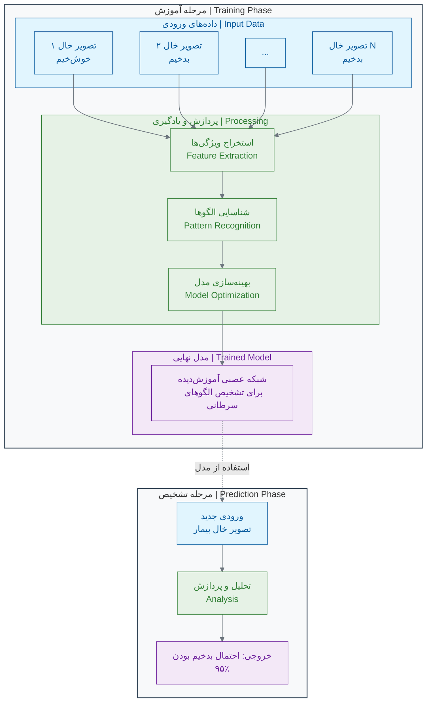

# فصل ۱: انقلاب جدید در زیست‌شناسی

## بخش ۱-۲: هوش مصنوعی چیست؟ یک تعریف ساده و کاربردی

در بخش قبل، دیدیم که چگونه علم زیست‌شناسی با یک "سونامی داده" روبرو شده و چرا به ابزارهای جدیدی برای تحلیل این داده‌ها نیاز داریم. آن ابزار جدید، هوش مصنوعی یا AI است. اما AI واقعاً چیست؟

وقتی اسم "هوش مصنوعی" را می‌شنوید، شاید یاد ربات‌های انسان‌نما در فیلم‌های علمی-تخیلی بیفتید. اما در واقعیت، هوش مصنوعی که ما امروز از آن استفاده می‌کنیم، بسیار کاربردی‌تر و ملموس‌تر است.

### 🎯 مسئله محوری این بخش:

فرض کنید می‌خواهید به یک کشاورز سنتی توضیح دهید که چگونه یک "مغز کامپیوتری" می‌تواند با دیدن عکس‌هایی که یک پهپاد از مزرعه گرفته، بیماری گیاهان را تشخیص دهد. آن کشاورز هیچ چیزی از کامپیوتر و الگوریتم نمی‌داند. هدف شما این نیست که جزئیات فنی را بگویید، بلکه می‌خواهید شهود و ایده اصلی پشت این جادو را منتقل کنید. از چه مثال یا استعاره‌ای استفاده می‌کنید؟

### 🤖 **یک تعریف ساده: هوش مصنوعی = تقلید از یادگیری انسان**

بیایید با یک مقایسه شروع کنیم. یک **پزشک متخصص پوست باتجربه** را در نظر بگیرید. او چگونه یک خال سرطانی را از یک خال خوش‌خیم تشخیص می‌دهد؟

1. **تجربه (آموزش):** او در طول سال‌ها، هزاران عکس از خال‌های مختلف دیده و به او گفته شده که کدام خوش‌خیم و کدام بدخیم بوده‌اند.
2. **یادگیری الگو:** مغز او به طور ناخودآگاه الگوهایی را یاد گرفته است. مثلاً "خال‌هایی با لبه‌های نامنظم" یا "خال‌هایی با رنگ غیریکنواخت" احتمالاً خطرناک هستند.
3. **تشخیص (پیش‌بینی):** وقتی یک خال جدید می‌بیند، مغزش آن را با الگوهای ذخیره شده در حافظه‌اش مقایسه می‌کند و یک تشخیص ارائه می‌دهد.
4. **یادگیری از اشتباه:** اگر تشخیص او اشتباه باشد (که توسط نمونه‌برداری تأیید می‌شود)، او این تجربه جدید را به حافظه‌اش اضافه می‌کند و در آینده دقیق‌تر عمل می‌کند.

**هوش مصنوعی دقیقاً همین فرآیند را تقلید می‌کند، اما در مقیاسی بسیار بزرگتر:**

- به جای هزاران عکس، به آن **میلیون‌ها عکس** نشان می‌دهیم.
- به جای مغز انسان، از **الگوریتم‌های ریاضی و قدرت محاسباتی** کامپیوترها استفاده می‌کند.
- به جای چند سال، در چند **ساعت یا چند روز** آموزش می‌بیند.
- **خسته نمی‌شود**، فراموش نمی‌کند و ۲۴ ساعته با دقت یکسان کار می‌کند.

> پس به زبان ساده، **هوش مصنوعی (در کاربرد امروزی) یعنی آموزش دادن به کامپیوترها برای تشخیص الگوها در داده‌ها، تا بتوانند بر اساس آن الگوها، پیش‌بینی یا تصمیم‌گیری کنند.**[1][2][3][4][5]

### 🎯 **مثال عملی ۱: تشخیص سرطان پوست با AI**

#### **مسئله واقعی:**

یک متخصص پوست به طور متوسط روزانه ۳۰ بیمار را ویزیت می‌کند. دقت تشخیص اولیه او برای سرطان پوست (ملانوما) بر اساس نگاه کردن، حدود ۸۵٪ است[6][7]. این یعنی از هر ۱۰۰ بیمار، ممکن است در تشخیص ۱۵ نفر اشتباه کند. این اشتباه می‌تواند کشنده باشد.

#### **راه‌حل با هوش مصنوعی:**

محققان دانشگاه استنفورد یک سیستم هوش مصنوعی را با **۱۳۰ هزار عکس** از خال‌های پوستی که تشخیص قطعی آن‌ها مشخص بود، "آموزش" دادند[6][8].

#### **نتایج شگفت‌انگیز:**

وقتی عملکرد این سیستم AI را با ۲۱ متخصص پوست مقایسه کردند، نتیجه خیره‌کننده بود: **دقت هوش مصنوعی در تشخیص، برابر یا حتی بهتر از متخصصان انسان بود**[6][8]. مطالعات بعدی نشان دادند که AI می‌تواند به دقت **۹۵٪ تا ۹۶٪** برسد[9][10][11].

> **نکته بسیار مهم:** این AI قرار نیست جایگزین پزشک شود. بلکه یک **ابزار کمکی فوق‌العاده قدرتمند** برای پزشک است[12][13][14]. پزشک می‌تواند از AI به عنوان "نظر دوم" استفاده کند تا دقت تشخیص خود را افزایش دهد و هیچ موردی را از دست ندهد. این یعنی همکاری انسان و ماشین برای رسیدن به بهترین نتیجه.

### 🔬 **مثال عملی ۲: کشف آنتی‌بیوتیک جدید با AI**

#### **مسئله سنتی:**

کشف یک داروی جدید به طور متوسط **۱۰ تا ۱۵ سال** زمان و بیش از **۲ میلیارد دلار** هزینه نیاز دارد[15][16]. یکی از دلایل این زمان طولانی، فرآیند غربالگری (Screening) است. دانشمندان باید هزاران یا میلیون‌ها ترکیب شیمیایی را در آزمایشگاه تست کنند تا شاید یکی از آن‌ها موثر باشد.

#### **انقلاب با هوش مصنوعی:**

در سال ۲۰۲۰، محققان MIT از هوش مصنوعی برای حل این مشکل استفاده کردند[17][18].

1. **آموزش:** آن‌ها یک مدل AI را با داده‌های ۲۵۰۰ ترکیب شیمیایی آموزش دادند تا یاد بگیرد کدام ساختارهای مولکولی می‌توانند باکتری _E. coli_ را از بین ببرند[18].
2. **غربالگری مجازی:** سپس از این مدل آموزش‌دیده خواستند که یک کتابخانه دیجیتال شامل **۱۰۰ میلیون ترکیب شیمیایی** را بررسی کند[17][18]!
3. **کشف:** هوش مصنوعی در عرض تنها **۳ روز**، یک مولکول بسیار قدرتمند به نام **هالیسین (Halicin)** را به عنوان یک آنتی‌بیوتیک بالقوه جدید شناسایی کرد که ساختار آن با تمام آنتی‌بیوتیک‌های شناخته‌شده متفاوت بود[17][19][18].

آزمایش‌های بعدی در آزمایشگاه نشان داد که هالیسین نه تنها _E. coli_ بلکه بسیاری از باکتری‌های مقاوم به داروهای دیگر، از جمله _Acinetobacter baumannii_ مقاوم به دارو و _Mycobacterium tuberculosis_ را نیز از بین می‌برد[20][19][18].

**مقایسه فرآیند:**

- **روش سنتی:** سال‌ها تحقیق و میلیون‌ها دلار هزینه.
- **روش AI:** سه روز پردازش کامپیوتری!

این یعنی AI می‌تواند فرآیند کشف دارو را به شدت تسریع کند و شانس ما را برای پیدا کردن درمان بیماری‌های جدید افزایش دهد[21][22][23].

### 📊 **انواع اصلی هوش مصنوعی در زیست‌شناسی**

کارهایی که از هوش مصنوعی در زیست‌شناسی می‌خواهیم، معمولا در یکی از این چهار دسته قرار می‌گیرند[24][25][26]:

| نوع AI                                  | سوالی که پاسخ می‌دهد              | مثال در زیست‌شناسی                                                   |
| :-------------------------------------- | :-------------------------------- | :------------------------------------------------------------------- |
| **۱. تشخیص الگو (Pattern Recognition)** | این داده شبیه کدام الگو است؟      | آیا این عکس بافت، الگوی سلول سرطانی را دارد؟[27][28][29]             |
| **۲. پیش‌بینی (Prediction)**            | در آینده چه اتفاقی می‌افتد؟       | آیا این بیمار به داروی X پاسخ مثبت خواهد داد؟[13][30]                |
| **۳. بهینه‌سازی (Optimization)**        | بهترین راه‌حل برای این مشکل چیست؟ | بهترین ساختار مولکولی برای اتصال به این پروتئین ویروسی چیست؟[31][16] |
| **۴. تولید (Generation)**               | یک نمونه جدید با این مشخصات بساز. | یک توالی پروتئین جدید طراحی کن که این عملکرد خاص را داشته باشد[31].  |

در اکثر موارد، این دسته‌ها با هم ترکیب می‌شوند. مثلا برای طراحی یک داروی جدید (بهینه‌سازی)، ابتدا باید الگوهای اتصال را یاد بگیریم (تشخیص الگو).

### 🔬 تمرین تحلیلی: شما نقش AI را بازی کنید!

حالا نوبت شماست که مثل یک ماشین فکر کنید.

#### **سناریو: تشخیص عفونت ادراری**

شما یک مدل هوش مصنوعی هستید که باید بر اساس داده‌های اولیه، وجود یا عدم وجود عفونت ادراری را تشخیص دهید. این داده‌های آموزشی شما هستند:

**🗂️ داده‌های آموزشی (۱۰ بیمار):**

| بیمار | سن  | جنسیت | تب دارد؟ | سوزش ادرار دارد؟ | تعداد گلبول سفید (در میکرولیتر خون) | تشخیص نهایی: عفونت دارد؟ |
| :---- | :-- | :---- | :------- | :--------------- | :---------------------------------- | :----------------------- |
| ۱     | ۲۵  | زن    | بله      | بله              | ۱۵,۰۰۰                              | **دارد**                 |
| ۲     | ۴۰  | مرد   | خیر      | خیر              | ۶,۰۰۰                               | **ندارد**                |
| ۳     | ۳۰  | زن    | بله      | بله              | ۲۰,۰۰۰                              | **دارد**                 |
| ۴     | ۵۰  | مرد   | خیر      | خیر              | ۵,۰۰۰                               | **ندارد**                |
| ۵     | ۲۰  | زن    | بله      | بله              | ۱۸,۰۰۰                              | **دارد**                 |
| ۶     | ۶۰  | مرد   | خیر      | **بله**          | ۷,۰۰۰                               | **ندارد**                |
| ۷     | ۳۵  | زن    | بله      | بله              | ۱۶,۰۰۰                              | **دارد**                 |
| ۸     | ۴۵  | مرد   | خیر      | خیر              | ۵,۵۰۰                               | **ندارد**                |
| ۹     | ۲۸  | زن    | بله      | بله              | ۱۹,۰۰۰                              | **دارد**                 |
| ۱۰    | ۳۸  | مرد   | **بله**  | خیر              | ۶,۵۰۰                               | **ندارد**                |

**مرحله ۱: کشف الگو (آموزش)**
با دقت به جدول نگاه کنید. به عنوان یک AI، شما به دنبال "قوانین" و "الگوها" هستید. چه الگوهایی پیدا می‌کنید؟

- **الگوی ۱:** اگر جنسیت "زن" باشد، تب "بله" باشد و سوزش ادرار "بله" باشد، احتمال عفونت خیلی بالاست.
- **الگوی ۲:** اگر تعداد گلبول سفید خیلی بالا باشد (مثلا > ۱۰,۰۰۰)، احتمال عفونت زیاد است[32][33][34].
- **الگوی ۳:** اگر جنسیت "مرد" باشد و تب و سوزش "خیر" باشد، احتمال عفونت خیلی کم است.
- **الگوی پیچیده‌تر:** به نظر می‌رسد هیچ‌کدام از این ویژگی‌ها به تنهایی کافی نیست (بیمار ۱۰ تب دارد ولی عفونت ندارد، بیمار ۶ سوزش ادرار دارد ولی عفونت ندارد). **ترکیب ویژگی‌ها** مهم است.

**مرحله ۲: تست (تشخیص)**
حالا یک بیمار جدید با داده‌های زیر به شما مراجعه کرده است. شما باید تشخیص دهید.

- **بیمار جدید:** سن: ۳۲ سال، جنسیت: زن، تب: بله، سوزش ادرار: بله، تعداد گلبول سفید: ۱۷,۰۰۰

**سوال: به عنوان یک مدل AI که بر اساس ۱۰ نمونه قبلی آموزش دیده، تشخیص شما چیست؟ چرا؟**

**مرحله ۳: درک محدودیت‌ها**
چرا تشخیص شما ممکن است ۱۰۰٪ قطعی نباشد؟ چه اطلاعات اضافی می‌توانست به شما کمک کند تا مدل بهتری بسازید؟ (مثلا: سابقه بیماری، نتایج کشت ادرار و...)

### 🚫 **باورهای غلط رایج درباره AI**

- **❌ باور غلط ۱: AI مانند انسان "فکر" می‌کند.**
  **واقعیت:** AI فکر نمی‌کند، احساس ندارد و خلاقیت به معنای انسانی ندارد[35][36][37]. AI یک ابزار بسیار قدرتمند برای **شناسایی الگوهای ریاضی** در داده‌هاست[2][38][39].

- **❌ باور غلط ۲: AI همیشه درست می‌گوید و هرگز اشتباه نمی‌کند.**
  **واقعیت:** دقت AI به شدت به **کیفیت و کمیت داده‌های آموزشی** آن بستگی دارد[36][40][41]. اگر داده‌های آموزشی ناقص یا دارای سوگیری باشند، AI هم همان اشتباهات را تکرار خواهد کرد. (به این می‌گویند: "Garbage in, garbage out" یا "آشغال بدی، آشغال تحویل می‌گیری").

- **❌ باور غلط ۳: AI قرار است جایگزین پزشکان و دانشمندان شود.**
  **واقعیت:** خیر. موفق‌ترین کاربردهای AI در **همکاری انسان و ماشین** است[12][13][14][30]. AI کارهای تکراری و تحلیلی را با سرعت بالا انجام می‌دهد و به انسان اجازه می‌دهد تا بر تفکر خلاق، تصمیم‌گیری نهایی و تعامل انسانی تمرکز کند.

### 💡 نکات کلیدی این بخش

- **AI تقلیدگر است:** هوش مصنوعی از فرآیند یادگیری انسان (تجربه -> الگو -> پیش‌بینی) تقلید می‌کند[1][2][3].
- **AI با داده کار می‌کند:** سوخت اصلی هوش مصنوعی، داده است[42][43][44]. هرچه داده بیشتر و باکیفیت‌تر باشد، AI هوشمندتر می‌شود.
- **AI یک ابزار است:** AI جایگزین تفکر انسان نیست، بلکه ابزاری برای تقویت و افزایش توانایی‌های ماست[12][13][14].
- **کاربردهای اصلی:** مهم‌ترین کاربردهای AI در زیست‌شناسی شامل تشخیص الگو، پیش‌بینی، بهینه‌سازی و تولید داده‌های جدید است[24][25][26][45].

حالا که یک درک کلی از چیستی هوش مصنوعی پیدا کردیم، در بخش بعدی به سراغ اولین ماده اولیه و مهم‌ترین بخش این پازل می‌رویم: **داده!** بیایید ببینیم "انقلاب داده" در زیست‌شناسی دقیقاً به چه معناست.

---

## **منابع**

[1] https://meng.uic.edu/news-stories/ai-artificial-intelligence-what-is-the-definition-of-ai-and-how-does-ai-work/
[2] https://www.techtarget.com/searchenterpriseai/definition/AI-Artificial-Intelligence
[3] https://www.coursera.org/articles/what-is-artificial-intelligence
[4] https://www.nasa.gov/what-is-artificial-intelligence/
[5] https://www.ibm.com/think/topics/artificial-intelligence
[6] https://news.stanford.edu/stories/2017/01/artificial-intelligence-used-identify-skin-cancer
[7] https://pmc.ncbi.nlm.nih.gov/articles/PMC10571810/
[8] https://cs.stanford.edu/people/esteva/nature/
[9] https://jamanetwork.com/journals/jamanetworkopen/fullarticle/2752995
[10] https://academic.oup.com/bjd/article/191/1/125/7564904
[11] https://www.ajmc.com/view/ai-based-smartphone-app-proves-reliable-in-diagnosis-of-melanoma
[12] https://www.nature.com/articles/s41598-022-18751-2
[13] https://www.weforum.org/stories/2024/04/human-ai-system-collaboration-equitable-healthcare/
[14] https://clanx.ai/glossary/human-ai-colaboration
[15] https://www.vox.com/future-perfect/23827785/artifical-intelligence-ai-drug-discovery-medicine-pharmaceutical
[16] https://pmc.ncbi.nlm.nih.gov/articles/PMC8356896/
[17] https://researchmatics.com/articles/halicin-ai-powered-revolution-in-antibiotic-discovery--dc11
[18] https://news.mit.edu/2020/artificial-intelligence-identifies-new-antibiotic-0220
[19] https://en.wikipedia.org/wiki/Halicin
[20] https://pmc.ncbi.nlm.nih.gov/articles/PMC8698312/
[21] https://pmc.ncbi.nlm.nih.gov/articles/PMC11200959/
[22] https://www.nature.com/articles/s44259-024-00068-x
[23] https://www.nature.com/articles/s44259-025-00085-4
[24] https://www.v7labs.com/blog/pattern-recognition-guide
[25] https://viso.ai/deep-learning/pattern-recognition/
[26] https://labelyourdata.com/articles/pattern-recognition
[27] https://lumenalta.com/insights/15-computer-vision-applications-in-healthcare
[28] https://www.nature.com/articles/s41746-020-00376-2
[29] https://springsapps.com/knowledge/using-computer-vision-in-medicine-full-guide-and-real-examples
[30] https://arxiv.org/abs/2501.16255
[31] https://med.stanford.edu/news/all-news/2024/03/ai-drug-development.html
[32] https://www.nhs.uk/conditions/urinary-tract-infections-utis/
[33] https://www.hopkinsmedicine.org/health/conditions-and-diseases/urinary-tract-infections
[34] https://www.cdc.gov/uti/about/index.html
[35] https://ctomagazine.com/the-8-most-common-ai-myths/
[36] https://www.nele.ai/en/ai-updates-news/mythen-und-missverstandnisse-rund-um-ki
[37] https://365datascience.com/trending/ai-myths-debunked/
[38] https://en.wikipedia.org/wiki/Artificial_intelligence
[39] https://learning.nd.edu/resource-library/ai-overview-and-definitions/
[40] https://www.gartner.com/smarterwithgartner/5-ai-myths-debunked
[41] https://www.scu.edu/ethics/healthcare-ethics-blog/human-ai-collaboration-in-health-care/
[42] https://www.ibm.com/think/topics/supervised-vs-unsupervised-learning
[43] https://www.v7labs.com/blog/supervised-vs-unsupervised-learning
[44] https://aws.amazon.com/compare/the-difference-between-machine-learning-supervised-and-unsupervised/
[45] https://focalx.ai/ai/pattern-recognition-definitions-applications-and-examples/
[46] https://ventionteams.com/healthtech/computer-vision
[47] https://www.coursera.org/articles/pattern-recognition
[48] https://binariks.com/blog/computer-vision-in-healthcare/
[49] https://pareto.ai/blog/pattern-recognition-in-machine-learning/
[50] https://www.leewayhertz.com/pattern-recognition/
[51] https://www.geeksforgeeks.org/machine-learning/pattern-recognition-introduction/
[52] https://viso.ai/applications/computer-vision-in-healthcare/
[53] https://www.microsoft.com/en-us/research/wp-content/uploads/2006/01/Bishop-Pattern-Recognition-and-Machine-Learning-2006.pdf
[54] https://thunderword.highline.edu/2024/10/10/ai-revolutionizes-skin-cancer-diagnosis-at-stanford-medicine/
[55] https://engineering.jhu.edu/news/using-computer-vision-to-catch-early-stage-skin-cancer/
[56] https://med.stanford.edu/news/all-news/2024/04/ai-skin-diagnosis.html
[57] https://arxiv.org/abs/2407.18554
[58] https://pmc.ncbi.nlm.nih.gov/articles/PMC7153112/
[59] https://www.youtube.com/watch?v=HXK8G0Yyw-8
[60] https://www.frontiersin.org/journals/oncology/articles/10.3389/fonc.2023.1151257/full
[61] https://news.cs.washington.edu/2024/02/20/more-than-skin-deep-allen-school-and-stanford-researchers-create-framework-for-auditing-ai-image-classifiers-for-detecting-melanoma/
[62] https://www.nature.com/articles/s41467-025-59532-5
[63] https://pmc.ncbi.nlm.nih.gov/articles/PMC9864434/
[64] https://pmc.ncbi.nlm.nih.gov/articles/PMC11415605/
[65] https://www.nature.com/articles/s41598-024-61681-4
[66] https://pubmed.ncbi.nlm.nih.gov/38594408/
[67] https://www.nature.com/articles/s43856-024-00598-5
[68] https://news.mit.edu/2020/mit-conference-reveals-power-using-artificial-intelligence-discover-new-drugs-0427
[69] https://news.mit.edu/2023/using-ai-mit-researchers-identify-antibiotic-candidates-1220
[70] https://mlpds.mit.edu
[71] https://www.frontiersin.org/journals/microbiology/articles/10.3389/fmicb.2024.1437602/full
[72] https://www.jsr.org/hs/index.php/path/article/view/6572
[73] https://pubmed.ncbi.nlm.nih.gov/33386097/
[74] https://news.mit.edu/2023/using-ai-scientists-combat-drug-resistant-infections-0525
[75] https://chandrakasan.mit.edu/category/2020/
[76] https://pmc.ncbi.nlm.nih.gov/articles/PMC8614913/
[77] https://mlpds.mit.edu/blog/
[78] https://pmc.ncbi.nlm.nih.gov/articles/PMC11144045/
[79] https://www.usertesting.com/glossary/s/supervised-unsupervised-and-semi-supervised-machine-learning-ml
[80] https://www.oaepublish.com/articles/ais.2021.15
[81] https://www.pecan.ai/blog/3-types-of-machine-learning/
[82] https://www.geeksforgeeks.org/machine-learning/supervised-unsupervised-learning/
[83] https://www.sciencedirect.com/science/article/pii/S2949866X24000662
[84] https://www.britannica.com/technology/artificial-intelligence
[85] https://www.simplilearn.com/tutorials/machine-learning-tutorial/supervised-and-unsupervised-learning
[86] https://careful.online/medical-imaging-diagnostics-ai-neural-networks-computer-vision-deep-learning/
[87] https://sebastianraschka.com/Articles/2014_intro_supervised_learning.html
[88] https://scholarspace.manoa.hawaii.edu/items/48162f4c-8c99-47dc-8fb5-fe74e9cbb51d
[89] https://en.wikipedia.org/wiki/Pattern_recognition
[90] https://www.blueprism.com/resources/blog/ai-myths-misconceptions/
[91] https://www.sciencedirect.com/science/article/pii/S2666920X2300022X
[92] https://codewave.com/insights/pattern-recognition-machine-learning/
[93] https://www.digitallearninginstitute.com/blog/myths-ai-learning
[94] https://pmc.ncbi.nlm.nih.gov/articles/PMC10853856/
[95] https://prevent-and-protect.com/pathogen/acinetobacter-baumannii/
[96] https://www.infectiousdiseaseadvisor.com/ddi/acinetobacter/
[97] https://pmc.ncbi.nlm.nih.gov/articles/PMC11460753/
[98] https://academic.oup.com/femspd/article/71/3/292/475786
[99] https://www.nice.org.uk/advice/mib311/chapter/Clinical-and-technical-evidence
[100] https://www.frontiersin.org/journals/microbiology/articles/10.3389/fmicb.2019.01601/full
[101] https://www.webmd.com/women/your-guide-urinary-tract-infections
[102] https://pmc.ncbi.nlm.nih.gov/articles/PMC9760861/
[103] https://pmc.ncbi.nlm.nih.gov/articles/PMC3442836/
[104] https://nyulangone.org/conditions/urinary-tract-infections/diagnosis
[105] https://www.frontiersin.org/journals/medicine/articles/10.3389/fmed.2021.637069/full
[106] https://pmc.ncbi.nlm.nih.gov/articles/PMC8003822/
[107] https://my.clevelandclinic.org/health/diseases/9135-urinary-tract-infections
[108] https://www.nature.com/articles/s41598-024-84864-5
[109] https://www.cdc.gov/acinetobacter/about/index.html
[110] https://www.mayoclinic.org/diseases-conditions/urinary-tract-infection/symptoms-causes/syc-20353447
