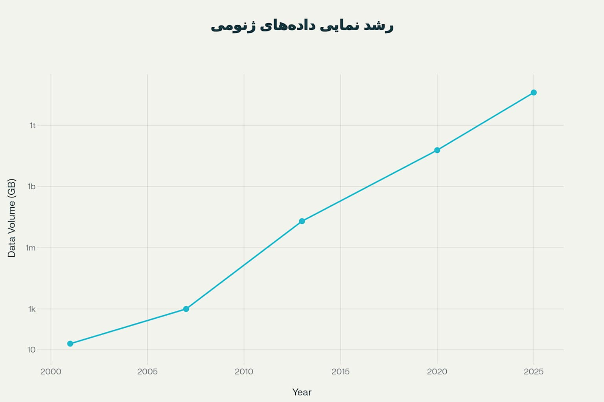
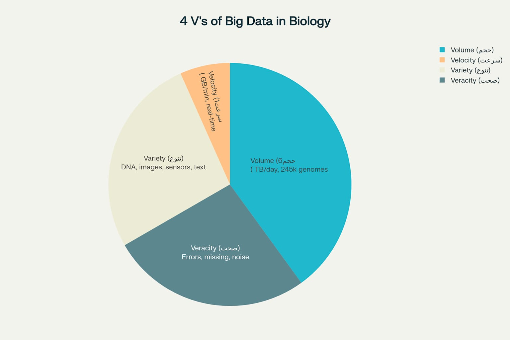

[← بخش ۱-۲: هوش مصنوعی چیست؟ یک شهود برای زیست‌شناسان](./02-what-is-ai-for-biologists.md) | [بخش ۱-۴: مطالعه موردی: تشخیص سرطان با چشم‌های مصنوعی →](./04-case-study-cancer-detection.md)

# فصل ۱: انقلاب جدید در زیست‌شناسی

## بخش ۱-۳: سونامی داده: انقلاب داده در زیست‌شناسی

در بخش‌های قبل، با داستان پروژه ژنوم انسان و تعریف ساده‌ای از هوش مصنوعی آشنا شدیم. گفتیم که سوخت اصلی هوش مصنوعی، "داده" است. حالا می‌خواهیم ببینیم این "داده" در دنیای زیست‌شناسی چه ابعادی دارد. آماده باشید تا با یک پدیده شگفت‌انگیز و کمی ترسناک به نام **"سونامی داده"** آشنا شوید.

### 🎯 مسئله محوری این بخش:

ما در جهانی زندگی می‌کنیم که یک دستگاه آزمایشگاهی می‌تواند در یک روز، داده‌ای بیشتر از کل داده‌های تولید شده در یک رشته علمی در یک سال در قرن گذشته تولید کند. این پدیده که به آن "انفجار داده" می‌گویند، هم یک فرصت بزرگ و هم یک چالش عظیم است. به نظر شما، چالش‌های اصلی کار با این حجم از اطلاعات در زیست‌شناسی چیست؟ چگونه می‌توان از این اقیانوس داده، مرواریدهای دانش را صید کرد؟

### **از قطره تا اقیانوس: مقایسه دو دوران**

#### **دوران قدیم (قبل از سال ۲۰۰۰): عصر کمبود داده**

تصور کنید شما یک محقق زیست‌شناسی در سال ۱۹۸۰ هستید.

- **پروژه تحقیقاتی شما:** بررسی اثر یک دارو بر روی ۱۰ موش آزمایشگاهی.
- **جمع‌آوری داده:** شما به مدت ۶ ماه، هفته‌ای یک بار از این موش‌ها خون می‌گیرید و چند فاکتور خونی را با دست اندازه می‌گیرید.
- **حجم داده:** کل داده‌های پروژه شما شاید در چند صفحه کاغذ یا یک فلاپی دیسک ۱.۴۴ مگابایتی جا شود.
- **تحلیل:** شما داده‌ها را با یک ماشین حساب مهندسی و با کشیدن نمودار روی کاغذ میلی‌متری تحلیل می‌کنید.
- **نتیجه:** بعد از چند سال، شاید بتوانید یک مقاله علمی منتشر کنید.

در آن دوران، مشکل اصلی **کمبود داده** بود. جمع‌آوری داده‌ها بسیار سخت، زمان‌بر و گران بود.

#### **دوران جدید (بعد از سال ۲۰۰۰): عصر انفجار داده**

حالا به سال ۲۰۲۵ برگردیم. یک آزمایشگاه ژنتیک مدرن را در نظر بگیرید.

- **یک دستگاه توالی‌یابی (Sequencer):** یک دستگاه مدرن مانند Illumina NovaSeq X می‌تواند در یک روز، تا **۶۴ ژنوم کامل انسان** را بخواند[1][2]. این یعنی تولید حدود **۸ ترابایت (۸۰۰۰ گیگابایت)** داده فقط در ۲۴ ساعت!
- **یک پروژه تحقیقاتی:** پروژه‌ای مانند UK Biobank، ژنوم کامل **۵۰۰ هزار نفر** را به همراه اطلاعات پزشکی کامل آن‌ها ذخیره کرده است که حجم این داده‌ها به **چندین پتابایت (میلیون‌ها گیگابایت)** می‌رسد[3][4][5].

_نمودار رشد نمایی داده‌های ژنومی ذخیره شده در جهان از سال ۲۰۰۱ تا ۲۰۲۵_

> **مقیاس‌ها:**
>
> - **ترابایت (TB):** ۱۰۰۰ گیگابایت
> - **پتابایت (PB):** ۱۰۰۰ ترابایت
> - **اگزابایت (EB):** ۱۰۰۰ پتابایت
> - **زتابایت (ZB):** ۱۰۰۰ اگزابایت (معادل یک میلیارد ترابایت!)

این رشد انفجاری فقط محدود به ژنومیک نیست. طبق تحقیقات، میزان داده‌های ژنومی تولیدی در حال حاضر هر **۷ ماه دو برابر** می‌شود و تا سال ۲۰۲۵ بین **۲ تا ۴۰ اگزابایت** خواهد رسید[6][7].

### 🔬 **منابع اصلی تولید این سونامی داده**

1. **ژنومیکس، پروتئومیکس و سایر -omicsها:**
   - **توالی‌یابی نسل جدید (NGS):** ستون فقرات این انقلاب است. هزینه کم و سرعت بالای آن، امکان بررسی ژنوم (DNA)، ترانسکریپتوم (RNA) و اپی‌ژنوم (تغییرات روی DNA) را در مقیاس وسیع فراهم کرده است[8][9].
   - **طیف‌سنجی جرمی (Mass Spectrometry):** این فناوری به ما اجازه می‌دهد هزاران پروتئین و متابولیت را در یک نمونه به طور همزمان بررسی کنیم (پروتئومیکس و متابولومیکس).
2. **تصویربرداری پزشکی با وضوح بالا:**
   - دستگاه‌های MRI, CT-Scan و PET-Scan امروزی تصاویری با جزئیات باورنکردنی از داخل بدن تولید می‌کنند. یک اسکن کامل بدن می‌تواند **چندین گیگابایت** حجم داشته باشد[10][11].
   - **Pathology دیجیتال:** اسکن کردن کامل یک نمونه بافت زیر میکروسکوپ و تبدیل آن به یک تصویر دیجیتال غول‌پیکر (با حجم چند گیگابایت)، به یک استاندارد جدید تبدیل می‌شود.
3. **اینترنت اشیاء پزشکی (IoMT - Internet of Medical Things):**
   - **دستگاه‌های پوشیدنی:** ساعت‌های هوشمند، مانیتورهای قند خون، حسگرهای ضربان قلب و... به طور مداوم در حال جمع‌آوری داده از بدن ما هستند. بازار IoT پزشکی از **۸۲.۴ میلیارد دلار در ۲۰۲۴** به **۹۷۱ میلیارد دلار تا ۲۰۳۴** خواهد رسید[12].
4. **پرونده‌های الکترونیک سلامت (EHR - Electronic Health Records):**
   - تمام سوابق پزشکی ما، از نتایج آزمایش خون گرفته تا داروهای مصرفی و یادداشت‌های پزشک، به تدریج در حال دیجیتالی شدن هستند. این یک منبع داده عظیم و البته بسیار پیچیده و نامنظم است. بازار ذخیره‌سازی داده‌های سلامت از **۵.۴۹ میلیارد دلار در ۲۰۲۴** به **۲۰.۹۸ میلیارد دلار تا ۲۰۳۴** خواهد رسید[13].

### ⚡ **چالش‌های بزرگ داده‌های زیستی (The 4 V's of Big Data)**

دانشمندان برای توصیف چالش‌های کار با "داده‌های بزرگ (Big Data)" از مدلی به نام **"4 V's"** استفاده می‌کنند. بیایید این مدل را در دنیای زیست‌شناسی بررسی کنیم.

_مدل 4V: چهار چالش اصلی داده‌های بزرگ در زیست‌شناسی_

#### **۱. حجم (Volume): حجم سرسام‌آور**

- **مقایسه:** حجم داده‌های تولید شده در زیست‌شناسی از صنایع دیگری مانند نجوم و حتی شبکه‌های اجتماعی (مثل یوتیوب و فیسبوک) پیشی گرفته است[7].
- **چالش:** چگونه این حجم عظیم از داده را ذخیره کنیم؟ هارد دیسک‌های معمولی کافی نیستند. ما به مراکز داده (Data Centers) عظیم و سیستم‌های ذخیره‌سازی ابری (Cloud Storage) نیاز داریم که خود نیازمند هزینه و انرژی بسیار زیادی است[14][15].

#### **۲. سرعت (Velocity): سرعت تولید دیوانه‌وار**

- **مثال:** یک دستگاه توالی‌یابی مدرن Illumina NovaSeq X با سرعتی نزدیک به **۱ گیگابایت در دقیقه** داده تولید می‌کند[16][1].
- **چالش:** تحلیل داده‌ها باید با سرعت تولید آن‌ها هماهنگ باشد، وگرنه داده‌ها به سرعت روی هم انباشته شده و تحلیل‌نشده باقی می‌مانند. ما به سیستم‌های **پردازش آنی (Real-time processing)** نیاز داریم که بتوانند همزمان با ورود داده، آن را تحلیل کنند[9].

#### **۳. تنوع (Variety): انواع گوناگون داده**

- داده‌های زیستی فقط عدد و رقم نیستند. ما با انواع بسیار متنوعی از داده‌ها روبرو هستیم:
  - **متن:** توالی DNA (رشته‌ای از حروف A,T,C,G)، مقالات علمی، یادداشت‌های پزشک.
  - **تصویر:** عکس‌های CT-Scan، MRI، تصاویر میکروسکوپی.
  - **سیگنال:** داده‌های نوار قلب (ECG) یا نوار مغز (EEG) که به صورت امواج هستند.
  - **داده‌های ساختاریافته:** جداولی مانند نتایج آزمایش خون.
  - **گراف‌ها و شبکه‌ها:** شبکه‌های تعاملات بین پروتئین‌ها یا شبکه‌های متابولیک[17].
- **چالش:** چگونه می‌توان این انواع مختلف داده را با هم یکپارچه و تحلیل کرد؟ نمی‌توان یک عکس MRI را با یک توالی DNA با یک روش یکسان تحلیل کرد.

#### **۴. صحت (Veracity): عدم قطعیت و خطای داده**

- **واقعیت:** داده‌های زیستی هرگز ۱۰۰٪ تمیز و دقیق نیستند.
  - **خطای توالی‌یابی:** دستگاه ممکن است در خواندن برخی حروف DNA اشتباه کنند[18].
  - **خطای انسانی:** ممکن است برچسب یک نمونه در آزمایشگاه اشتباه بخورد.
  - **نویز بیولوژیک:** بدن انسان یک سیستم پویا و پیچیده است. سطح یک فاکتور خونی در صبح و شب می‌تواند متفاوت باشد.
  - **داده‌های ناقص (Missing Data):** بسیاری از پرونده‌های پزشکی، اطلاعات کاملی ندارند[17].
- **چالش:** چگونه می‌توانیم با وجود این "کثیفی" و عدم قطعیت در داده‌ها، به نتایج قابل اعتماد برسیم؟ الگوریتم‌های ما باید به اندازه‌ای هوشمند باشند که بتوانند نویز را از سیگنال واقعی تشخیص دهند.

### 🤖 **و باز هم... ضرورت هوش مصنوعی**

حالا بهتر می‌توانیم درک کنیم که چرا هوش مصنوعی دیگر یک انتخاب لوکس نیست، بلکه یک **ضرورت مطلق** در زیست‌شناسی مدرن است.

- **برای مقابله با Volume:** الگوریتم‌های AI می‌توانند حجم عظیمی از داده را در زمان کوتاه پردازش کنند، کاری که برای انسان غیرممکن است. بازار تحلیل داده‌های NGS با نرخ رشد سالانه **۲۳.۱٪** در حال گسترش است[9].
- **برای مقابله با Velocity:** سیستم‌های هوشمند می‌توانند به صورت آنی داده‌ها را تحلیل کرده و هشدار دهند (مثلاً تشخیص فوری یک آریتمی قلبی خطرناک از روی داده‌های ساعت هوشمند)[19].
- **برای مقابله با Variety:** مدل‌های پیشرفته AI (مانند مدل‌های چندوجهی یا Multimodal) می‌توانند یاد بگیرند که انواع مختلف داده (مثلاً عکس، متن و داده ژنتیک) را با هم ترکیب کرده و به یک درک جامع از وضعیت بیمار برسند[20].
- **برای مقابله با Veracity:** الگوریتم‌های هوشمند می‌توانند الگوهای خطا را در داده‌ها شناسایی کرده، داده‌های ناقص را به طور منطقی تخمین بزنند (Imputation) و نتایج را با درجه‌ای از اطمینان (Confidence score) ارائه دهند[21].

### 🔬 تمرین تحلیلی: مدیریت داده در یک پروژه تحقیقاتی

#### **سناریو:**

شما به یک تیم تحقیقاتی برای بررسی دلایل ژنتیکی بیماری دیابت نوع ۲ پیوسته‌اید.

**برنامه پروژه:**

1. جمع‌آوری نمونه از **۱۰۰۰ بیمار** دیابتی و **۱۰۰۰ فرد سالم** (گروه کنترل).
2. برای هر فرد، موارد زیر جمع‌آوری می‌شود:
   - **توالی کامل ژنوم (WGS):** حجم تقریبی ۱۰۰ گیگابایت برای هر نفر[22][23].
   - **نتایج آزمایش خون:** شامل ۵۰ فاکتور مختلف (قند خون، انسولین و...)، حجم تقریبی ۱۰ کیلوبایت برای هر نفر.
   - **پرسشنامه سبک زندگی:** شامل ۱۰۰ سوال در مورد رژیم غذایی و ورزش، حجم تقریبی ۵ کیلوبایت برای هر نفر.
   - **داده‌های ساعت هوشمند:** به مدت یک ماه، داده‌های فعالیت و خواب جمع‌آوری می‌شود، حجم تقریبی ۳۰ مگابایت برای هر نفر.

#### **سوالات:**

1. **محاسبه Volume:** حجم کل داده‌های این پروژه **۱۹۵.۴ ترابایت** خواهد بود (تقریباً ۲۰۰ ترابایت).
2. **تحلیل Variety:** حداقل ۴ نوع مختلف از داده در این پروژه:
   - **داده‌های توالی‌یابی:** رشته‌های DNA (A,T,C,G)
   - **داده‌های عددی ساختاریافته:** نتایج آزمایش خون
   - **داده‌های متنی:** پاسخ‌های پرسشنامه
   - **داده‌های سری زمانی:** اطلاعات ساعت هوشمند
3. **تحلیل Veracity:** مشکلات احتمالی صحت داده:
   - **خطای توالی‌یابی:** دستگاه ممکن است در خواندن برخی نوکلئوتیدها اشتباه کند
   - **داده‌های ناقص:** برخی شرکت‌کنندگان ممکن است پرسشنامه را کامل پر نکنند یا ساعت هوشمند خود را همیشه نپوشند
4. **چالش اصلی:** بزرگترین چالش **یکپارچه‌سازی و تحلیل همزمان** انواع مختلف داده خواهد بود. هوش مصنوعی می‌تواند با ایجاد مدل‌های چندوجهی (Multimodal) که قابلیت پردازش همزمان انواع مختلف داده را دارند، به حل این مشکل کمک کند[24].

### 💡 نکات کلیدی این بخش

- **انفجار داده یک واقعیت است:** حجم، سرعت و تنوع داده‌های زیستی به شکل نمایی در حال رشد است. طبق تحقیقات، داده‌های ژنومی سالانه حدود **۲۰ اگزابایت** تولید می‌شوند که ۴۰ برابر بیشتر از یوتیوب است[25].
- **چالش‌های 4V's:** این چهار ویژگی، تحلیل داده‌های زیستی را بسیار پیچیده می‌کنند و نیاز به ابزارهای پیشرفته دارند.
- **محدودیت‌های روش‌های سنتی:** نرم‌افزارهای آماری کلاسیک و تحلیل‌های دستی برای این مقیاس از داده طراحی نشده‌اند.
- **AI به عنوان راه‌حل:** هوش مصنوعی ابزارهای لازم برای مدیریت این چهار چالش و استخراج دانش از این اقیانوس داده را در اختیار ما قرار می‌دهد. بازار بیوانفورماتیک از **۱۴.۲۹ میلیارد دلار در ۲۰۲۴** به **۵۰.۲۵ میلیارد دلار تا ۲۰۳۴** خواهد رسید[26].
- **هزینه‌های ذخیره‌سازی:** در حالی که هزینه ذخیره‌سازی به شدت کاهش یافته (از ۱۲۴۰ دلار برای هر ترابایت در ۲۰۰۶ به ۵۰ دلار در ۲۰۲۴)[27][28]، اما حجم عظیم داده‌ها همچنان چالش‌های مالی و فنی قابل توجهی ایجاد می‌کند.

در بخش بعدی، به سراغ یک مطالعه موردی جذاب خواهیم رفت تا ببینیم هوش مصنوعی در عمل چگونه با یکی از پیچیده‌ترین انواع داده‌های زیستی، یعنی تصاویر پزشکی، برای تشخیص سرطان مبارزه می‌کند.

---

## **منابع**

[1] https://www.amgenbiotechexperience.com/explosion-data-science-biotechnology
[2] https://www.biostars.org/p/9575324/
[3] https://www.technologyreview.com/2015/10/26/165419/how-do-genome-sequencing-centers-store-such-huge-amounts-of-data/
[4] https://www.gsk.com/en-gb/behind-the-science-magazine/ai-ml-data-computing-power/
[5] https://www.genome.gov/about-genomics/fact-sheets/Genomic-Data-Science
[6] https://www.strand-ngs.com/support/ngs-data-storage-requirements
[7] https://blog.crownbio.com/2025-and-beyond-the-future-of-genomic-data-analysis-and-innovations-in-genomics-services
[8] https://www.grandviewresearch.com/industry-analysis/genomics-market
[9] https://pmc.ncbi.nlm.nih.gov/articles/PMC3083090/
[10] https://journals.plos.org/plosbiology/article?id=10.1371%2Fjournal.pbio.3003152
[11] https://www.biospace.com/genomics-market-size-to-hit-usd-157-47-billion-by-2033
[12] https://sequencing.com/blog/post/how-to-use-genome-sequencing-data-files
[13] https://newsletter.baratunde.com/p/10-predictions-for-2024-ai-explosion
[14] https://www.nature.com/articles/s41586-023-06957-x
[15] https://www.genome.gov/about-genomics/fact-sheets/DNA-Sequencing-Costs-Data
[16] https://www.nature.com/articles/d41586-025-01592-0
[17] https://www.rootsanalysis.com/reports/genomics-market.html
[18] https://www.illumina.com/techniques/sequencing/dna-sequencing/whole-genome-sequencing.html
[19] https://academic.oup.com/nar/article/52/D1/D1/7456037
[20] https://3billion.io/blog/big-data-among-big-data-genome-data
[21] https://www.youtube.com/watch?v=s5p0JpR6QfY
[22] https://formtek.com/blog/health-care-ehr-data-storage-costs-to-be-minimal/
[23] https://www.illumina.com/systems/sequencing-platforms/novaseq-x-plus/specifications.html
[24] https://pmc.ncbi.nlm.nih.gov/articles/PMC2989618/
[25] https://www.precedenceresearch.com/healthcare-data-storage-market
[26] https://www.illumina.com/systems/sequencing-platforms/novaseq-x-plus/applications/broad-sequencing.html
[27] https://www.grandviewresearch.com/industry-analysis/next-generation-sequencing-ngs-data-analysis-market
[28] https://dhinsights.org/blog/back-to-the-future-why-on-premises-healthcare-data-storage-matters-again/
[29] https://investor.illumina.com/news/press-release-details/2025/Illumina-advances-NovaSeq-X-Series-delivering-single-flow-cell-system-software-upgrade-and-new-kits-to-enable-multiomic-applications/default.aspx
[30] https://pmc.ncbi.nlm.nih.gov/articles/PMC10376292/
[31] https://www.ibm.com/think/insights/cost-of-a-data-breach-healthcare-industry
[32] https://investor.illumina.com/news/press-release-details/2023/Illuminas-revolutionary-NovaSeq-X-exceeds-200th-order-milestone-in-first-quarter-2023/default.aspx
[33] https://www.bumc.bu.edu/microarray/pricing/illumina-pricing/
[34] https://news.ku.dk/all_news/2024/03/health-data-storage-has-a-climate-cost.-in-the-future-data-may-be-stored-in-dna/
[35] https://www.illumina.com/company/news-center/press-releases/press-release-details.html?newsid=8d04df3f-d9c1-4c85-8177-6ea604627ccd
[36] https://pmc.ncbi.nlm.nih.gov/articles/PMC12153493/
[37] https://www.illumina.com/systems/sequencing-platforms/novaseq-x-plus/applications/transition.html
[38] https://www.decibio.com/product/next-generation-sequencing-ngs-market-assessment-report
[39] https://www.science.org/content/article/uk-biobank-releases-half-million-whole-genome-sequences-biomedical-research
[40] https://dcmsys.com/project/medical-imaging-data-storage-hot-warm-or-cold/
[41] https://binariks.com/blog/iot-healthcare-automated-data-collection/
[42] https://www.ukri.org/news/worlds-largest-genetic-project-unveils-incredible-new-data/
[43] https://www.dicomdirector.com/best-medical-image-data-storage-option-five-factors-to-consider/
[44] https://ordr.net/article/iot-healthcare-examples
[45] https://www.ukbiobank.ac.uk/enable-your-research/about-our-data/genetic-data
[46] https://blog.medicai.io/en/medical-imaging-storage-improving-the-management-and-preservation/
[47] https://www.towardshealthcare.com/insights/healthcare-iot-security-market-sizing
[48] https://www.nature.com/articles/s41586-018-0579-z
[49] https://pmc.ncbi.nlm.nih.gov/articles/PMC10958697/
[50] https://www.marketsandmarkets.com/Market-Reports/iot-healthcare-market-160082804.html
[51] https://en.wikipedia.org/wiki/UK_Biobank
[52] https://www2.rsna.org/re/twotopicimagingworkshoppresentations/index%20files/sunderland%20panel%20mgmt%20of%20data.pdf
[53] https://www.marketsandmarkets.com/Market-Reports/iot-medical-device-market-15629287.html
[54] https://www.nature.com/articles/s41586-022-04965-x
[55] https://www.ramsoft.com/blog/medical-image-storage-management
[56] https://www.precedenceresearch.com/iot-medical-devices-market
[57] https://www.ukbiobank.ac.uk/enable-your-research/about-our-data
[58] https://www.scality.com/use-cases/medical-imaging-archive/
[59] https://www.reddit.com/r/genetics/comments/1f3hsba/why_would_a_human_genome_need_300gb_of_data/
[60] https://stackoverflow.com/questions/8954571/how-much-storage-would-be-required-to-store-a-human-genome
[61] https://www.annualreviews.org/content/journals/10.1146/annurev-biodatasci-122120-104825
[62] https://pmc.ncbi.nlm.nih.gov/articles/PMC1526419/
[63] https://www.pbs.org/wgbh/nova/genome/facts.html
[64] https://www.researchallofus.org
[65] https://www.statista.com/statistics/1085166/genomics-data-increase-worldwide-in-gb-per-year/
[66] http://www.nature.com/scitable/topicpage/dna-sequencing-technologies-key-to-the-human-828
[67] https://www.researchallofus.org/data-tools/
[68] https://www.cshl.edu/the-biggest-beast-in-the-big-data-forest-one-field-s-astonishing-growth-is-well-genomical/
[69] https://www.nih.gov/news-events/nih-research-matters/first-complete-sequence-human-genome
[70] https://allofus.nih.gov/article/announcement-all-of-us-adds-data-from-50-more-participants-in-largest-data-expansion-to-date
[71] https://pmc.ncbi.nlm.nih.gov/articles/PMC6926122/
[72] https://allofus.nih.gov/article/announcement-all-us-returns-health-related-dna-results-100000-participants
[73] https://www.genome.gov/about-genomics/educational-resources/fact-sheets/human-genome-project
[74] https://www.sciencedirect.com/science/article/pii/S2666389922001817
[75] https://www.purview.net/blog/how-much-does-a-new-pacs-cost
[76] https://www.biospace.com/press-releases/bioinformatics-market-size-leads-13-73-cagr-to-hit-47-48-bn-by-2034
[77] https://www.numberanalytics.com/blog/visualizing-biomedical-data-cloud-step-by-step
[78] https://pmc.ncbi.nlm.nih.gov/articles/PMC3097744/
[79] https://straitsresearch.com/report/bioinformatics-market
[80] https://www.postdicom.com/en/services/cloud-medical
[81] https://pmc.ncbi.nlm.nih.gov/articles/PMC3045175/
[82] https://www.grandviewresearch.com/industry-analysis/bioinformatics-industry
[83] https://blog.box.com/benefits-of-cloud-storage-in-healthcare
[84] https://www.purview.net/blog/how-much-does-a-cloud-pacs-cost
[85] https://www.mordorintelligence.com/industry-reports/global-bioinformatics-market-industry
[86] https://wasabi.com/solutions/healthcare-and-life-sciences
[87] https://www.coinbase.com/en-in/converter/pac/inr
[88] https://www.fortunebusinessinsights.com/bioinformatics-market-109493
[89] https://www.numberanalytics.com/blog/cloud-computing-biomedical-data-python
[90] https://www.medicai.io/pricing
[91] https://www.factmr.com/report/bioinformatics-market
[92] https://pmc.ncbi.nlm.nih.gov/articles/PMC10173774/
[93] https://advapacs.com/pricing/
[94] https://www.towardshealthcare.com/insights/bioinformatics-market-sizing
