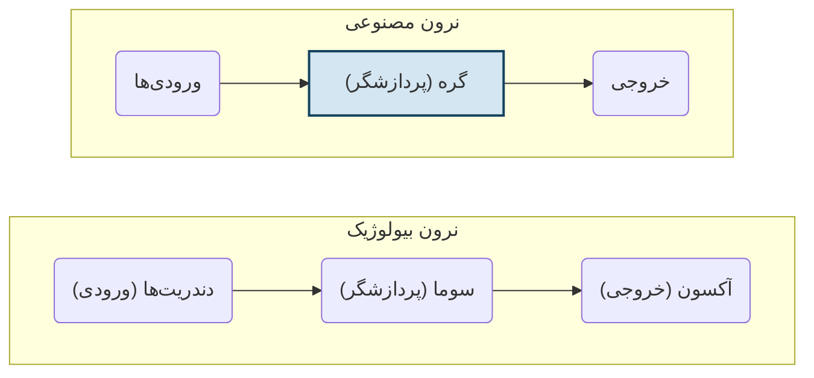

[← مقدمه فصل دوم](./00-introduction.md) | [بخش ۲-۲: یادگیری با معلم: یادگیری تحت نظارت (Supervised Learning) →](./02-supervised-learning.md)

# فصل ۲: ماشین چگونه یاد می‌گیرد؟

## بخش ۲-۱: از مغز انسان تا مغز مصنوعی: سفری به دنیای شبکه‌های عصبی

مغز انسان، پیچیده‌ترین ساختار شناخته‌شده در جهان، چگونه از میلیاردها سلول ساده به نام نرون، قابلیت‌های شگفت‌انگیزی مانند یادگیری، تشخیص چهره و خلاقیت را به وجود می‌آورد؟ آیا می‌توانیم با الهام از این شاهکار طبیعت، یک "مغز مصنوعی" بسازیم که به کامپیوترها قدرت یادگیری بدهد؟ در این بخش، به قلب هوش مصنوعی مدرن سفر می‌کنیم.

در فصل اول، دیدیم که هوش مصنوعی می‌تواند کارهای شگفت‌انگیزی مانند تشخیص سرطان و تحلیل داده‌های ژنومی را انجام دهد. اما سوال اصلی این است: یک ماشین چگونه "فکر" می‌کند؟ چگونه یاد می‌گیرد که الگوها را تشخیص دهد؟ پاسخ در یکی از زیباترین ایده‌های مهندسی نهفته است که از خود طبیعت الهام گرفته شده: **شبکه‌های عصبی مصنوعی (Artificial Neural Networks)**.

### 🎯 مسئله محوری این بخش:

فرض کنید باید ماشینی ساده بسازید که بتواند دایره را از مربع تشخیص دهد. شما نمی‌توانید از قوانین ثابت (مثلاً «اگر ۴ گوشه داشت، مربع است») استفاده کنید؛ ماشین باید خودش از روی مثال‌ها یاد بگیرد. به نظر شما، اجزای حداقلی برای ساخت یک «سلول» یادگیرنده چه چیزهایی هستند؟ این سلول چگونه اطلاعات (تصویر) را پردازش کرده و به یک تصمیم می‌رسد؟

---

### **الهام از یک شاهکار بیولوژیک: مغز**

مغز شما از میلیاردها سلول تخصصی به نام **نرون** تشکیل شده است. هر نرون به تنهایی یک واحد پردازشی بسیار ساده است. اما وقتی این میلیاردها نرون از طریق اتصالات پیچیده‌ای به نام **سیناپس** با یکدیگر ارتباط برقرار می‌کنند، یک سیستم فوق‌العاده قدرتمند برای یادگیری، تحلیل و تصمیم‌گیری به وجود می‌آید.

وقتی شما چهره دوستتان را در یک جمعیت شلوغ تشخیص می‌دهید، این فرآیند در مغز شما چگونه رخ می‌دهد؟

1.  **ورودی (Input):** نور از چهره دوستتان به چشمان شما می‌رسد و سلول‌های شبکیه آن را به سیگنال‌های الکتریکی تبدیل می‌کنند.
2.  **پردازش (Processing):** این سیگنال‌ها از طریق عصب بینایی به مغز شما سفر می‌کنند. در آنجا، لایه‌های مختلفی از نرون‌ها به صورت سلسله‌مراتبی این اطلاعات را پردازش می‌کنند. یک لایه ممکن است خطوط و لبه‌های ساده را تشخیص دهد. لایه بعدی این خطوط را با هم ترکیب کرده و شکل‌هایی مانند چشم و بینی را شناسایی می‌کند. لایه بالاتر، این اَشکال را با هم ترکیب کرده و در نهایت چهره کامل را بازشناسی می‌کند.
3.  **خروجی (Output):** پس از این پردازش چندلایه‌ای، مغز شما به یک نتیجه می‌رسد: "بله، این دوست من است!" و یک سیگنال برای شما ارسال می‌کند تا برایش دست تکان دهید.

### **ساخت یک مغز ساده: نرون مصنوعی**

حالا بیایید این ایده را به زبان ریاضی و کامپیوتر ترجمه کنیم. یک **نرون مصنوعی** یا **گره (Node)** یک واحد محاسباتی ساده است که سعی می‌کند از یک نرون بیولوژیک تقلید کند.



همانطور که در نمودار می‌بینید:

- **ورودی‌ها (Inputs):** مانند دندریت‌ها، اطلاعات را دریافت می‌کنند. در مثال تشخیص سرطان، این ورودی‌ها می‌توانند مقادیر پیکسل‌های مختلف یک تصویر ماموگرافی باشند.
- **گره (Node):** مانند سوما (جسم سلولی)، یک محاسبه ساده روی ورودی‌ها انجام می‌دهد. این گره، هر ورودی را در یک "وزن" (Weight) ضرب می‌کند. این وزن‌ها اهمیت هر ورودی را مشخص می‌کنند (درست مانند اینکه برخی سیناپس‌ها قوی‌تر از بقیه هستند). سپس تمام این مقادیر وزن‌دار را با هم جمع کرده و از یک **تابع فعال‌سازی (Activation Function)** عبور می‌دهد.
- **خروجی (Output):** مانند آکسون، نتیجه نهایی را به گره‌های بعدی ارسال می‌کند. تابع فعال‌سازی تصمیم می‌گیرد که آیا سیگنال باید به لایه بعد منتقل شود یا نه (شبیه به پتانسیل عمل در نرون واقعی).

### **شبکه عصبی: قدرت در همکاری**

یک نرون به تنهایی قدرت چندانی ندارد. جادو زمانی اتفاق می‌افتد که ما هزاران یا میلیون‌ها از این نرون‌های مصنوعی را در لایه‌های مختلف به هم متصل کنیم و یک **شبکه عصبی مصنوعی** بسازیم.

یک شبکه عصبی ساده معمولاً سه نوع لایه دارد:

```mermaid
graph TD
    subgraph شبکه عصبی مصنوعی
        direction LR

        subgraph لایه ورودی (Input Layer)
            I1("ورودی ۱ (مثلاً پیکسل ۱)")
            I2("ورودی ۲ (مثلاً پیکسل ۲)")
            I3("...")
        end

        subgraph لایه پنهان (Hidden Layer)
            H1("نرون H1")
            H2("نرون H2")
            H3("نرون H3")
        end

        subgraph لایه خروجی (Output Layer)
            O1("خروجی ۱ (مثلاً احتمال 'سرطان')")
            O2("خروجی ۲ (مثلاً احتمال 'سالم')")
        end

        I1 --> H1;
        I1 --> H2;
        I1 --> H3;
        I2 --> H1;
        I2 --> H2;
        I2 --> H3;
        I3 --> H1;
        I3 --> H2;
        I3 --> H3;

        H1 --> O1;
        H1 --> O2;
        H2 --> O1;
        H2 --> O2;
        H3 --> O1;
        H3 --> O2;
    end

    style H1 fill:#D4E6F1,stroke:#154360,stroke-width:2px
    style H2 fill:#D4E6F1,stroke:#154360,stroke-width:2px
    style H3 fill:#D4E6F1,stroke:#154360,stroke-width:2px

```

1.  **لایه ورودی (Input Layer):** این لایه داده‌های خام را دریافت می‌کند. برای یک تصویر، هر نرون در این لایه می‌تواند معرف یک پیکسل از تصویر باشد.
2.  **لایه‌های پنهان (Hidden Layers):** این‌ها لایه‌های میانی هستند که پردازش اصلی در آن‌ها انجام می‌شود. مانند مغز، این لایه‌ها ویژگی‌های پیچیده‌تر را به صورت سلسله‌مراتبی استخراج می‌کنند. لایه پنهان اول ممکن است لبه‌ها و رنگ‌ها را یاد بگیرد، لایه دوم ممکن است بافت‌ها و اَشکال ساده را تشخیص دهد و لایه‌های بعدی این‌ها را برای شناسایی مفاهیم پیچیده‌تر (مانند یک تومور) ترکیب می‌کنند. هرچه تعداد لایه‌های پنهان بیشتر باشد، به آن **یادگیری عمیق (Deep Learning)** می‌گویند.
3.  **لایه خروجی (Output Layer):** این لایه نتیجه نهایی را ارائه می‌دهد. برای مثال، می‌تواند دو نرون داشته باشد: یکی احتمال وجود سرطان و دیگری احتمال سالم بودن بافت را نشان می‌دهد.

---

### 🔬 تمرین تحلیلی: طراحی یک نرون تصمیم‌گیر

**سناریو:** می‌خواهیم یک نرون مصنوعی ساده طراحی کنیم که تصمیم بگیرد آیا یک سلول باید تقسیم شود یا خیر. این تصمیم بر اساس دو سیگنال ورودی است:

- **ورودی ۱ (فاکتور رشد):** اگر وجود داشته باشد ۱، وگرنه ۰.
- **ورودی ۲ (مهار تماسی):** اگر وجود داشته باشد ۱، وگرنه ۰.

**هدف:** شما باید وزن‌های w1 (برای فاکتور رشد) و w2 (برای مهار تماسی) را طوری تعیین کنید که نرون فقط زمانی فعال (خروجی > ۰) شود که سیگنال رشد وجود داشته باشد و همزمان سیگنال مهار وجود نداشته باشد.
(فرض کنید نرون زمانی فعال می‌شود که: `(ورودی۱ * w1) + (ورودی۲ * w2) > 0`)

**سوال:** چه مقادیری برای w1 و w2 انتخاب می‌کنید؟ (پاسخ‌های متعددی ممکن است درست باشد).

---

### 💡 نکات کلیدی این بخش

- **الهام از طبیعت:** شبکه‌های عصبی مصنوعی از ساختار مغز انسان (نرون‌ها و سیناپس‌ها) الهام گرفته‌اند.
- **واحد پایه:** یک نرون مصنوعی یک واحد محاسباتی ساده است که ورودی‌های وزن‌دار را دریافت کرده و یک خروجی تولید می‌کند.
- **قدرت در شبکه:** قدرت اصلی شبکه‌های عصبی در اتصال تعداد زیادی از این نرون‌های ساده در لایه‌های مختلف به یکدیگر است.
- **یادگیری عمیق:** به شبکه‌های عصبی‌ای گفته می‌شود که دارای لایه‌های پنهان متعدد هستند و قابلیت یادگیری الگوهای بسیار پیچیده را دارند.

---

"یادگیری" در یک شبکه عصبی، در واقع فرآیند تنظیم دقیق **وزن‌ها (Weights)** در تمام اتصالات بین نرون‌هاست. در بخش بعدی، خواهیم دید که ماشین چگونه با استفاده از داده‌ها، این وزن‌ها را به گونه‌ای تنظیم می‌کند که بهترین تصمیم‌ها را بگیرد.
