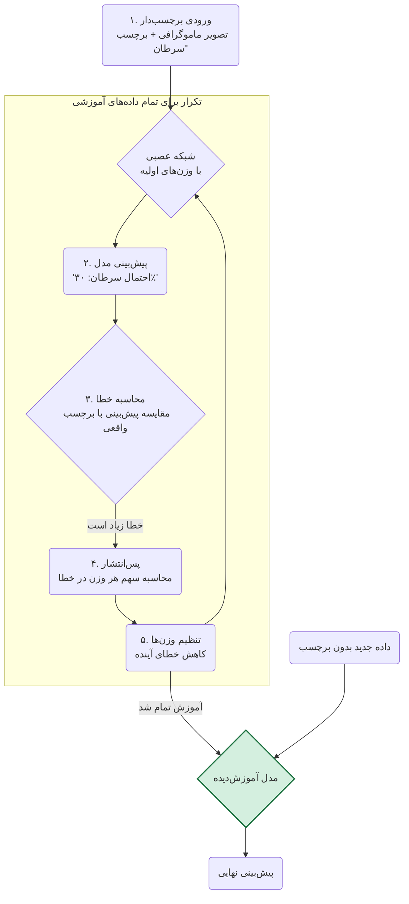

[← بخش ۲-۱: از مغز انسان تا مغز مصنوعی: سفری به دنیای شبکه‌های عصبی](./01-from-brain-to-ann.md) | [بخش ۲-۳: کشف الگوهای پنهان: یادگیری بدون نظارت (Unsupervised Learning) →](./03-unsupervised-learning.md)

# فصل ۲: ماشین چگونه یاد می‌گیرد؟

## بخش ۲-۲: یادگیری بانظارت: آموزش ماشین با یک معلم مجازی

شما چگونه یاد گرفتید که یک گربه را از یک سگ تشخیص دهید؟ به احتمال زیاد، در کودکی، بزرگترها با اشاره به این حیوانات، نام آن‌ها را به شما گفته‌اند. هزاران مثال دیده‌اید و هزاران بار بازخورد گرفته‌اید. این فرآیند "یادگیری با معلم" است. چگونه می‌توانیم همین فرآیند را برای یک ماشین شبیه‌سازی کنیم تا به او یاد بدهیم یک سلول سرطانی را از یک سلول سالم تشخیص دهد؟

در بخش قبل، با ساختار یک شبکه عصبی آشنا شدیم. دیدیم که این شبکه‌ها از نرون‌های مصنوعی و اتصالات وزن‌دار تشکیل شده‌اند. اما این وزن‌ها در ابتدا مقادیر تصادفی دارند. شبکه عصبی ما در ابتدای کار، مانند یک نوزاد است که هیچ چیز نمی‌داند. چگونه می‌توانیم به این شبکه آموزش دهیم تا وظیفه مشخصی را یاد بگیرد؟

پاسخ در رایج‌ترین رویکرد یادگیری ماشین نهفته است: **یادگیری با نظارت (Supervised Learning)**.

### 🎯 مسئله محوری این بخش:

فرض کنید مجموعه داده بزرگی از ایمیل‌ها به شما داده شده و وظیفه شما ساختن یک فیلتر اسپم (هرزنامه) است. برای هر ایمیل، شما متن کامل آن (ورودی) را در اختیار دارید. مهم‌تر از آن، برای هر ایمیل یک برچسب نیز وجود دارد: «اسپم» یا «اسپم نیست» که توسط کاربران مشخص شده است. چگونه از این داده‌های «برچسب‌دار» استفاده می‌کنید تا به یک ماشین «یاد بدهید» که یک ایمیل کاملاً جدید را به طور خودکار دسته‌بندی کند؟ نقش «معلم» در این فرآیند چیست؟

---

### **یادگیری با برچسب: معلم مجازی**

تصور کنید می‌خواهید به یک کودک تفاوت بین سیب و پرتقال را یاد بدهید. شما یک سیب را به او نشان می‌دهید (ورودی) و می‌گویید: "این سیب است" (برچسب/پاسخ صحیح). سپس یک پرتقال را نشان می‌دهید و می‌گویید: "این پرتقال است". با تکرار این فرآیند با ده‌ها مثال مختلف از سیب و پرتقال، کودک به تدریج یاد می‌گیرد که الگوهای مشخصی (رنگ، شکل، بافت) را با هر میوه مرتبط کند.

یادگیری بانظارت دقیقاً به همین شکل عمل می‌کند. ما به ماشین یک **مجموعه داده آموزشی (Training Dataset)** می‌دهیم که شامل دو بخش است:

1.  **داده‌های ورودی (Input Data):** نمونه‌هایی از چیزی که می‌خواهیم ماشین یاد بگیرد. (مثلاً تصاویر ماموگرافی، توالی‌های DNA، داده‌های بیان ژن).
2.  **برچسب‌های صحیح (Correct Labels):** پاسخ درست برای هر نمونه ورودی. (مثلاً برچسب "سرطانی" یا "سالم" برای هر تصویر، نام ژن برای هر توالی).

این مجموعه داده برچسب‌دار، نقش یک **معلم مجازی** یا یک **پاسخنامه** را برای ماشین ایفا می‌کند.

### **فرآیند آموزش: یک چرخه بازخورد**

فرآیند آموزش یک مدل یادگیری بانظارت، یک چرخه تکراری از پیش‌بینی، مقایسه و اصلاح است. بیایید این چرخه را با مثال تشخیص سرطان دنبال کنیم:

1.  **پیش‌بینی (Predict):** یک تصویر از مجموعه آموزشی به شبکه عصبی (که وزن‌هایش هنوز تصادفی است) داده می‌شود. شبکه آن را پردازش کرده و یک پیش‌بینی اولیه ارائه می‌دهد. مثلاً می‌گوید: "به احتمال ۳۰٪ سرطانی است".
2.  **مقایسه (Compare):** این پیش‌بینی با برچسب واقعی مقایسه می‌شود. برچسب واقعی این تصویر در مجموعه داده ما، "سرطانی" (یعنی احتمال ۱۰۰٪) است. واضح است که پیش‌بینی شبکه اشتباه بوده و یک "خطا" یا "زیان" (Error / Loss) قابل توجهی وجود دارد.
3.  **اصلاح (Correct / Backpropagation):** اینجاست که جادوی یادگیری اتفاق می‌افتد. الگوریتم با استفاده از یک فرآیند ریاضی هوشمندانه به نام **پس‌انتشار (Backpropagation)**، این خطا را به صورت معکوس در شبکه به عقب برمی‌گرداند. این الگوریتم محاسبه می‌کند که هر "وزن" در شبکه، چقدر در این خطای نهایی مقصر بوده است.
4.  **تنظیم (Adjust):** سپس، وزن‌ها به مقدار بسیار کمی در جهتی تنظیم می‌شوند که خطا را کاهش دهند. وزن‌هایی که بیشتر مقصر بودند، بیشتر تغییر می‌کنند.

این چرخه (پیش‌بینی -> مقایسه -> اصلاح -> تنظیم) هزاران یا میلیون‌ها بار برای تمام نمونه‌های موجود در مجموعه داده آموزشی تکرار می‌شود. در هر تکرار، شبکه عصبی کمی بهتر می‌شود و پیش‌بینی‌هایش به پاسخ‌های صحیح نزدیک‌تر می‌گردد. این فرآیند، مانند دانش‌آموزی است که مدام تمرین حل می‌کند، پاسخ‌هایش را با پاسخنامه چک می‌کند و از اشتباهاتش درس می‌گیرد.

### **نمودار چرخه یادگیری بانظارت**

### **آزمون نهایی: مرحله استنتاج (Inference)**

وقتی فرآیند آموزش کامل شد و وزن‌های شبکه بهینه شدند، مدل ما آماده استفاده در دنیای واقعی است. به این مرحله **استنتاج (Inference)** یا **پیش‌بینی (Prediction)** می‌گویند. حالا ما می‌توانیم یک تصویر ماموگرافی **جدید** که مدل هرگز آن را ندیده و برچسبی ندارد، به آن بدهیم. از آنجایی که مدل الگوهای مرتبط با سرطان را یاد گرفته است، می‌تواند با دقت بالایی پیش‌بینی کند که آیا این تصویر جدید، سرطانی است یا خیر.

---

### 🔬 تمرین تحلیلی: ارزیابی یک مدل پزشکی

**سناریو:** یک بیمارستان داده‌های ۱۰۰۰ بیمار را برای پیش‌بینی ریسک دیابت در اختیار شما قرار می‌دهد. برای هر بیمار، ورودی‌هایی مانند سن، BMI و سطح قند خون و همچنین برچسب خروجی («دیابتی» یا «غیردیابتی») را دارید. شما یک مدل یادگیری بانظارت را آموزش می‌دهید.

**نتایج تست:** مدل شما بر روی ۱۰۰ بیمار جدید تست می‌شود. نتایج به این صورت است: مدل ۴۵ نفر از ۵۰ فرد غیردیابتی را به درستی و ۴۰ نفر از ۵۰ فرد دیابتی را به درستی شناسایی می‌کند.

**سوال ۱:** دقت کلی (Overall Accuracy) مدل شما روی این مجموعه تست چقدر است؟
**سوال ۲:** مدل شما ۵ فرد سالم را به اشتباه دیابتی (مثبت کاذب) و ۱۰ فرد دیابتی را به اشتباه سالم (منفی کاذب) تشخیص داده است. در زمینه پزشکی، کدام یک از این دو نوع خطا خطرناک‌تر است؟ چرا؟

---

### 💡 نکات کلیدی این بخش

- **یادگیری با داده‌های برچسب‌دار:** یادگیری بانظارت از داده‌های دارای برچسب (جفت‌های ورودی-خروجی) برای آموزش یک مدل استفاده می‌کند.
- **چرخه آموزش:** فرآیند آموزش شامل یک چرخه تکراری است: پیش‌بینی، مقایسه با برچسب صحیح، محاسبه خطا و تنظیم پارامترهای مدل.
- **هدف نهایی:** هدف اصلی، قادر ساختن مدل به انجام پیش‌بینی‌های دقیق بر روی داده‌های جدید و دیده‌نشده است.
- **الگوریتم کلیدی:** پس‌انتشار (Backpropagation) الگوریتم اصلی برای تنظیم وزن‌ها در شبکه‌های عصبی طی فرآیند آموزش است.

---

در بخش بعدی، با نوع دیگری از یادگیری آشنا می‌شویم که در آن، هیچ معلم یا پاسخنامه‌ای در کار نیست!
