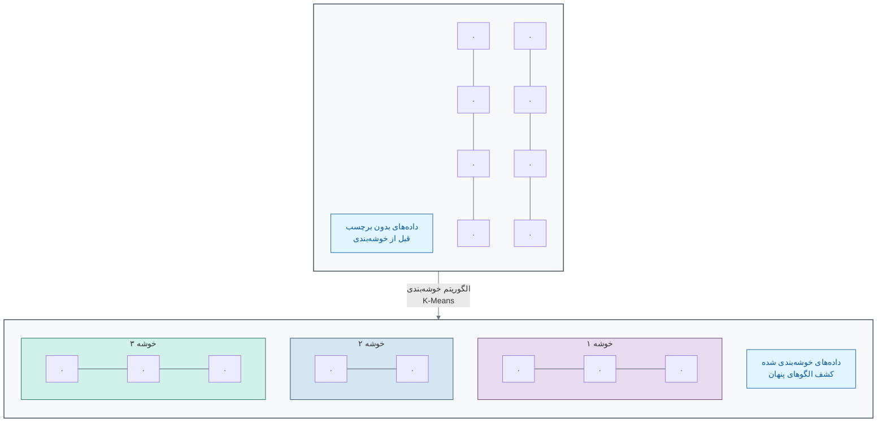
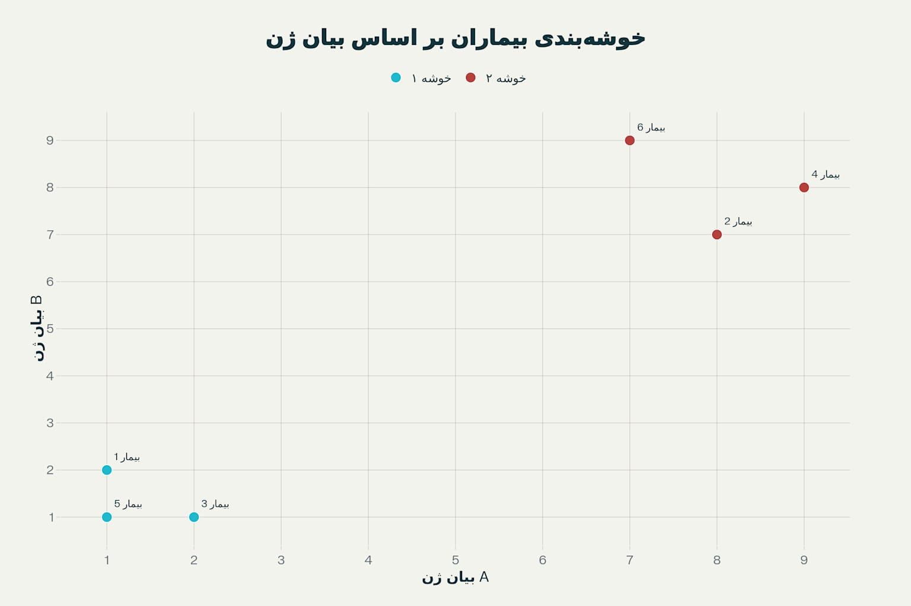

[← بخش ۲-۲: یادگیری بانظارت: آموزش ماشین با یک معلم مجازی](./02-supervised-learning.md) | [بخش ۲-۴: مطالعه موردی: آلفافولد و معمای تاشدگی پروتئین →](./04-case-study-alphafold.md)

# فصل ۲: ماشین چگونه یاد می‌گیرد؟

## بخش ۲-۳: یادگیری بدون نظارت: کشف الگوهای پنهان در داده‌ها

فرض کنید به شما یک کتابخانه عظیم با هزاران کتاب داده می‌شود که هیچ‌کدام برچسب عنوان یا موضوع ندارند. چگونه می‌توانید در این کتابخانه نظمی برقرار کنید؟ احتمالاً کتاب‌هایی که جلد و قطع مشابهی دارند یا در مورد موضوعات یکسانی صحبت می‌کنند را کنار هم قرار می‌دهید، حتی بدون اینکه نام دقیق موضوع را بدانید. شما در حال کشف ساختار پنهان در داده‌ها هستید. حال تصور کنید به جای کتاب، داده‌های ژنتیکی هزاران بیمار را داریم. چگونه می‌توانیم بدون هیچ برچسبی، گروه‌های بیماران مشابه را پیدا کنیم؟

در یادگیری بانظارت، ما یک "معلم" داشتیم: مجموعه داده‌ای با برچسب‌های صحیح که به مدل می‌گفت چه چیزی را یاد بگیرد. اما اگر چنین معلمی در کار نباشد چه؟ اگر ما یک حجم عظیم از داده‌های زیستی داشته باشیم، اما هیچ پاسخنامه یا برچسبی برای آن‌ها موجود نباشد؟

اینجا جایی است که **یادگیری بدون نظارت (Unsupervised Learning)** وارد میدان می‌شود. در این رویکرد، ما از ماشین می‌خواهیم که خودش به تنهایی ساختارها، روابط و الگوهای پنهان را در دل داده‌های بدون برچسب (Unlabeled Data) کشف کند[1][2].

### 🎯 **مسئله محوری این بخش:**

تصور کنید یک زیست‌شناس هستید و داده‌های بیان ژن از ۱۰۰۰ نمونه تومور مختلف که همگی برچسب «سرطان ریه» دارند را دریافت کرده‌اید. با این حال، شما شک دارید که «سرطان ریه» یک بیماری واحد نیست، بلکه چندین زیرگروه مجزا با رفتارهای متفاوت است. شما هیچ برچسب از پیش تعیین‌شده‌ای برای این زیرگروه‌ها ندارید. چگونه می‌توانید از یک رویکرد محاسباتی برای کشف خودکار این گروه‌های توموری مشابه در میان داده‌هایتان استفاده کنید، بدون اینکه هیچ «دانش قبلی» یا «معلمی» در کار باشد؟

### **یادگیری بدون دستورالعمل: مرتب‌سازی لگوها**

تصور کنید یک جعبه غول‌پیکر پر از هزاران قطعه لگوی رنگارنگ و با اشکال مختلف به شما داده می‌شود، اما هیچ نقشه یا دستورالعملی برای ساخت وجود ندارد. شما به صورت غریزی شروع به چه کاری می‌کنید؟ احتمالاً قطعات را بر اساس ویژگی‌هایشان مرتب می‌کنید: تمام قطعات قرمز را در یک دسته، تمام قطعات آبی را در دسته‌ای دیگر، قطعات مربعی را جدا و قطعات مستطیلی را هم جدا می‌کنید.

شما بدون اینکه کسی به شما بگوید، در حال **خوشه‌بندی (Clustering)** لگوها بر اساس شباهت‌هایشان هستید. این دقیقاً همان کاری است که الگوریتم‌های یادگیری بدون نظارت انجام می‌دهند. آن‌ها به دنبال ساختار ذاتی در داده‌ها می‌گردند[3][4].

### **کاربرد در زیست‌شناسی: کشف زیرگروه‌های بیماری**

یکی از قدرتمندترین کاربردهای یادگیری بدون نظارت در زیست‌شناسی، تحلیل داده‌های بیان ژن است[5][6]. فرض کنید ما داده‌های بیان هزاران ژن را از صدها بیمار مبتلا به سرطان کبد در اختیار داریم. ما فقط می‌دانیم که همه آن‌ها سرطان کبد دارند، اما شاید همه این سرطان‌ها یکسان نباشند.

اگر این داده‌ها را به یک الگوریتم خوشه‌بندی بدهیم، چه اتفاقی می‌افتد؟

1. الگوریتم هر بیمار را به عنوان یک نقطه در یک فضای چندبعدی (که هر بعد، یک ژن است) در نظر می‌گیرد.
2. سپس سعی می‌کند بیمارانی را که پروفایل بیان ژن **مشابهی** دارند، در یک گروه یا **خوشه (Cluster)** قرار دهد. برای مثال، بیمارانی که در آن‌ها گروه مشخصی از ژن‌های مرتبط با متابولیسم فعال هستند، در یک خوشه قرار می‌گیرند و بیمارانی که ژن‌های مرتبط با تکثیر سلولی در آن‌ها فعال است، در خوشه‌ای دیگر[7][8].

نتیجه نهایی ممکن است سه یا چهار خوشه مجزا از بیماران باشد. این خوشه‌ها می‌توانند نمایانگر **زیرگروه‌های مولکولی (Molecular Subtypes)** مختلف از سرطان کبد باشند که قبلاً ناشناخته بودند. این کشف می‌تواند بسیار ارزشمند باشد، زیرا ممکن است هر زیرگروه به یک نوع درمان خاص بهتر پاسخ دهد. این همان مسیری است که به سمت **پزشکی دقیق‌تر (Precision Medicine)** می‌رود[9][10].

### **نمودار خوشه‌بندی (Clustering)**

نمودار زیر به صورت شماتیک این فرآیند را نشان می‌دهد. در ابتدا داده‌ها پراکنده و بدون ساختار به نظر می‌رسند. الگوریتم یادگیری بدون نظارت، گروه‌های طبیعی را بر اساس نزدیکی نقاط داده به یکدیگر شناسایی می‌کند[11][12].

### **یادگیری بانظارت در مقابل بدون نظارت**

| ویژگی        | یادگیری بانظارت                             | یادگیری بدون نظارت                        |
| :----------- | :------------------------------------------ | :---------------------------------------- |
| **نوع داده** | داده‌های برچسب‌دار                          | داده‌های بدون برچسب                       |
| **هدف**      | پیش‌بینی یک خروجی مشخص (طبقه‌بندی، رگرسیون) | کشف ساختارها و الگوهای پنهان (خوشه‌بندی)  |
| **مثال**     | تشخیص "سرطان" یا "سالم" از روی تصویر        | گروه‌بندی بیماران به زیرگروه‌های ناشناخته |
| **آنالوژی**  | یادگیری با یک معلم و پاسخنامه               | مرتب‌سازی لگوها بدون دستورالعمل           |

### 🔬 **تمرین تحلیلی: پیدا کردن گروه‌های پنهان**

**سناریو:**
داده‌های مربوط به ۶ بیمار بر اساس بیان دو ژن (ژن A و ژن B) به شما داده شده است. هر بیمار با یک زوج مرتب (بیان ژن A, بیان ژن B) نمایش داده می‌شود:

- بیمار ۱: (۱, ۲)، بیمار ۲: (۸, ۷)، بیمار ۳: (۲, ۱)، بیمار ۴: (۹, ۸)، بیمار ۵: (۱, ۱)، بیمار ۶: (۷, ۹).

**سوال ۱:** این بیماران را به عنوان نقاطی در یک نمودار دو بعدی در ذهن خود یا روی کاغذ رسم کنید. به طور طبیعی چند خوشه یا گروه در این داده‌ها مشاهده می‌کنید؟

**سوال ۲:** کدام بیماران به هر خوشه تعلق دارند؟

**سوال ۳:** ویژگی اصلی یک الگوریتم یادگیری بدون نظارت (مانند خوشه‌بندی) که آن را برای این نوع مسئله مناسب می‌سازد، چیست؟

_خوشه‌بندی بیماران بر اساس بیان ژن - نمایش دو خوشه طبیعی در داده‌های آزمایشی_

همانطور که در نمودار بالا مشاهده می‌کنید، بیماران به طور طبیعی به دو خوشه تقسیم می‌شوند: **خوشه ۱** شامل بیماران با مقادیر پایین بیان ژن (بیماران ۱، ۳، ۵) و **خوشه ۲** شامل بیماران با مقادیر بالای بیان ژن (بیماران ۲، ۴، ۶) است. این الگوی واضح نشان می‌دهد که چگونه الگوریتم‌های خوشه‌بندی می‌توانند بدون هیچ برچسب قبلی، گروه‌های طبیعی را در داده‌ها تشخیص دهند.

### 💡 **نکات کلیدی این بخش**

- **کار با داده‌های بدون برچسب:** یادگیری بدون نظارت با داده‌هایی کار می‌کند که هیچ برچسب یا پاسخ صحیحی برایشان تعریف نشده است[1][13].

- **هدف اصلی: کشف ساختار:** هدف اصلی این نوع یادگیری، کشف الگوها، گروه‌ها و ساختارهای پنهان و ذاتی در داده‌هاست[14][15].
- **خوشه‌بندی:** یک تکنیک اصلی در یادگیری بدون نظارت است که برای گروه‌بندی داده‌های مشابه به یکدیگر استفاده می‌شود[3][16].
- **کاربردهای کلیدی:** این رویکرد برای کارهایی مانند شناسایی زیرگروه‌های ناشناخته بیماری، تقسیم‌بندی مشتریان یا تحلیل داده‌های اکتشافی بسیار قدرتمند است[5][17].

هر دو رویکرد به شدت در زیست‌شناسی محاسباتی قدرتمند و پرکاربرد هستند. در بخش بعدی، یک مطالعه موردی شگفت‌انگیز را بررسی خواهیم کرد که نشان می‌دهد چگونه یادگیری عمیق (یک شاخه از یادگیری بانظارت) توانست یکی از بزرگترین معماهای زیست‌شناسی را حل کند: **مسئله تاشدگی پروتئین** و نحوه حل آن توسط **AlphaFold**[18][19][20].

[1] https://www.techtarget.com/searchenterpriseai/definition/unsupervised-learning
[2] https://www.ibm.com/think/topics/supervised-vs-unsupervised-learning
[3] https://www.geeksforgeeks.org/machine-learning/clustering-in-machine-learning/
[4] https://encord.com/glossary/unsupervised-learning-definition/
[5] https://www.numberanalytics.com/blog/clustering-algorithms-bioinformatics-beginners
[6] https://journals.plos.org/plosone/article?id=10.1371%2Fjournal.pone.0171429
[7] https://www.pnas.org/doi/10.1073/pnas.96.12.6745
[8] https://pmc.ncbi.nlm.nih.gov/articles/PMC4656721/
[9] https://pmc.ncbi.nlm.nih.gov/articles/PMC7794969/
[10] https://pubmed.ncbi.nlm.nih.gov/40227634/
[11] https://www.machinelearningmastery.com/clustering-algorithms-with-python/
[12] https://developers.google.com/machine-learning/clustering/clustering-algorithms
[13] https://cloud.google.com/discover/what-is-unsupervised-learning
[14] https://en.wikipedia.org/wiki/Unsupervised_learning
[15] https://www.alexanderthamm.com/en/blog/this-is-how-unsupervised-machine-learning-works/
[16] https://www.mathworks.com/discovery/clustering.html
[17] https://pmc.ncbi.nlm.nih.gov/articles/PMC5135122/
[18] https://blog.rootsofprogress.org/alphafold-protein-folding-explainer
[19] https://www.nature.com/articles/s41586-021-03819-2
[20] https://en.wikipedia.org/wiki/AlphaFold
[21] https://cloud.google.com/discover/supervised-vs-unsupervised-learning
[22] https://www.geeksforgeeks.org/machine-learning/supervised-unsupervised-learning/
[23] https://www.geeksforgeeks.org/machine-learning/unsupervised-learning/
[24] https://aws.amazon.com/compare/the-difference-between-machine-learning-supervised-and-unsupervised/
[25] https://www.oracle.com/tr/artificial-intelligence/machine-learning/unsupervised-learning/
[26] https://www.youtube.com/watch?v=W01tIRP_Rqs
[27] https://www.freecodecamp.org/news/8-clustering-algorithms-in-machine-learning-that-all-data-scientists-should-know/
[28] https://www.seldon.io/supervised-vs-unsupervised-learning-explained-2/
[29] https://scikit-learn.org/stable/modules/clustering.html
[30] https://www.coursera.org/articles/supervised-vs-unsupervised-learning
[31] https://www.pathologyoutlines.com/topic/breastmolecularsubtypes.html
[32] https://docs.gdc.cancer.gov/Data_Portal/Users_Guide/gene_expression_clustering/
[33] https://pubmed.ncbi.nlm.nih.gov/38424845/
[34] https://www.biorxiv.org/content/10.1101/2024.03.21.586064v1.full.pdf
[35] https://pubmed.ncbi.nlm.nih.gov/37941025/
[36] https://www.nature.com/articles/s41575-019-0109-y
[37] https://www.numberanalytics.com/blog/ultimate-guide-clustering-analysis-bioinformatics
[38] https://pubmed.ncbi.nlm.nih.gov/36324085/
[39] https://www.ncbi.nlm.nih.gov/books/NBK583808/
[40] https://www.cd-genomics.com/bmb/cluster-analysis.html
[41] https://www.sciencedirect.com/science/article/pii/S2667102623000396
[42] https://www.cancer.gov/publications/dictionaries/cancer-terms/def/molecular-subtype
[43] https://library.fiveable.me/bioinformatics/unit-8/clustering-algorithms/study-guide/bpJJDtAKaUwYaJvx
[44] http://gdc.cancer.gov/content/gene-expression-clustering-gdc-20
[45] https://www.mdpi.com/2072-6694/17/7/1102
[46] https://journals.plos.org/plosone/article?id=10.1371%2Fjournal.pone.0066256
[47] https://academic.oup.com/bioinformatics/article/37/16/2231/6143031
[48] https://www.ebi.ac.uk/training/online/courses/alphafold/an-introductory-guide-to-its-strengths-and-limitations/what-is-the-protein-folding-problem/
[49] https://ascopubs.org/doi/10.1200/JCO.2024.42.16_suppl.2576
[50] https://pmc.ncbi.nlm.nih.gov/articles/PMC5687665/
[51] https://www.reddit.com/r/labrats/comments/1b1l68p/people_are_overestimating_alphafold_and_its_a/
[52] https://www.nature.com/articles/nrc.2016.126
[53] https://arxiv.org/abs/2207.14639
[54] https://www.frontiersin.org/journals/artificial-intelligence/articles/10.3389/frai.2022.875587/full
[55] https://pubmed.ncbi.nlm.nih.gov/28113782/
[56] https://www.sciencedirect.com/science/article/pii/S1896112624000397
[57] https://www.frontiersin.org/journals/genetics/articles/10.3389/fgene.2019.00020/full
[58] https://www.mdpi.com/2072-6694/15/15/3837
[59] https://www.sciencedirect.com/science/article/pii/S1532046423001272
