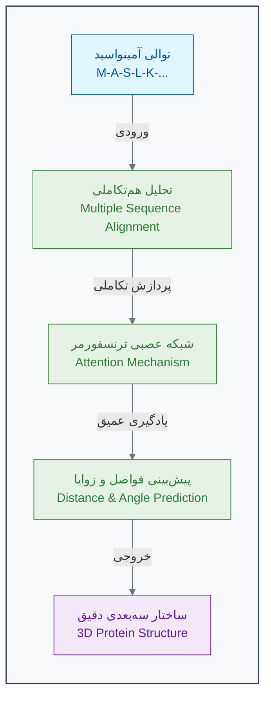

[← بخش ۲-۳: یادگیری بدون نظارت: کشف الگوهای پنهان در داده‌ها](./03-unsupervised-learning.md) | [بخش ۲-۵: بازی عملی: یک نورون را خودتان آموزش دهید! →](./05-exercise-train-a-neuron.md)

# فصل ۲: ماشین چگونه یاد می‌گیرد؟

## بخش ۲-۴: مطالعه موردی: AlphaFold چگونه معمای ساختار پروتئین را حل کرد؟

پروتئین‌ها، ماشین‌های مولکولی حیات هستند. اما یک پروتئین فقط یک رشته خطی از آمینواسیدها نیست؛ قدرت آن در ساختار سه‌بعدی پیچیده و دقیقی است که به خود می‌گیرد. برای ۵۰ سال، پیش‌بینی این ساختار سه‌بعدی از روی توالی خطی، یکی از "مسائل مقدس" در زیست‌شناسی بود[1][2]. چگونه می‌توان ماشینی ساخت که با نگاه کردن به یک رشته یک‌بعدی از حروف (توالی آمینواسید)، بتواند شکل سه‌بعدی دقیق آن را در فضا با دقتی در حد اتم پیش‌بینی کند؟ این چالش، مرزهای هوش مصنوعی را جابجا کرد.

برای دهه‌ها، یکی از بزرگترین و بنیادی‌ترین چالش‌ها در زیست‌شناسی، **"مسئله تاخوردگی پروتئین" (Protein Folding Problem)** بود. این معما را می‌توان در یک سوال ساده خلاصه کرد: چگونه می‌توان ساختار سه‌بعدی و پیچیده یک پروتئین را تنها از روی توالی خطی آمینواسیدهای سازنده‌اش پیش‌بینی کرد؟

اهمیت این مسئله از آنجاست که **ساختار یک پروتئین، عملکرد آن را تعیین می‌کند**[3][4]. یک پروتئین تنها زمانی می‌تواند کار خود را (مثلاً کاتالیز یک واکنش یا انتقال یک مولکول) به درستی انجام دهد که به شکل سه‌بعدی منحصر به فرد و صحیح خود تا بخورد. هرگونه خطای کوچک در این تاخوردگی می‌تواند منجر به بیماری‌های سختی مانند آلزایمر، پارکینسون و بسیاری از سرطان‌ها شود[4][5].

دانشمندان برای ۵۰ سال با استفاده از روش‌های آزمایشگاهی بسیار پرهزینه و زمان‌بر مانند کریستالوگرافی اشعه ایکس و میکروسکوپ الکترونی کرایو (Cryo-EM)، توانسته بودند ساختار حدود ۲۰۰,۰۰۰ پروتئین را تعیین کنند[6][7]. این عدد در مقابل بیش از ۲۰۰ میلیون پروتئین شناخته شده در طبیعت، مانند قطره‌ای در اقیانوس بود[8][9].

### **ورود یک بازیگر جدید: AlphaFold**

در سال ۲۰۲۰، شرکت DeepMind (یک آزمایشگاه تحقیقاتی هوش مصنوعی متعلق به گوگل) با ارائه سیستمی به نام **AlphaFold2**، جهان زیست‌شناسی را شگفت‌زده کرد[10][11]. AlphaFold2 یک سیستم یادگیری عمیق (یک شاخه بسیار پیشرفته از یادگیری بانظارت) است که توانست مسئله تاخوردگی پروتئین را با دقتی در حد روش‌های آزمایشگاهی حل کند. این یک پیشرفت انقلابی بود که از آن به عنوان یکی از بزرگترین دستاوردهای علمی قرن ۲۱ یاد می‌شود[12][13].

### **AlphaFold چگونه یاد گرفت؟**

ایده اصلی AlphaFold بسیار هوشمندانه است و مفاهیمی که در بخش‌های قبل یاد گرفتیم را ترکیب می‌کند:

1. **معلم مجازی (داده‌های آموزشی):** تیم DeepMind از پایگاه داده ساختار پروتئین (PDB) به عنوان مجموعه داده آموزشی خود استفاده کرد[10][14]. این پایگاه داده، "پاسخنامه" مدل بود. برای هر پروتئین، AlphaFold **توالی آمینواسید (ورودی)** و **ساختار سه‌بعدی نهایی (برچسب صحیح)** را در اختیار داشت. مدل بر اساس حدود ۱۷۰,۰۰۰ ساختار پروتئین موجود در PDB آموزش داده شد[10][14][3].

2. **نگاه به تاریخ تکاملی (MSA):** AlphaFold تنها به یک توالی نگاه نمی‌کند[15][16]. این سیستم با جستجو در پایگاه‌داده‌های عظیم ژنومی، توالی پروتئین مورد نظر را با هزاران نسخه مشابه آن در گونه‌های مختلف (از باکتری تا انسان) مقایسه می‌کند. این کار که **هم‌ترازی چند توالی (Multiple Sequence Alignment - MSA)** نام دارد، سرنخ‌های تکاملی فوق‌العاده‌ای را فراهم می‌کند[15][17]. برای مثال، اگر دو آمینواسید که در توالی از هم دور هستند، در طول تکامل همیشه با هم تغییر کرده باشند (پدیده **هم‌تکاملی Co-evolution**)، این یک سرنخ قوی است که آن‌ها در ساختار سه‌بعدی نهایی، در کنار یکدیگر قرار دارند[18][19].

3. **شبکه عصبی توجه‌محور (Attention Network):** قلب AlphaFold یک نوع شبکه عصبی بسیار پیشرفته به نام "ترنسفورمر" (Transformer) است که از مکانیزم "توجه" (Attention) استفاده می‌کند[20][21]. این شبکه یاد می‌گیرد که به کدام بخش از اطلاعات MSA و به کدام روابط بین آمینواسیدها "توجه" بیشتری کند تا بتواند فاصله بین هر جفت آمینواسید و زوایای بین پیوندهای آن‌ها را با دقت بالایی پیش‌بینی کند[22][23].

4. **ساخت مدل سه‌بعدی:** در نهایت، شبکه این اطلاعات فضایی (فاصله‌ها و زوایا) را به یک مدل سه‌بعدی فیزیکی تبدیل می‌کند و ساختار نهایی را با دقت اتمی ارائه می‌دهد[10][12].

### **از توالی تا ساختار: انقلاب AlphaFold**

### **دقت بی‌نظیر در CASP14**

موفقیت AlphaFold2 در مسابقه CASP14 (Critical Assessment of Structure Prediction) در سال ۲۰۲۰ تحولی انقلابی محسوب می‌شود[10][24]. این مسابقه که هر دو سال یکبار برگزار می‌شود، محققان را به چالش می‌کشد تا ساختار پروتئین‌هایی را که به تازگی تعیین شده اما هنوز منتشر نشده‌اند، پیش‌بینی کنند.

AlphaFold2 با کسب امتیاز **۹۲.۴ GDT** (Global Distance Test) رکورد جدیدی ثبت کرد[20][24][3]. این امتیاز نشان می‌دهد که پیش‌بینی‌های AlphaFold2 تا حدی دقیق هستند که با روش‌های آزمایشگاهی قابل مقایسه‌اند. برای مقایسه، در CASP13 (سال ۲۰۱۸)، بهترین روش‌ها تنها امتیاز ۶۰ کسب کرده بودند[25][26].

### **تأثیر بر زیست‌شناسی و پزشکی**

موفقیت AlphaFold تنها یک دستاورد آکادمیک نبود. DeepMind با همکاری آزمایشگاه زیست‌شناسی مولکولی اروپا (EMBL)، ساختار پیش‌بینی‌شده **بیش از ۲۰۰ میلیون پروتئین** از تمام موجودات شناخته شده را به صورت رایگان در دسترس تمام محققان جهان قرار داد[27][28][29]. این کار، یک شبه، میزان دانش ساختاری ما از جهان پروتئین‌ها را هزاران برابر افزایش داد و درهای جدیدی را برای پژوهش در زمینه‌های زیر گشود:

- **کشف دارو:** محققان اکنون می‌توانند ساختار پروتئین‌های بیماری‌زا را که قبلاً ناشناخته بودند، مشاهده کرده و داروهای جدیدی را برای هدف قرار دادن آن‌ها طراحی کنند[30][31][32]. مطالعات نشان داده‌اند که AlphaFold در شناسایی داروهای جدید علیه ویروس‌ها و سرطان بسیار مؤثر است[30].

- **پزشکی شخصی‌سازی‌شده:** درک اینکه چگونه یک جهش ژنتیکی ساختار یک پروتئین را تغییر می‌دهد، به تشخیص و درمان بهتر بیماری‌های ژنتیکی کمک می‌کند[33].

- **طراحی پروتئین‌های جدید:** دانشمندان می‌توانند پروتئین‌هایی با عملکردهای کاملاً جدید طراحی کنند، مثلاً آنزیم‌هایی که پلاستیک را تجزیه می‌کنند یا پروتئین‌هایی که واکسن‌های موثرتری می‌سازند[10][30].

### 🔬 تمرین تحلیلی: سرنخ‌های تکاملی

**سناریو:** موفقیت آلفافولد به شدت به تحلیل «هم‌ترازی چند توالی» (MSA) برای یافتن آمینواسیدهای هم‌تکامل‌یافته وابسته است. فرض کنید در یک پروتئین، متوجه می‌شوید که در هزاران گونه مختلف، هرگاه آمینواسید موقعیت ۲۵ یک فنیل‌آلانین (بزرگ) است، آمینواسید موقعیت ۱۵۰ یک گلیسین (کوچک) است. و هرگاه موقعیت ۲۵ به گلیسین (کوچک) جهش می‌یابد، موقعیت ۱۵۰ نیز اغلب به فنیل‌آلانین (بزرگ) تغییر می‌کند.

**سوال ۱:** این الگوی هم‌تکاملی، چه چیزی را در مورد رابطه بین موقعیت ۲۵ و ۱۵۰ در ساختار سه‌بعدی نهایی پروتئین نشان می‌دهد؟
**سوال ۲:** چرا این نوع اطلاعات (از MSA) برای پیش‌بینی ساختار، بسیار قدرتمندتر از تحلیل یک توالی پروتئین به تنهایی است؟

### **محدودیت‌ها و چالش‌های باقی‌مانده**

علی‌رغم موفقیت‌های چشمگیر، AlphaFold2 همچنان محدودیت‌هایی دارد[34][35][36]:

- **عدم حساسیت به جهش‌ها:** AlphaFold2 نمی‌تواند تأثیر جهش‌های نقطه‌ای بر ساختار پروتئین را به دقت پیش‌بینی کند[34][37].
- **عدم آگاهی از مولکول‌های همراه:** این سیستم نمی‌تواند اثر یون‌ها، کوفاکتورها یا لیگاندهای کوچک بر ساختار را در نظر بگیرد[35][36].
- **پیش‌بینی تک حالت:** AlphaFold2 تنها یک حالت ثابت از پروتئین را پیش‌بینی می‌کند، در حالی که بسیاری از پروتئین‌ها در طبیعت چندین شکل متفاوت دارند[36].

### 💡 نکات کلیدی این بخش

- **حل معمای بزرگ:** آلفافولد با استفاده از یادگیری عمیق، چالش ۵۰ ساله پیش‌بینی ساختار پروتئین را با دقت بسیار بالا حل کرد[1][24].
- **قدرت داده‌های تکاملی:** این سیستم با استفاده هوشمندانه از داده‌های تکاملی (MSA) و روابط هم‌تکاملی، روابط فضایی بین آمینواسیدها را استنتاج می‌کند[15][18].
- **دموکراتیزه کردن علم:** این دستاورد با در دسترس قرار دادن رایگان میلیون‌ها ساختار پروتئینی، زیست‌شناسی ساختاری را متحول کرده است[27][28].
- **کاربردهای انقلابی:** آلفافولد مسیرهای جدیدی را در کشف دارو، درک بیماری‌ها و طراحی پروتئین‌های جدید باز کرده است[30][31][32].

AlphaFold یک نمونه درخشان از این است که چگونه هوش مصنوعی می‌تواند به عنوان یک ابزار قدرتمند، به حل بزرگترین معماهای علمی بشر کمک کند و عصر جدیدی از اکتشافات را در زیست‌شناسی و پزشکی آغاز نماید[38][30].

[1] https://pubmed.ncbi.nlm.nih.gov/23180855/
[2] https://dasher.wustl.edu/bio5357/readings/science-338-1042-12.pdf
[3] https://guinnessworldrecords.com/world-records/642132-highest-score-at-the-casp-competition
[4] https://pmc.ncbi.nlm.nih.gov/articles/PMC3882043/
[5] https://pubmed.ncbi.nlm.nih.gov/16689923/
[6] https://www.rcsb.org/news/639b9e337f8444f313d20414
[7] http://www.ebi.ac.uk/pdbe/news/pdb-reaches-new-milestone-200000-entries
[8] https://www.linkedin.com/posts/a-banks_ai-just-predicted-the-structure-of-200-million-activity-7193227445607518209-_JbO
[9] https://www.nature.com/articles/s41592-023-01790-6
[10] https://www.technologyreview.com/2020/11/30/1012712/deepmind-protein-folding-ai-solved-biology-science-drugs-disease/
[11] https://www.cnbc.com/2020/11/30/deepmind-solves-protein-folding-grand-challenge-with-alphafold-ai.html
[12] https://www.nature.com/articles/s41586-021-03819-2
[13] https://pmc.ncbi.nlm.nih.gov/articles/PMC8166336/
[14] https://core.ac.uk/download/pdf/519717154.pdf
[15] https://pmc.ncbi.nlm.nih.gov/articles/PMC10928435/
[16] https://en.wikipedia.org/wiki/Multiple_sequence_alignment
[17] https://pubmed.ncbi.nlm.nih.gov/39766238/
[18] https://elifesciences.org/articles/34300
[19] https://www.nature.com/articles/s42003-025-07676-x
[20] https://www.infoq.com/news/2021/01/deepmind-alphafold-protein/
[21] https://pmc.ncbi.nlm.nih.gov/articles/PMC8329862/
[22] https://arxiv.org/pdf/2402.19095.pdf
[23] https://elifesciences.org/articles/82819
[24] https://pmc.ncbi.nlm.nih.gov/articles/PMC8726744/
[25] https://www.ebi.ac.uk/training/online/courses/alphafold/validation-and-impact/how-have-alphafolds-predictions-of-protein-structure-been-validated/
[26] https://www.rasalsi.com/the-limitations-of-alphafold2-2/
[27] https://www.insideprecisionmedicine.com/news-and-features/embl-launches-freely-available-database-of-more-than-200-million-protein-structures/
[28] https://alphafold.ebi.ac.uk
[29] https://www.ebi.ac.uk/about/news/technology-and-innovation/alphafold-200-million
[30] https://pmc.ncbi.nlm.nih.gov/articles/PMC11292590/
[31] https://3decision.discngine.com/blog/2023/03/13/the-impact-of-alphafold-in-drug-discovery-and-emerging-ml-methods
[32] https://pubs.rsc.org/en/content/articlelanding/2023/sc/d2sc05709c
[33] https://www.lindushealth.com/blog/the-revolutionary-impact-of-alphafold-on-drug-discovery-decoding-the-mystery-of-protein-folding
[34] https://pmc.ncbi.nlm.nih.gov/articles/PMC11956457/
[35] https://www.ebi.ac.uk/training/online/courses/alphafold/an-introductory-guide-to-its-strengths-and-limitations/strengths-and-limitations-of-alphafold/
[36] https://www.embopress.org/doi/10.15252/embr.202154046
[37] https://scitechdaily.com/the-limits-of-alphafold-high-schoolers-reveal-ais-flaws-in-bioinformatics-challenge/
[38] https://www.quantamagazine.org/how-ai-revolutionized-protein-science-but-didnt-end-it-20240626/
[39] https://pmc.ncbi.nlm.nih.gov/articles/PMC10245900/
[40] https://chemistry.unist.ac.kr/new-study-tests-the-limits-of-alphafold2s-accuracy-in-protein-structure-prediction/
[41] https://academic.oup.com/bib/article/19/3/482/2769436
[42] https://www.arturorobertazzi.it/2023/09/60-years-in-the-making-alphafolds-historical-breakthrough-in-protein-structure-prediction/
[43] https://deepmind.google/science/alphafold/
[44] https://www.frontiersin.org/journals/bioinformatics/articles/10.3389/fbinf.2023.1120370/full
[45] https://en.wikipedia.org/wiki/AlphaFold
[46] https://www.nature.com/articles/s41392-023-01381-z
[47] https://en.wikipedia.org/wiki/Protein_structure_prediction
[48] https://blog.google/technology/ai/google-deepmind-isomorphic-alphafold-3-ai-model/
[49] https://deepmind.google/discover/blog/alphafold-a-solution-to-a-50-year-old-grand-challenge-in-biology/
[50] https://www.sciencedirect.com/science/article/pii/S0021925821006700
[51] https://www.blopig.com/blog/2020/12/casp14-what-google-deepminds-alphafold-2-really-achieved-and-what-it-means-for-protein-folding-biology-and-bioinformatics/
[52] https://foldingathome.org/2012/12/03/the-protein-folding-problem-50-years-on/
[53] https://en.wikipedia.org/wiki/Protein_Data_Bank
[54] https://pubmed.ncbi.nlm.nih.gov/29544427/
[55] https://pmc.ncbi.nlm.nih.gov/articles/PMC9599165/
[56] https://www.rcsb.org/stats/data_storage_growth
[57] https://www.nature.com/articles/s41592-023-02087-4
[58] https://www.rcsb.org/stats/growth/growth-released-structures
[59] https://www.nature.com/articles/s41592-023-01857-4
[60] http://dal.novanet.ca/discovery/fulldisplay/cdi_proquest_miscellaneous_1220571199/01NOVA_DAL:DAL
[61] https://www.rcsb.org
[62] https://www.nature.com/articles/s41467-022-34032-y
[63] https://www.biorxiv.org/content/10.1101/2023.04.26.538026v3.full.pdf
[64] https://peakproteins.com/alphafold-nearly-one-year-on/
[65] https://academic.oup.com/bioinformatics/article/39/11/btad630/7320008
[66] https://arxiv.org/pdf/2401.14819.pdf
[67] https://pmc.ncbi.nlm.nih.gov/articles/PMC4820728/
[68] https://academic.oup.com/bioinformatics/article/39/2/btad052/7000335
[69] https://predictioncenter.org
[70] https://www.mdpi.com/2218-273X/14/12/1531
[71] https://www.sciencedirect.com/science/article/pii/S1877050925011603
[72] https://www.ebi.ac.uk/jdispatcher/msa
[73] https://docs.mermaidchart.com/mermaid-oss/syntax/flowchart.html
[74] https://github.com/mermaid-js/mermaid
[75] https://www.linkedin.com/posts/ebi_alphafold-bioinformatics-activity-7274353090814783488-Eozc
[76] https://build.nvidia.com/deepmind/alphafold2-multimer/modelcard
[77] https://huggingface.co/TroyDoesAI/Mermaid-Llama-3-8B
[78] https://redocly.com/docs-legacy/developer-portal/guides/mermaid
[79] https://www.ebi.ac.uk/training/online/courses/alphafold/accessing-and-predicting-protein-structures-with-alphafold/
[80] https://mermaid.js.org
[81] https://www.embl.org/news/updates-from-data-resources/alphafold-database-update-sequence-based-search/
[82] https://www.reddit.com/r/ChatGPTCoding/comments/1ijiq41/updated_cline_memory_bank_mermaid_diagrams/
[83] https://www.embl.org/news/science/alphafold-using-open-data-and-ai-to-discover-the-3d-protein-universe/
[84] https://pmc.ncbi.nlm.nih.gov/articles/PMC2649964/
[85] https://www.sciencedirect.com/science/article/pii/S0969212622001320
[86] https://www.pnas.org/doi/10.1073/pnas.1712021114
[87] https://arxiv.org/html/2410.24022v1
[88] https://predictioncenter.org/casp14/index.cgi
[89] https://www.biorxiv.org/content/10.1101/2022.08.07.503071v3.full-text
[90] https://www.sciencedirect.com/science/article/abs/pii/B9780123942920000096
[91] https://www.darkdaily.com/2020/12/18/google-deepminds-alphafold-wins-casp14-competition-helps-solve-mystery-of-protein-folding-in-a-discovery-that-might-be-used-in-new-medical-laboratory-tests/
[92] https://www.reddit.com/r/MachineLearning/comments/k3ygrc/r_alphafold_2/
[93] https://www.nature.com/articles/s41467-021-22869-8
[94] https://en.wikipedia.org/wiki/Proteinopathy
[95] https://www.bmglabtech.com/en/blog/misfolded-proteins-and-neurodegenerative-diseases/
[96] https://www.nature.com/scitable/topicpage/protein-misfolding-and-degenerative-diseases-14434929/
[97] https://pmc.ncbi.nlm.nih.gov/articles/PMC10796696/
[98] https://www.nature.com/articles/d41586-025-00868-9
[99] https://www.frontiersin.org/journals/pharmacology/articles/10.3389/fphar.2020.01024/full
[100] https://www.dnastar.com/resources/the-advantages-and-challenges-of-alphafold-2/
[101] https://www.labiotech.eu/in-depth/alpha-fold-3-drug-discovery/
[102] https://febs.onlinelibrary.wiley.com/doi/10.1111/j.1742-4658.2006.05181.x
