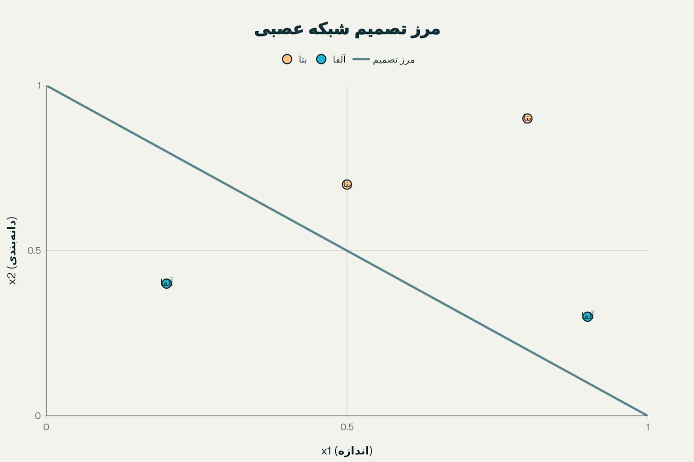

[← بخش ۲-۴: مطالعه موردی: AlphaFold چگونه معمای ساختار پروتئین را حل کرد؟](./04-case-study-alphafold.md) | [آزمون فصل دوم →](./exam/index.md)

# فصل ۲: ماشین چگونه یاد می‌گیرد؟

## بخش ۲-۵: بازی عملی: آموزش دستی یک شبکه عصبی

این بخش یکی از مهم‌ترین و کاربردی‌ترین بخش‌های یادگیری ماشین را با روشی تعاملی و قابل فهم ارائه می‌دهد. از طریق یک تمرین عملی، شما با فرآیند واقعی آموزش یک شبکه عصبی آشنا خواهید شد.

## مسئله محوری: تشخیص سلول‌های زیستی

شما در نقش یک زیست‌شناس سلولی، دو نوع سلول جدید کشف کرده‌اید که بر اساس دو ویژگی اصلی قابل تمایز هستند[1][2]. هدف، ساختن یک "مغز" تک-نرونی است که بتواند با دریافت این ویژگی‌ها، نوع سلول را به درستی تشخیص دهد[3][4].

_تصویرسازی جامع آموزش دستی شبکه عصبی تک-نرونی برای تشخیص انواع سلول‌های زیستی_

## مدل پرسپترون: ساده‌ترین شبکه عصبی

### ساختار مدل

نرون مصنوعی ما بر اساس مدل پرسپترون کلاسیک طراحی شده است[5][6]:

- **دو ورودی**: `x1` (اندازه) و `x2` (زبری غشاء)
- **وزن‌های قابل تنظیم**: `w1` و `w2` که اهمیت هر ویژگی را نشان می‌دهند[7][4]
- **محاسبه مجموع وزن‌دار**: `Sum = (x1 × w1) + (x2 × w2)`
- **تابع فعال‌سازی پله‌ای**: اگر `Sum ≥ 1.0` → نوع بتا (β)، در غیر این صورت → نوع آلفا (α)[8][9]

### داده‌های آموزشی

| نمونه | اندازه (x1) | زبری (x2) | نوع واقعی    |
| ----- | ----------- | --------- | ------------ |
| **۱** | 0.8         | 0.9       | **β (بتا)**  |
| **۲** | 0.2         | 0.4       | **α (آلفا)** |
| **۳** | 0.9         | 0.3       | **α (آلفا)** |
| **۴** | 0.5         | 0.7       | **β (بتا)**  |

## فرآیند آموزش گام‌به‌گام

### قانون یادگیری پرسپترون

فرآیند آموزش بر اساس قانون یادگیری پرسپترون عمل می‌کند[3][10]:

1. **مقداردهی اولیه**: وزن‌ها با مقادیر تصادفی شروع می‌شوند
2. **پیش‌بینی**: محاسبه خروجی برای هر نمونه
3. **مقایسه**: بررسی تطابق با پاسخ صحیح
4. **تنظیم وزن‌ها**: در صورت خطا، اصلاح وزن‌ها[11][4]

### تمرین عملی آموزش

**وزن‌های اولیه**: `w1 = 0.5`, `w2 = 0.5`

#### گام اول: نمونه ۱

- **ورودی**: x1 = 0.8, x2 = 0.9
- **محاسبه**: Sum = (0.8 × 0.5) + (0.9 × 0.5) = 0.85
- **پیش‌بینی**: 0.85 < 1.0 → آلفا (α)
- **واقعیت**: بتا (β)
- **نتیجه**: خطا! خروجی پایین است
- **تنظیم**: افزایش وزن‌ها به w1 = 0.7, w2 = 0.7[7][10]

#### گام دوم: نمونه ۲

- **ورودی**: x1 = 0.2, x2 = 0.4
- **محاسبه**: Sum = (0.2 × 0.7) + (0.4 × 0.7) = 0.42
- **پیش‌بینی**: 0.42 < 1.0 → آلفا (α)
- **واقعیت**: آلفا (α)
- **نتیجه**: صحیح! بدون تغییر وزن‌ها

#### گام سوم: نمونه ۳

- **ورودی**: x1 = 0.9, x2 = 0.3
- **محاسبه**: Sum = (0.9 × 0.7) + (0.3 × 0.7) = 0.84
- **پیش‌بینی**: 0.84 < 1.0 → آلفا (α)
- **واقعیت**: آلفا (α)
- **نتیجه**: صحیح! بدون تغییر وزن‌ها

#### گام چهارم: نمونه ۴

- **ورودی**: x1 = 0.5, x2 = 0.7
- **محاسبه**: Sum = (0.5 × 0.7) + (0.7 × 0.7) = 0.84
- **پیش‌بینی**: 0.84 < 1.0 → آلفا (α)
- **واقعیت**: بتا (β)
- **نتیجه**: خطا! تنظیم نهایی به w1 = 1.0, w2 = 1.0

## مفهوم بده‌بستان (Trade-off)

### تحلیل نتایج نهایی

با وزن‌های نهایی (w1=1.0, w2=1.0)[12][13]:

- **نمونه ۱**: 1.7 ≥ 1.0 → بتا ✓
- **نمونه ۲**: 0.6 < 1.0 → آلفا ✓
- **نمونه ۳**: 1.2 ≥ 1.0 → بتا ✗ (باید آلفا باشد)
- **نمونه ۴**: 1.2 ≥ 1.0 → بتا ✓

### درس‌آموزی از Trade-off

این مثال نشان‌دهنده یکی از مفاهیم اساسی یادگیری ماشین است[12][14]:

- **بده‌بستان عملکرد**: بهبود عملکرد روی یک نمونه ممکن است عملکرد روی نمونه‌های دیگر را بدتر کند[15][16]
- **تعمیم‌پذیری**: هدف، یافتن مدلی است که برای همه داده‌ها به بهترین شکل ممکن عمل کند[17][18]
- **پیچیدگی مناسب**: نه خیلی ساده (underfitting) و نه خیلی پیچیده (overfitting)[13][19]

## مرز تصمیم‌گیری

وزن‌های نهایی معادله خطی ایجاد می‌کنند که دو کلاس را از هم جدا می‌کند[20][21]:

**معادله مرز**: w1 × x1 + w2 × x2 = 1.0

این خط، فضای ویژگی را به دو نواحی تقسیم می‌کند[22][23]:

- **بالای خط**: پیش‌بینی نوع بتا
- **زیر خط**: پیش‌بینی نوع آلفا

## نکات کلیدی یادگیری

### ۱. یادگیری به عنوان فرآیند تکراری

آموزش مدل، فرآیندی گام‌به‌گام برای اصلاح پارامترها بر اساس بازخورد از داده‌های آموزشی است[7][24]. این مشابه نحوه یادگیری انسان‌ها از تجربه است.

### ۲. وزن‌ها نشان‌دهنده اهمیت

وزن‌های مدل نشان می‌دهند که کدام ویژگی‌های ورودی برای تصمیم‌گیری درست مهم‌تر هستند[4][6]. در مثال ما، هر دو ویژگی اهمیت یکسانی پیدا کردند.

### ۳. اصل بده‌بستان

پیدا کردن بهترین مدل معمولاً به معنی یافتن تعادلی است که برای همه داده‌ها به طور میانگین خوب عمل کند[12][14]. این یکی از چالش‌های اصلی یادگیری ماشین است.

### ۴. از شهود تا ریاضیات

این تمرین دستی، شهود پشت الگوریتم‌های پیچیده‌تری مانند گرادیان کاهشی را نشان می‌دهد[25][26]. همین اصول در مقیاس بسیار بزرگ‌تر و با میلیون‌ها پارامتر اعمال می‌شوند.

## ارتباط با سیستم‌های پیشرفته

این بازی ساده، جوهره اصلی یادگیری ماشین را نشان می‌دهد[7][27]. وقتی این فرآیند را برای شبکه‌ای با میلیون‌ها وزن و داده گسترده می‌دهیم، همان جادویی حاصل می‌شود که در پشت سیستم‌هایی مانند AlphaFold قرار دارد.

### کاربردهای واقعی

- **تشخیص پزشکی**: تشخیص انواع سلول‌های سرطانی[1]
- **بینایی کامپیوتر**: تشخیص اشیاء در تصاویر[24]
- **پردازش زبان طبیعی**: طبقه‌بندی متن[28]

این تمرین عملی نشان می‌دهد که چگونه ماشین‌ها می‌توانند از داده‌ها یاد بگیرند و الگوهای پیچیده را کشف کنند. در ادامه، این مفاهیم در آزمون جامع فصل دوم مورد بررسی دقیق‌تر قرار خواهند گرفت.

---

## **منابع**

[1] https://www.geeksforgeeks.org/deep-learning/sklearn-classification-using-perceptron/
[2] https://www.machinelearningmastery.com/perceptron-algorithm-for-classification-in-python/
[3] https://www.geeksforgeeks.org/deep-learning/what-is-the-perceptron-rule/
[4] https://www.simplilearn.com/tutorials/deep-learning-tutorial/perceptron
[5] https://en.wikipedia.org/wiki/Perceptron
[6] https://rasbt.github.io/mlxtend/user_guide/classifier/Perceptron/
[7] https://kotwel.com/how-neural-networks-learn-from-training-data/
[8] https://www.linkedin.com/pulse/step-activation-function-vs-sigmoid-detailed-babu-chakraborty
[9] https://www.codecademy.com/resources/docs/ai/neural-networks/binary-step-activation-function
[10] https://www.mldawn.com/the-perceptron-training-rule/
[11] https://hagan.okstate.edu/4_Perceptron.pdf
[12] https://www.geeksforgeeks.org/machine-learning/ml-bias-variance-trade-off/
[13] https://www.geeksforgeeks.org/machine-learning/underfitting-and-overfitting-in-machine-learning/
[14] https://www.ibm.com/think/topics/bias-variance-tradeoff
[15] https://h2o.ai/wiki/bias-variance-tradeoff/
[16] https://en.wikipedia.org/wiki/Bias%E2%80%93variance_tradeoff
[17] https://developers.google.com/machine-learning/crash-course/overfitting/overfitting
[18] https://en.wikipedia.org/wiki/Overfitting
[19] https://www.simplilearn.com/tutorials/machine-learning-tutorial/overfitting-and-underfitting
[20] https://en.wikipedia.org/wiki/Linear_separability
[21] https://www.geeksforgeeks.org/machine-learning/linear-separability-with-python/
[22] https://pmc.ncbi.nlm.nih.gov/articles/PMC7999416/
[23] https://www.sciencedirect.com/topics/computer-science/linear-separability
[24] https://www.geeksforgeeks.org/machine-learning/neural-networks-a-beginners-guide/
[25] https://www.geeksforgeeks.org/data-science/what-is-gradient-descent/
[26] https://www.ibm.com/think/topics/gradient-descent
[27] https://ml4a.github.io/ml4a/how_neural_networks_are_trained/
[28] https://www.scaler.com/topics/machine-learning/perceptron-learning-algorithm/
[29] https://www.komtas.com/en/glossary/gradient-descent-nedir
[30] https://learnopencv.com/how-to-train-neural-networks-for-beginners/
[31] https://openai.com/index/techniques-for-training-large-neural-networks/
[32] https://www.geeksforgeeks.org/gradient-descent-algorithm-and-its-variants/
[33] https://developers.google.com/machine-learning/crash-course/neural-networks/backpropagation
[34] https://www.youtube.com/watch?v=sDv4f4s2SB8
[35] https://en.wikipedia.org/wiki/Gradient_descent
[36] https://www.sciencedirect.com/topics/computer-science/neural-network-training
[37] https://www.khanacademy.org/math/multivariable-calculus/applications-of-multivariable-derivatives/optimizing-multivariable-functions/a/what-is-gradient-descent
[38] https://en.wikibooks.org/wiki/Artificial_Neural_Networks/Activation_Functions
[39] https://cmci.colorado.edu/classes/INFO-4604/files/slides-3_perceptron.pdf
[40] https://www.geeksforgeeks.org/activation-functions/
[41] https://www.reddit.com/r/learnmachinelearning/comments/ejgmvk/how_do_you_define_linear_separability_when_there/
[42] https://www.geeksforgeeks.org/machine-learning/what-is-perceptron-the-simplest-artificial-neural-network/
[43] https://stats.stackexchange.com/questions/271701/why-is-step-function-not-used-in-activation-functions-in-machine-learning
[44] https://sefiks.com/2017/05/15/step-function-as-a-neural-network-activation-function/
[45] https://engineering.purdue.edu/ChanGroup/ECE595/files/Lecture06_separable.pdf
[46] https://www.youtube.com/watch?v=Nu8dPdWvdcY
[47] https://en.wikipedia.org/wiki/Activation_function
[48] https://s3.amazonaws.com/helpscout.net/docs/assets/5a65f5cc0428632faf62074c/attachments/5c63e800042863543cccec4e/Neural-Networks-manual.pdf
[49] https://www.science.org/content/article/fat-cells-remember-being-bigger-and-act-it
[50] https://github.com/tmadl/highdimensional-decision-boundary-plot
[51] https://www.neuron.yale.edu/neuron/docs
[52] https://pmc.ncbi.nlm.nih.gov/articles/PMC3174765/
[53] https://pypi.org/project/decision-boundary-mapper/
[54] https://www.youtube.com/watch?v=KiW-W4v0nBo
[55] https://www.nature.com/articles/s41586-024-08165-7
[56] https://www.geeksforgeeks.org/r-machine-learning/how-to-draw-decision-boundaries-in-r/
[57] https://nrn.readthedocs.io
[58] https://pmc.ncbi.nlm.nih.gov/articles/PMC3797148/
[59] https://stackoverflow.com/questions/71243582/visualizing-decision-boundaries-of-classifier
[60] https://awsdocs-neuron.readthedocs-hosted.com/en/latest/general/models/training-trn1-samples.html
[61] https://www.sciencedirect.com/topics/biochemistry-genetics-and-molecular-biology/body-weight-control
[62] https://scikit-learn.org/stable/modules/generated/sklearn.inspection.DecisionBoundaryDisplay.html
[63] https://awsdocs-neuron.readthedocs-hosted.com/en/latest/general/quick-start/index.html
[64] https://www.healthline.com/health/set-point-theory
[65] https://hackernoon.com/how-to-plot-a-decision-boundary-for-machine-learning-algorithms-in-python-3o1n3w07
[66] https://support.makeblock.com/hc/en-us/articles/25578157650199-Makeblock-Neuron-Learning-Teaching-Resources
[67] https://www.nm.org/healthbeat/healthy-tips/how-your-body-fights-weight-loss
[68] https://docs.aws.amazon.com/wellarchitected/latest/machine-learning-lens/mlper-09.html
[69] https://uniathena.com/understanding-bias-variance-tradeoff-balance-model-performance
[70] https://towardsdatascience.com/machine-learning-bias-variance-tradeoff-and-regularization-94846f945131/
[71] https://arxiv.org/abs/2403.04226
[72] https://www.youtube.com/watch?v=EuBBz3bI-aA
[73] https://www.coursera.org/articles/overfitting-vs-underfitting
[74] https://www.cs.cornell.edu/courses/cs4780/2018fa/lectures/lecturenote12.html
[75] https://www.linkedin.com/advice/3/what-do-you-your-machine-learning-model-development-zclqc
[76] https://www.ibm.com/think/topics/overfitting-vs-underfitting
[77] https://www.bmc.com/blogs/bias-variance-machine-learning/
[78] https://docs.aws.amazon.com/machine-learning/latest/dg/model-fit-underfitting-vs-overfitting.html
[79] https://mlu-explain.github.io/bias-variance/
