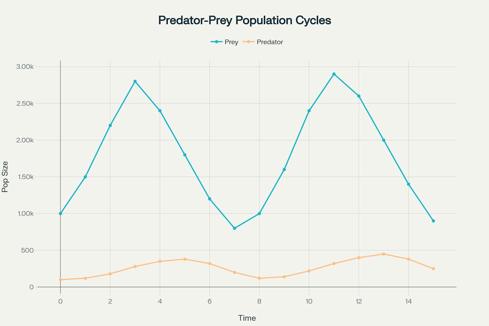

[→ مقدمه فصل سوم](./00-introduction.md) | [بخش ۳-۲: جستجوی هوشمند در توالی‌ها: داستان BLAST ←](./02-intelligent-sequence-search-blast.md)

# فصل ۳: هنر شناخت الگو در داده‌های زیستی

## بخش ۳-۱: الگوها در دنیای زنده: از اکوسیستم تا ژنوم

جهان طبیعت، از رقص منظم سیارات در آسمان شب گرفته تا چیدمان دقیق دانه‌های یک گل آفتابگردان، سرشار از **الگوها** است[1][2]. این الگوها تصادفی نیستند؛ آن‌ها زبان طبیعت برای ساختن ساختارهای پیچیده و انتقال اطلاعات هستند[3][4]. در زیست‌شناسی، این اصل اهمیتی دوچندان دارد. از چرخه‌های جمعیتی یک اکوسیستم تا کدهای نوشته شده در DNA، درک الگوها کلید رمزگشایی از اسرار حیات است[5][6].

در این بخش، ما سفری را در مقیاس‌های مختلف دنیای زنده آغاز می‌کنیم تا ببینیم الگوها چگونه در همه جا، از بزرگترین اکوسیستم‌ها تا کوچکترین مولکول‌ها، پنهان شده‌اند و چه داستانی برای ما روایت می‌کنند.

### 🎯 مسئله محوری این بخش:

فرض کنید شما یک محقق ژنتیک هستید و توالی کامل ژنوم یک باکتری تازه کشف‌شده را در اختیار دارید؛ رشته‌ای طولانی و به ظاهر بی‌معنی از حروف A, T, C و G. از شواهد اولیه اینطور برمی‌آید که این باکتری توانایی منحصربه‌فردی برای تولید یک آنتی‌بیوتیک جدید دارد.

سوال این است: در میان این دریای عظیم از داده‌های ژنتیکی، از کجا باید جستجو برای یافتن **الگوی ژنتیکی** مسئول این ویژگی شگفت‌انگیز را آغاز کنید؟ چگونه می‌توان یک الگوی معنادار را از تکرارهای تصادفی حروف در ژنوم تمایز داد؟

---

## الگو چیست و چرا در زیست‌شناسی حیاتی است؟

در ساده‌ترین تعریف، یک **الگو (Pattern)** یک تکرار یا یک ترتیب غیرتصادفی از عناصر است[1][7]. یک دیوار آجری دارای الگو است، در حالی که توده‌ای از آجرها که به صورت اتفاقی روی هم ریخته شده‌اند، فاقد الگوست. اهمیت الگو در زیست‌شناسی از این واقعیت ناشی می‌شود که: **الگو با عملکرد (Function) گره خورده است**[6][8].

وقتی یک زیست‌شناس یک الگوی تکرارشونده را در یک توالی DNA، یک ساختار پروتئینی یا رفتار یک جمعیت مشاهده می‌کند، اولین سوالی که به ذهنش می‌رسد این است: "این الگو چه معنایی دارد؟ چه کاری انجام می‌دهد؟" زیرا تکامل، فرآیندی به شدت صرفه‌جو است و به ندرت چیزی را بدون دلیل حفظ می‌کند[5][9]. یک الگوی حفظ‌شده در طول میلیون‌ها سال تکامل، به احتمال زیاد نقشی حیاتی برای بقای موجود زنده ایفا می‌کند.

> **الگوها در زیست‌شناسی، سیگنال‌هایی هستند که از میان نویز پس‌زمینه خود را به ما نشان می‌دهند**[6][10]. وظیفه ما به عنوان دانشمندان داده‌های زیستی، ساختن ابزارهایی است که بتوانند این سیگنال‌های ضعیف را از میان حجم عظیمی از نویز تشخیص دهند.

## سفری در مقیاس‌های حیات: الگوها در همه جا

الگوهای زیستی در هر سطحی از سازماندهی حیات قابل مشاهده هستند[2][11]. بیایید نگاهی به چند مثال بیندازیم:

### سطح اکوسیستم: چرخه‌های شکار و شکارچی

رابطه بین شکارچیان و طعمه‌هایشان یک الگوی کلاسیک در اکولوژی است[12][13]. افزایش جمعیت طعمه (مثلاً خرگوش‌ها) منجر به افزایش غذای در دسترس برای شکارچیان (مثلاً روباه‌ها) می‌شود و جمعیت آن‌ها نیز افزایش می‌یابد[14][15]. اما افزایش تعداد شکارچیان، فشار را بر جمعیت طعمه زیاد کرده و باعث کاهش تعداد آن‌ها می‌شود. این کاهش به نوبه خود، منجر به کمبود غذا برای شکارچیان و کاهش جمعیت آن‌ها می‌گردد[16][17]. این چرخه به طور مداوم تکرار می‌شود و یک الگوی نوسانی قابل پیش‌بینی ایجاد می‌کند[13][18].


_نمودار چرخه‌های جمعیت شکارچی-طعمه که الگوی نوسانی منظم در طبیعت را نشان می‌دهد_

معادلات ریاضی Lotka-Volterra این روابط را به صورت دقیق توصیف می‌کنند[13][19]:

$$\frac{dx}{dt} = \alpha x - \beta xy$$

$$\frac{dy}{dt} = -\gamma y + \delta xy$$

که در آن x جمعیت طعمه، y جمعیت شکارچی، و α، β، γ، δ پارامترهای مربوط به نرخ رشد و تعامل هستند[18][13].

### سطح ارگانیسم: تقارن و تکرار

بدن بسیاری از حیوانات (از جمله انسان) دارای **تقارن دوطرفه (Bilateral Symmetry)** است[20][21]. این یک الگوی ساختاری است که حرکت و جهت‌یابی را تسهیل می‌کند[22][23]. در دنیای گیاهان، الگوهای مارپیچی در چیدمان برگ‌ها روی ساقه (فیلوتاکسی) یا گلچه‌های یک گل آفتابگردان، بهینه‌ترین حالت برای دریافت نور خورشید را فراهم می‌کنند[24][25]. این‌ها الگوهای فضایی هستند که به بقا کمک می‌کنند[26][27].

تقارن دوطرفه مزایای متعددی دارد از جمله قابلیت حرکت بهتر، تعادل بیشتر، و توسعه سیستم عصبی پیشرفته‌تر[21][28]. بیشتر حیوانات از پستانداران تا حشرات این نوع تقارن را نشان می‌دهند.

### سطح ژنوم: زبان پنهان DNA

شاید مهم‌ترین و بنیادین‌ترین الگوها در زیست‌شناسی، در توالی DNA نهفته باشند[29][30]. ژنوم یک کتاب دستورالعمل است، اما این دستورالعمل‌ها به زبان ساده نوشته نشده‌اند. آن‌ها از الگوهای خاصی به نام **موتیف (Motif)** تشکیل شده‌اند[29][31].

- **پروموتر (Promoter):** یک موتیف خاص (مانند TATA-box) که به سلول می‌گوید خواندن یک ژن را از کجا شروع کند[32][33].
- **کدون پایان (Stop Codon):** سه حرف مشخص (مانند TAA, TAG, TGA) که به سلول فرمان "پایان ترجمه" را می‌دهد.
- **جایگاه اتصال فاکتور رونویسی:** الگوهای کوتاهی که پروتئین‌های خاصی به آن‌ها متصل شده و بیان ژن را تنظیم می‌کنند[34][35].

یک ژن خود یک الگوی ساختاری است که از بخش‌های مختلف (اگزون و اینترون) تشکیل شده است:

`[... پروموتر ...] --- [اگزون ۱] --- [اینترون ۱] --- [اگزون ۲] --- [... سیگنال پایان ...]`

تشخیص این الگوهای ساختاری و عملکردی، هسته اصلی بسیاری از تحلیل‌های بیوانفورماتیکی است[36][37].

موتیف‌های DNA معمولاً توسط ماتریس‌های فراوانی موقعیت (Position Frequency Matrix) و لوگوهای توالی نمایش داده می‌شوند[29][38]. این روش‌ها امکان تشخیص الگوهای حفظ‌شده در میان توالی‌های مختلف را فراهم می‌کنند.

### 🔬 تمرین تحلیلی: کشف موتیف تنظیم‌کننده

**سناریو:** شما در حال مطالعه یک ژن هستید که فقط در شرایط استرس گرمایی در سلول بیان می‌شود. شما ۵ توالی کوتاه از ناحیه بالادست (upstream) ژن‌های مختلف که همگی به گرما حساس هستند را جدا کرده‌اید. فرض بر این است که یک موتیف مشترک در این نواحی وجود دارد که مسئول فعال‌سازی هماهنگ آن‌هاست.

**داده‌ها:**

```
توالی ۱: GATTACAGGTCCAT
توالی ۲: CGGTAATCCAAT
توالی ۳: TAAGTACATGCG
توالی ۴: ATCTGGTACATC
توالی ۵: GCCAGGTACAGT
```

**سوالات:**

1. با دقت به این ۵ توالی نگاه کنید. آیا می‌توانید یک الگوی (موتیف) ۸ حرفی مشترک و یکسان را در تمام آن‌ها پیدا کنید؟
2. اگر این موتیف در هزاران ناحیه دیگر در ژنوم که به گرما حساس نیستند، یافت نشود، چه نتیجه‌ای می‌توان گرفت؟
3. این تمرین ساده، شبیه‌سازی کدام چالش اصلی در تحلیل داده‌های ژنومی است که در "مسئله محوری" این بخش مطرح شد؟

### 💡 نکات کلیدی این بخش

- **الگو یعنی اطلاعات:** در زیست‌شناسی، الگوهای غیرتصادفی حامل اطلاعات و نشان‌دهنده عملکرد هستند[7][8].

- **حیات چندمقیاسی، الگوهای چندمقیاسی:** الگوها در تمام سطوح سازماندهی حیات، از اکوسیستم و ارگانیسم گرفته تا ساختارهای مولکولی و ژنومی، وجود دارند[2][1].

- **موتیف‌ها، کلمات زبان DNA:** ژنوم از طریق الگوهای کوتاه و تکرارشونده‌ای به نام موتیف، دستورالعمل‌های خود را کد می‌کند[29][30].

- **چالش اصلی: سیگنال در برابر نویز:** وظیفه اصلی در بیوانفورماتیک، توسعه روش‌هایی برای تشخیص الگوهای معنادار (سیگنال) از توالی‌های تصادفی (نویز) است[6][10].

اکنون که با مفهوم الگو و اهمیت آن در مقیاس‌های مختلف حیات آشنا شدیم، این سوال پیش می‌آید که چگونه می‌توانیم به صورت خودکار و در مقیاس بزرگ، به دنبال الگوهای مشابه در میان میلیاردها حرف ژنوم بگردیم. در بخش بعدی، با یکی از قدرتمندترین ابزارهای تاریخ بیوانفورماتیک، **BLAST**، آشنا می‌شویم که دقیقاً برای پاسخ به همین سوال طراحی شده است[36][37].

---

## **منابع**

[1] https://en.wikipedia.org/wiki/Patterns_in_nature
[2] https://www.th-habitat.com/post/pattern-in-nature?lang=en
[3] https://news.utk.edu/2022/09/20/the-conversation-why-does-nature-create-patterns/
[4] https://theconversation.com/why-does-nature-create-patterns-a-physicist-explains-the-molecular-level-processes-behind-crystals-stripes-and-basalt-columns-186433
[5] https://www.sparknotes.com/biology/evolution/patternsofevolution/section1/
[6] https://scholars.cityu.edu.hk/en/studentTheses/pattern-recognition-in-biological-sequences-and-matrices
[7] https://pmc.ncbi.nlm.nih.gov/articles/PMC2824446/
[8] https://pmc.ncbi.nlm.nih.gov/articles/PMC3475482/
[9] https://bio.libretexts.org/Bookshelves/Introductory_and_General_Biology/General_Biology_(Boundless)/18:_Evolution_and_the_Origin_of_Species/18.01:_Understanding_Evolution/18.1D:_Processes_and_Patterns_of_Evolution
[10] https://pmc.ncbi.nlm.nih.gov/articles/PMC3820096/
[11] https://www.terramai.com/blog/patterns-in-nature-and-built-environment/
[12] https://www.mcgill.ca/newsroom/channels/news/perpetual-predator-prey-population-cycles-303632
[13] https://en.wikipedia.org/wiki/Lotka%E2%80%93Volterra_equations
[14] https://bio.libretexts.org/Bookshelves/Ecology/Environmental_Science_(Ha_and_Schleiger)/02:_Ecology/2.03:_Communities/2.3.01:_Biotic_Interactions/2.3.1.01:_Trophic_Interactions/2.3.1.1.01:_Predation
[15] https://www.bbc.co.uk/bitesize/guides/zwgbpbk/revision/2
[16] https://www.nature.com/scitable/knowledge/library/dynamics-of-predation-13229468/
[17] https://www.khanacademy.org/science/hs-bio/x230b3ff252126bb6:ecology-and-natural-systems/x230b3ff252126bb6:interactions-in-communities/v/predator-prey-population-cycles
[18] https://mathworld.wolfram.com/Lotka-VolterraEquations.html
[19] https://math.libretexts.org/Bookshelves/Applied_Mathematics/Mathematical_Biology_(Chasnov)/01:_Population_Dynamics/1.04:_The_Lotka-Volterra_Predator-Prey_Model
[20] https://www.biologyonline.com/dictionary/bilateral-symmetry
[21] https://study.com/learn/lesson/bilateral-symmetry-overview-examples.html
[22] https://www.numberanalytics.com/blog/ultimate-guide-bilateral-symmetry
[23] https://www.britannica.com/science/bilateral-symmetry
[24] https://royalsocietypublishing.org/doi/10.1098/rsif.2018.0850
[25] https://en.wikipedia.org/wiki/Phyllotaxis
[26] https://www.scienceworld.ca/stories/patterns-nature-where-spot-spirals/
[27] https://bluelabyrinths.com/2015/03/19/why-do-spirals-exist-everywhere-in-nature/
[28] https://en.wikipedia.org/wiki/Symmetry_in_biology
[29] https://biocorecrg.github.io/CRG_Bioinformatics_for_Biologists_2021/dna_motifs.html
[30] https://en.wikipedia.org/wiki/Sequence_motif
[31] https://academic.oup.com/nar/article/52/8/4137/7640531
[32] https://en.wikipedia.org/wiki/TATA_box
[33] https://www.nature.com/wls/definition/tata-box-313/
[34] https://www.nichd.nih.gov/about/org/dir/dir_showcase/clark-transcription-factor-binding-sites
[35] https://pmc.ncbi.nlm.nih.gov/articles/PMC7394279/
[36] https://bio.libretexts.org/Bookshelves/Computational_Biology/Book:_Computational_Biology_-_Genomes_Networks_and_Evolution_(Kellis_et_al.)/03:_Rapid_Sequence_Alignment_and_Database_Search/3.05:_The_BLAST_algorithm_(Basic_Local_Alignment_Search_Tool)
[37] https://en.wikipedia.org/wiki/BLAST_(biotechnology)
[38] https://pubmed.ncbi.nlm.nih.gov/38572749/
