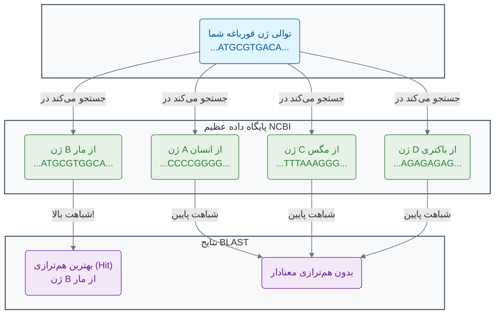

[→ بخش ۳-۱: جعبه ابزار یک دانشمند داده: مروری بر ابزارهای کلیدی](./01-patterns-in-living-world.md) | [بخش ۳-۳: ساختن درخت زندگی: فیلوژنتیک مولکولی ←](./03-building-tree-of-life-phylogenetics.md)

# فصل ۳: هنر الگویابی در داده‌های زیستی

## بخش ۳-۲: جستجوی هوشمند در توالی‌ها: داستان BLAST

شما یک ژن کاملاً جدید در یک موجود ناشناخته کشف کرده‌اید. این توالی، رشته‌ای از حروف A, T, C, G، هیچ معنای آشکاری برای شما ندارد. اولین و مهم‌ترین سوالی که به ذهن شما می‌رسد چیست؟ "آیا موجود دیگری در این سیاره، ژنی شبیه به این دارد؟" پاسخ به این سوال می‌تواند کلید درک عملکرد و تاریخچه این ژن باشد. اما چگونه می‌توان این توالی را با میلیون‌ها ژن شناخته‌شده در تمام پایگاه‌های داده جهان مقایسه کرد؟ این کار مانند پیدا کردن یک سوزن در انبار کاه نیست، بلکه مانند پیدا کردن یک سوزن خاص در انبار عظیمی از سوزن‌های دیگر است.

### 🎯 مسئله محوری این بخش:

شما یک توالی پروتئینی جدید را از یک باکتری اعماق اقیانوس جداسازی کرده‌اید و گمان می‌کنید ممکن است در تجزیه پلاستیک نقش داشته باشد. پایگاه داده پروتئین‌ها میلیون‌ها توالی دارد. چگونه می‌توانید به سرعت و با اطمینان بالا، نزدیک‌ترین خویشاوندان این پروتئین را پیدا کنید تا فرضیه خود را بیازمایید؟ صرفاً مقایسه حرف به حرف کافی است یا به ابزاری هوشمندتر نیاز داریم که بتواند روابط تکاملی دور را نیز تشخیص دهد؟

در بخش قبل، ما در مورد اهمیت الگوها در زیست‌شناسی صحبت کردیم. حالا سوال این است: چگونه می‌توانیم یک الگوی خاص (مثلاً یک توالی ژن) را در یک پایگاه داده‌ی عظیم (مثلاً کل ژنوم انسان یا مجموعه‌ای از تمام ژنوم‌های شناخته‌شده) پیدا کنیم؟

### **یک سوال بنیادی**

تصور کنید شما یک زیست‌شناس هستید که در جنگل‌های آمازون یک گونه جدید قورباغه را کشف کرده‌اید. پس از توالی‌یابی ژنوم آن، یک ژن کاملاً جدید پیدا می‌کنید که قبلاً هرگز دیده نشده است. شما هیچ ایده‌ای ندارید که این ژن چه کاری انجام می‌دهد. اولین قدم شما برای پی بردن به عملکرد این ژن چیست؟

پاسخ در یکی از اصول بنیادی بیوانفورماتیک نهفته است: **"اصل شباهت"**[1][2]. این اصل می‌گوید:

> **اگر دو توالی (ژن یا پروتئین) شباهت زیادی به هم داشته باشند، احتمالاً عملکرد مشابهی نیز دارند و از یک جد مشترک تکامل یافته‌اند.**

بنابراین، بهترین راه برای حدس زدن عملکرد ژن ناشناخته شما، این است که آن را با تمام ژن‌های شناخته شده در جهان مقایسه کنید. اگر ژن شما به یک ژن شناخته شده که مثلاً در تولید یک سم خاص نقش دارد شباهت زیادی داشته باشد، شما یک سرنخ بسیار قوی در دست دارید که ژن شما نیز ممکن است در تولید سم نقش داشته باشد.

اما چگونه این جستجوی عظیم را انجام دهیم؟

### **گوگل دنیای زیست‌شناسی: BLAST**

در سال ۱۹۹۰، دانشمندان **استفن آلتشول (Stephen Altschul)، وارن گیش (Warren Gish)، وب میلر (Webb Miller)، یوجین مایرز (Eugene Myers) و دیوید لیپمن (David Lipman)** در مرکز ملی اطلاعات بیوتکنولوژی (NCBI) ابزاری انقلابی به نام **BLAST (Basic Local Alignment Search Tool)** را توسعه دادند[3][4][5]. BLAST را می‌توان به سادگی به عنوان "گوگل برای زیست‌شناسان" توصیف کرد[6][7]. شما توالی ژن یا پروتئین خود را به عنوان "عبارت جستجو" وارد می‌کنید و BLAST آن را در چند ثانیه با پایگاه‌های داده‌ای حاوی میلیاردها توالی مقایسه می‌کند.

مقاله اصلی BLAST که در مجله Journal of Molecular Biology منتشر شد، پرارجاع‌ترین مقاله دهه ۱۹۹۰ بوده است[8][7] و بیش از ۱۰۰,۰۰۰ بار به آن ارجاع داده شده است[4].

BLAST به دنبال **هم‌ترازی‌های محلی (Local Alignments)** می‌گردد[9][4]. این یعنی BLAST تلاش نمی‌کند کل توالی شما را با کل یک توالی دیگر مطابقت دهد. بلکه به دنبال پیدا کردن **مشابه‌ترین قطعه‌ها یا ناحیه‌ها** بین توالی شما و توالی‌های موجود در پایگاه داده است[10][11]. این ویژگی بسیار قدرتمند است، زیرا بسیاری از پروتئین‌ها از بخش‌ها یا "دومین‌های" عملکردی مختلفی تشکیل شده‌اند و ممکن است تنها یکی از این دومین‌ها بین دو پروتئین مشترک باشد.

نتیجه جستجوی BLAST لیستی از "**hit**" هاست: توالی‌هایی در پایگاه داده که بیشترین شباهت را به توالی شما دارند، به همراه یک امتیاز شباهت (Score) و یک مقدار معناداری آماری (**E-value**) که نشان می‌دهد این شباهت چقدر محتمل است که شانسی باشد[9][12][13].



### **چگونه BLAST کار می‌کند؟**

الگوریتم BLAST بر اساس چندین مرحله عمل می‌کند[9][4][14]:

1. **شناسایی کلمات مشابه**: BLAST توالی جستجو را به قطعات کوتاه (معمولاً ۳ آمینواسید برای پروتئین‌ها یا ۱۱ نوکلئوتید برای DNA) تقسیم می‌کند[9].

2. **جستجوی دقیق**: برای هر کلمه، الگوریتم به دنبال تطبیق‌های دقیق در پایگاه داده می‌گردد[4].

3. **گسترش هم‌ترازی**: هنگامی که یک تطبیق یافت شد، BLAST سعی می‌کند آن را در هر دو جهت گسترش دهد[9][4].

4. **امتیازدهی آماری**: در نهایت، معناداری آماری هر هم‌ترازی محاسبه می‌شود[12][13].

### **E-value: کلید درک معناداری نتایج**

**E-value (Expectation Value)** یکی از مهم‌ترین مفاهیم در تفسیر نتایج BLAST است[12][13][15]. E-value تعداد هم‌ترازی‌هایی است که انتظار می‌رود با همان کیفیت یا بهتر، به طور تصادفی در پایگاه داده یافت شوند[13][16].

- **E-value پایین (مثلاً 1e-50)**: نشان‌دهنده شباهت بسیار معنادار است[15][16]
- **E-value بالا (مثلاً 10)**: احتمال شانسی بودن شباهت زیاد است[15][16]

فرمول E-value عبارت است از[13]:

```
E-value = K × m × n × e^(-λS)
```

که در آن m طول توالی جستجو، n طول کل پایگاه داده، و S امتیاز هم‌ترازی است.

### **تفاوت هم‌ترازی محلی و سراسری**

BLAST از **هم‌ترازی محلی** استفاده می‌کند، برخلاف الگوریتم‌هایی مانند **نیدلمن-وانش (Needleman-Wunsch)** که هم‌ترازی سراسری انجام می‌دهند[10][11][17]:

- **هم‌ترازی سراسری**: کل طول دو توالی را مقایسه می‌کند، مناسب برای توالی‌های مشابه با طول یکسان[10][17]
- **هم‌ترازی محلی**: تنها شباهت‌ترین قطعات را پیدا می‌کند، مناسب برای یافتن دومین‌های عملکردی[10][18]

BLAST بر اساس **الگوریتم اسمیت-واترمن (Smith-Waterman)** طراحی شده، اما سریع‌تر است[4][19][18].

### **فراتر از BLAST: الگوریتم‌های هوشمندتر**

BLAST یک ابزار فوق‌العاده قدرتمند و هنوز هم پرکاربردترین ابزار در بیوانفورماتیک است[20][21]. اما محدودیت‌هایی نیز دارد. این ابزار در پیدا کردن خویشاوندان تکاملی بسیار نزدیک عالی عمل می‌کند، اما ممکن است در یافتن **خویشاوندان بسیار دور** که در طول میلیون‌ها سال تکامل، تفاوت‌های زیادی پیدا کرده‌اند، دچار مشکل شود.

اینجا جایی است که الگوریتم‌های پیشرفته‌تر مبتنی بر هوش مصنوعی وارد می‌شوند. روش‌هایی مانند:

- **جستجو بر اساس پروفایل (Profile-based Search)**: مانند استفاده از **مدل‌های پنهان مارکوف (Hidden Markov Models - HMMs)** که به جای جستجوی یک توالی، یک "پروفایل" آماری از یک خانواده کامل از پروتئین‌ها را جستجو می‌کنند[22][23][24]. این کار اجازه می‌دهد تا اعضای بسیار دور یک خانواده که شباهت کمی به توالی اولیه دارند نیز پیدا شوند[25][26].

- **الگوریتم‌های یادگیری عمیق**: مدل‌های جدیدی مانند **ProteinBERT**[27] و **ProteinMPNN**[28] که می‌توانند الگوهای بسیار پیچیده و غیرخطی را در توالی‌ها یاد بگیرند تا روابط دورتر و ظریف‌تر را کشف کنند[29][30].

درک این الگوریتم‌های پیشرفته نیازمند دانش عمیق‌تری در ریاضیات و علوم کامپیوتر است، اما اصل اساسی آن‌ها مشابه است: **یافتن الگوهای پنهان شباهت که نشان‌دهنده عملکرد یا تاریخچه تکاملی مشترک است**.

### 🔬 تمرین تحلیلی: تحلیل نتایج BLAST

فرض کنید شما توالی ژن مرموز خود را در BLAST جستجو کرده‌اید و نتایج زیر را دریافت کرده‌اید:

| Hit (توالی مشابه)                             | Score (امتیاز شباهت) | E-value (ارزش احتمال) |
| --------------------------------------------- | -------------------- | --------------------- |
| ژن A (از شامپانزه) - مسئول تولید آنزیم گوارشی | 250                  | 1e-80                 |
| ژن B (از گاو) - عملکرد ناشناخته               | 120                  | 2e-30                 |
| ژن C (از یک ویروس) - پروتئین کپسید            | 45                   | 0.02                  |
| ژن D (از مخمر) - پروتئین ساختاری دیواره سلولی | 42                   | 0.06                  |

**سوالات:**

1. **کدام نتیجه بیشترین شباهت معنادار را به توالی شما دارد؟ چرا؟**

   ژن A از شامپانزه بیشترین معناداری را دارد، زیرا بالاترین امتیاز (250) و کمترین E-value (1e-80) را دارد. E-value بسیار پایین نشان می‌دهد که احتمال شانسی بودن این شباهت تقریباً صفر است.

2. **کدام نتایج را می‌توان با اطمینان کمتری به عنوان یک خویشاوند واقعی در نظر گرفت و چرا؟**

   ژن C و D با اطمینان کمتری قابل قبول هستند، زیرا E-value آن‌ها (0.02 و 0.06) بزرگتر از آستانه معمول 0.01 است، که نشان می‌دهد احتمال شانسی بودن این شباهت‌ها نسبتاً بالا است[15][2].

3. **بر اساس بهترین نتیجه، محتمل‌ترین عملکرد برای ژن شما چیست؟**

   بر اساس قوی‌ترین نتیجه (ژن A)، احتمالاً ژن شما نیز در تولید آنزیم گوارشی نقش دارد.

### 💡 نکات کلیدی این بخش

- **اصل شباهت**: توالی‌های مشابه، عملکردهای مشابهی دارند و از جد مشترک تکامل یافته‌اند[1][2].

- **BLAST**: ابزار جستجوی بنیادی برای یافتن هم‌ترازی‌های محلی (Local Alignments) بین توالی‌ها و پایگاه‌های داده عظیم است[4][20].

- **E-value**: یک معیار آماری کلیدی در BLAST است که احتمال شانسی بودن یک هم‌ترازی را نشان می‌دهد[12][13]. هرچه این عدد به صفر نزدیک‌تر باشد، نتیجه معنادارتر است.

- **محدودیت BLAST**: این ابزار در یافتن خویشاوندان تکاملی بسیار دور محدودیت دارد و برای این کار به روش‌های مبتنی بر پروفایل (مانند HMMs) یا یادگیری عمیق نیاز است[22][27].

- **کاربردهای BLAST**: شناسایی گونه‌ها، یافتن دومین‌های عملکردی، برقراری روابط فیلوژنتیک، و مقایسه توالی‌ها[4][31].

اکنون که می‌دانیم چگونه می‌توانیم توالی‌های مشابه را پیدا کنیم، در بخش بعدی به یک چالش مهم‌تر می‌پردازیم: چگونه می‌توانیم چندین توالی را با هم مقایسه کرده و الگوهای مشترک میان آن‌ها را کشف کنیم؟ این کار ما را به دنیای هم‌ترازی چندگانه توالی‌ها خواهد برد.

---

## **منابع**

[1] https://pmc.ncbi.nlm.nih.gov/articles/PMC2845305/
[2] https://pmc.ncbi.nlm.nih.gov/articles/PMC3820096/
[3] https://www.biostat.wisc.edu/bmi576/papers/blast.pdf
[4] https://en.wikipedia.org/wiki/BLAST_(biotechnology)
[5] https://pubmed.ncbi.nlm.nih.gov/2231712/
[6] https://www.ncbi.nlm.nih.gov/Web/Newsltr/Summer99/decade.html
[7] https://www.nature.com/scitable/topicpage/basic-local-alignment-search-tool-blast-29096/
[8] http://csc.columbusstate.edu/carroll/7840/private/papers/BasicLocalAlignmentSearchTool-BLAST.pdf
[9] https://pmc.ncbi.nlm.nih.gov/articles/PMC138974/
[10] https://biology.stackexchange.com/questions/11263/what-is-the-difference-between-local-and-global-sequence-alignments
[11] https://bio.libretexts.org/Bookshelves/Computational_Biology/Book:_Computational_Biology_-_Genomes_Networks_and_Evolution_(Kellis_et_al.)/03:_Rapid_Sequence_Alignment_and_Database_Search/3.03:_Global_alignment_vs._Local_alignment_vs._Semi-global_alignment
[12] https://academic.oup.com/bioinformatics/article/40/12/btae729/7916501
[13] https://sequenceserver.com/blog/blast-e-value-meaning/
[14] https://is.muni.cz/el/sci/jaro2014/C2135/um/46997701/BLAST_algorithm.pdf
[15] https://www.nlm.nih.gov/ncbi/workshops/2023-08_BLAST_evol/e_value.html
[16] https://www.metagenomics.wiki/tools/blast/evalue
[17] https://en.wikipedia.org/wiki/Needleman%E2%80%93Wunsch_algorithm
[18] https://en.wikipedia.org/wiki/Smith%E2%80%93Waterman_algorithm
[19] https://www.youtube.com/watch?v=bFDRny7T3_s
[20] https://microbenotes.com/blast-bioinformatics/
[21] https://pmc.ncbi.nlm.nih.gov/articles/PMC1538791/
[22] http://www.biopred.net/hmm.html
[23] https://bip.weizmann.ac.il/education/materials/gcg/profileanalysis.html
[24] https://pmc.ncbi.nlm.nih.gov/articles/PMC2766791/
[25] https://academic.oup.com/bioinformatics/article/14/9/755/259550
[26] https://www.ebi.ac.uk/Tools/hmmer/search/hmmsearch
[27] https://academic.oup.com/bioinformatics/article/38/8/2102/6502274
[28] https://pmc.ncbi.nlm.nih.gov/articles/PMC9997061/
[29] https://www.pnas.org/doi/10.1073/pnas.2104878118
[30] https://pmc.ncbi.nlm.nih.gov/articles/PMC9947925/
[31] https://guides.lib.berkeley.edu/ncbi/blast
[32] https://bio.libretexts.org/Bookshelves/Computational_Biology/Book:_Computational_Biology_-_Genomes_Networks_and_Evolution_(Kellis_et_al.)/03:_Rapid_Sequence_Alignment_and_Database_Search/3.05:_The_BLAST_algorithm_(Basic_Local_Alignment_Search_Tool)
[33] https://en.wikipedia.org/wiki/Blast_(American_band)
[34] https://cs.brown.edu/courses/csci1810/fall-2023/resources/ch1_readings/Basic_local_alignment_search_tool.pdf
[35] https://www.ncbi.nlm.nih.gov/books/NBK148949/
[36] https://www.ccg.unam.mx/~vinuesa/tlem/pdfs/Bioinformatics_explained_BLAST.pdf
[37] https://www.bionity.com/en/encyclopedia/BLAST.html
[38] https://resources.qiagenbioinformatics.com/manuals/clcgenomicsworkbench/2100/index.php?manual=BE_BLAST.html
[39] https://www.sciencedirect.com/science/article/pii/S0022283605803602
[40] https://www.bbc.com/news/uk-england-manchester-36474535
[41] https://tr.wikipedia.org/wiki/BLAST
[42] https://www.sciencedirect.com/science/article/pii/S1674775518305614
[43] https://blast.ncbi.nlm.nih.gov/Blast.cgi
[44] https://academic.oup.com/bioinformatics/article/35/9/1613/5106166
[45] https://academic.oup.com/nar/article/25/17/3389/1061651
[46] https://en.wikipedia.org/wiki/Stephen_Altschul
[47] http://people.umass.edu/bioch623/623/FirstSection/Papers/BLAST.pdf
[48] https://irp.nih.gov/pi/stephen-altschul
[49] https://www.ncbi.nlm.nih.gov/BLAST/tutorial/Altschul-1.html
[50] https://pmc.ncbi.nlm.nih.gov/articles/PMC146917/
[51] https://www.ncbi.nlm.nih.gov/research/staff/altschul/
[52] https://onlinelibrary.wiley.com/doi/10.1038/npg.els.0005253
[53] https://www.sciencedirect.com/science/article/abs/pii/S0022283605803602
[54] https://llri.in/difference-between-global-and-local-alignment/
[55] https://www.pnas.org/doi/10.1073/pnas.1424324112
[56] https://www.majordifferences.com/2016/05/difference-between-global-and-local.html
[57] https://dergipark.org.tr/en/pub/bsengineering/issue/83068/1402011
[58] https://ravilabio.info/notes/bioinformatics/e-value-bitscore.html
[59] https://www.slideshare.net/slideshow/sequence-alignment-global-vs-local/171884342
[60] https://www.sciencedirect.com/topics/medicine-and-dentistry/sequence-homology
[61] https://blast.ncbi.nlm.nih.gov/doc/blast-help/FAQ.html
[62] https://www.youtube.com/watch?v=nqqBgWaNoig
[63] https://journals.plos.org/ploscompbiol/article?id=10.1371%2Fjournal.pcbi.1002645
[64] https://www.biostars.org/p/463451/
[65] https://microbenotes.com/local-global-multiple-sequence-alignment/
[66] https://www2.cs.uh.edu/~ceick/ML/HMM_in_BI.pdf
[67] https://dl.acm.org/doi/pdf/10.1145/370954.370969
[68] https://en.wikipedia.org/wiki/Hidden_Markov_model
[69] https://www.pnas.org/doi/10.1073/pnas.0810767106
[70] https://www.youtube.com/watch?v=GzP_NDV6zmU
[71] https://en.wikipedia.org/wiki/Sequence_profiling_tool
[72] https://www.frontiersin.org/journals/pharmacology/articles/10.3389/fphar.2025.1498662/full
[73] https://www.nature.com/articles/s41467-022-29443-w
[74] https://www.slideshare.net/slideshow/myhmm/30949520
[75] https://www.embl.org/news/updates-from-data-resources/alphafold-database-update-sequence-based-search/
[76] https://www.slideshare.net/slideshow/the-needleman-wunsch-algorithm/16572021
[77] https://www.geniranlab.ir/%D8%A2%D8%B4%D9%86%D8%A7%DB%8C%DB%8C-%D8%A8%D8%A7-ncbi/
[78] https://cs.stanford.edu/people/eroberts/courses/soco/projects/computers-and-the-hgp/smith_waterman.html
[79] https://www.youtube.com/watch?v=18vt6k-2Jbs
[80] https://bioinformatics101.ir/%D9%BE%D8%A7%DB%8C%DA%AF%D8%A7%D9%87-%D8%AF%D8%A7%D8%AF%D9%87/
[81] https://pishgam-bio.ir/%D8%A2%D8%B4%D9%86%D8%A7%DB%8C%DB%8C-%D8%A8%D8%A7-%D9%BE%D8%A7%DB%8C%DA%AF%D8%A7%D9%87-%D8%AF%D8%A7%D8%AF%D9%87-genbank-%D9%BE%D8%A7%DB%8C%DA%AF%D8%A7%D9%87-%D8%AF%D8%A7%D8%AF%D9%87-%D8%AC%D9%87%D8%A7/
[82] https://www.slideshare.net/slideshow/the-smith-waterman-algorithm/16572305
[83] https://web.itu.edu.tr/yilmazerayse/docs/Furkan_BASARIM_2022.pdf
[84] https://www.aparat.com/v/a40yfo7
[85] https://github.com/giorgapost/smith-waterman-algorithm
[86] https://www.cs.sjsu.edu/~aid/cs152/NeedlemanWunsch.pdf
[87] https://www.vanyarbioinf.ir/ncbi/
[88] https://www.youtube.com/watch?v=te_csPu5lmM
[89] https://bioboot.github.io/bimm143_W20/class-material/nw/
[90] https://www.ncbi.nlm.nih.gov/protein/
[91] https://www.biogem.org/downloads/notes/kau/Local%20Alignment.pdf
[92] https://blast.ncbi.nlm.nih.gov/Blast.cgi?PAGE_TYPE=BlastSearch&BLAST_SPEC=GlobalAln
