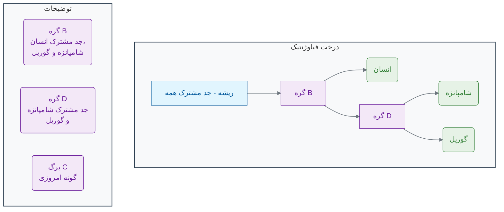
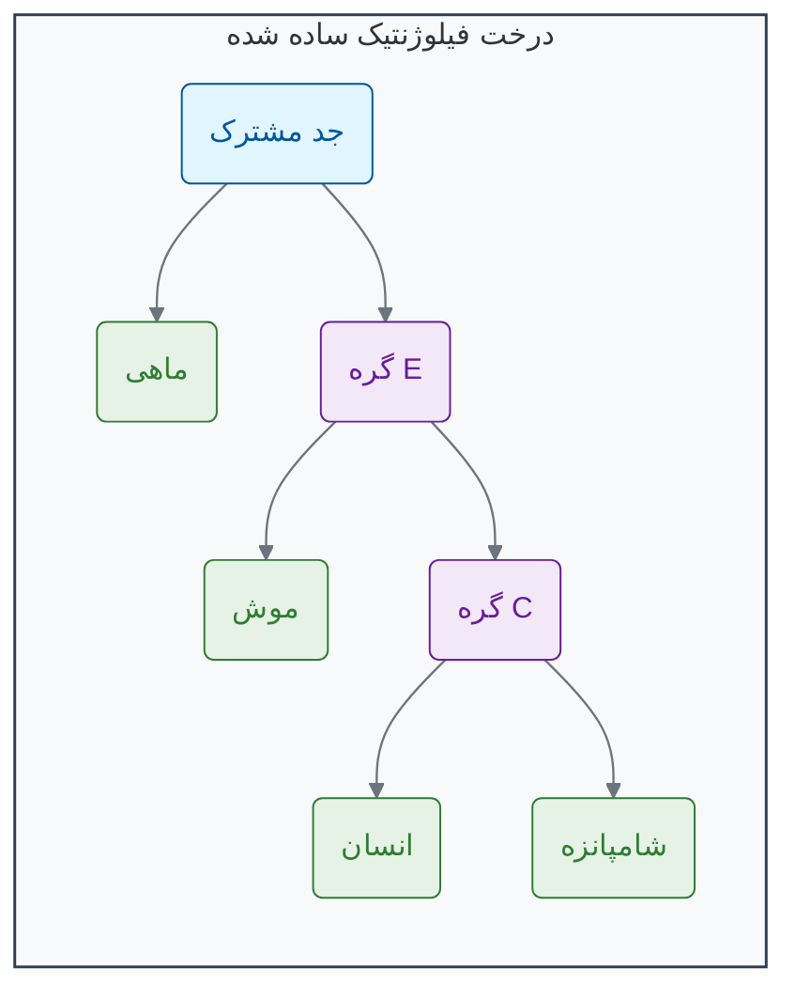

[→ بخش ۳-۲: جستجوی هوشمند در توالی‌ها: داستان BLAST](./02-intelligent-sequence-search-blast.md) | [بخش ۳-۴: مطالعه موردی: ردیابی ویروس‌ها در زمان واقعی ←](./04-case-study-real-time-virus-tracking.md)

# فصل ۳: هنر الگویابی در داده‌های زیستی

## بخش ۳-۳: ساختن درخت زندگی: فیلوژنتیک مولکولی

همه ما شنیده‌ایم که انسان و شامپانزه جد مشترکی دارند. اما این "جد" دقیقاً چه زمانی زندگی می‌کرده؟ و کدام گونه به ما نزدیک‌تر است: گوریل یا اورانگوتان؟ چگونه می‌توانیم با استفاده از داده‌های DNA که امروز در دست داریم، به گذشته سفر کنیم و نقشه خویشاوندی تمام موجودات زنده را با دقت ترسیم کنیم؟ این کار مانند ساختن یک شجره‌نامه خانوادگی است، اما برای کل حیات روی زمین و با داده‌هایی که در طول میلیون‌ها سال در حال تغییر بوده‌اند. این چالش، نیازمند ابزارهای قدرتمندی برای بازسازی تاریخ است.

### 🎯 مسئله محوری این بخش:

یک ویروس جدید و ناشناخته در حال شیوع است. دانشمندان توالی ژنوم این ویروس را از بیماران مختلف در سراسر جهان به دست آورده‌اند. این توالی‌ها بسیار شبیه‌ به هم هستند اما تفاوت‌های جزئی دارند. چگونه می‌توان از این تفاوت‌های کوچک برای بازسازی نقشه انتشار ویروس استفاده کرد؟ آیا می‌توانیم به عقب برگردیم و بفهمیم ویروس از کدام منطقه جغرافیایی یا کدام گونه حیوانی منشأ گرفته است؟ این صرفاً یک کنجکاوی آکادمیک نیست؛ پاسخ آن می‌تواند به کنترل یک اپیدمی جهانی کمک کند[1][2].

در سال ۱۸۳۷، چارلز داروین در یکی از دفترچه‌های یادداشت خود، یک طرح ساده و در عین حال انقلابی را ترسیم کرد. یک دیاگرام شاخه‌شاخه که بالای آن نوشته بود: "من فکر می‌کنم" (I think)[3][4][5]. این طرح، اولین نمایش از **درخت زندگی (Tree of Life)** بود؛ یک ایده قدرتمند که تمام موجودات زنده بر روی زمین، از یک جد مشترک منشأ گرفته‌اند و در طول میلیاردها سال، مانند شاخه‌های یک درخت عظیم، از هم جدا شده‌اند[6][7].

امروزه، ما دیگر نیازی به حدس و گمان بر اساس ویژگی‌های ظاهری نداریم. ما می‌توانیم این درخت را با دقت بسیار بالاتری با استفاده از داده‌های مولکولی بازسازی کنیم. به این رشته علمی **فیلوژنتیک (Phylogenetics)** می‌گویند[8][9].

### **چگونه با DNA درخت بسازیم؟**

ایده اصلی بسیار ساده است. دو گونه‌ای که از نظر تکاملی به هم نزدیک‌تر هستند (یعنی زمان کمتری از جدایی آن‌ها از یک جد مشترک گذشته است)، زمان کمتری برای انباشته شدن تفاوت‌ها در DNA خود داشته‌اند. در نتیجه[8][10]:

> **هرچه توالی DNA یا پروتئین دو گونه شبیه‌تر باشد، آن دو گونه ارتباط تکاملی نزدیک‌تری با هم دارند.**

با مقایسه یک ژن مشخص (مثلاً ژن سیتوکروم اکسیداز) بین چندین گونه مختلف، ما می‌توانیم یک ماتریس از شباهت‌ها بسازیم و از روی آن، محتمل‌ترین درخت تکاملی که این روابط را توضیح می‌دهد، استنتاج کنیم[11][9].

### **آناتومی یک درخت فیلوژنتیک**

یک درخت فیلوژنتیک اجزای ساده‌ای دارد، اما هرکدام معنای عمیقی دارند[12][13][14]:

- **شاخه‌ها (Branches):** نشان‌دهنده یک نسب یا دودمان در طول زمان هستند. طول شاخه‌ها گاهی نشان‌دهنده میزان تغییرات تکاملی یا زمان است[15][16].
- **گره‌ها (Nodes):** نقطه‌ای که در آن یک شاخه به دو یا چند شاخه تقسیم می‌شود. هر گره نشان‌دهنده **یک جد مشترک فرضی** است؛ آخرین موجودی که قبل از جدا شدن دو یا چند نسب، وجود داشته است[12][13][14].
- **برگ‌ها یا نوک‌ها (Leaves/Tips):** انتهای شاخه‌ها که نشان‌دهنده گونه‌های امروزی (یا توالی‌هایی که ما تحلیل می‌کنیم) هستند[12][13][15].

در این مثال، درخت نشان می‌دهد که شامپانزه و گوریل خویشاوندی نزدیک‌تری به هم دارند تا به انسان، زیرا آن‌ها یک جد مشترک (گره D) دارند که انسان در آن سهیم نیست. **با این حال، مطالعات مولکولی نشان داده‌اند که انسان و شامپانزه در واقع نزدیک‌ترین خویشاوندان یکدیگر هستند**[17][18][19][20].

### **چرا تحلیل تکاملی به هوش مصنوعی نیاز دارد؟**

ساختن یک درخت برای ۳ گونه، تنها ۳ حالت ممکن دارد. اما برای ۱۰ گونه، بیش از ۲ میلیون درخت ممکن وجود دارد! و برای تنها ۵۰ گونه، تعداد درخت‌های ممکن از تعداد اتم‌های موجود در جهان بیشتر می‌شود![21][22][23] جستجو در این فضای عظیم از احتمالات برای یافتن "بهترین" درخت که داده‌های ما را توضیح دهد، یک چالش محاسباتی بسیار بزرگ است[24][25].

اینجاست که **هوش مصنوعی** به کمک ما می‌آید. الگوریتم‌های فیلوژنتیک مدرن[26][27][28]:

- **الگوریتم‌های بهینه‌سازی (Optimization Algorithms):** مانند **حداکثر درست‌نمایی (Maximum Likelihood)** و **استنتاج بیزی (Bayesian Inference)**، از روش‌های هوشمند آماری برای جستجو در فضای وسیع درخت‌ها استفاده می‌کنند تا محتمل‌ترین درخت را بدون نیاز به بررسی همه حالات، پیدا کنند[27][28][29][30].
- **مدل‌های تکاملی پیچیده:** این الگوریتم‌ها می‌توانند مدل‌های پیچیده‌ای از چگونگی جهش در DNA را در نظر بگیرند (مثلاً اینکه بعضی جهش‌ها از بقیه رایج‌تر هستند) تا درخت‌های دقیق‌تری بسازند[26][31][32].

**تحلیل فیلوژنتیک تنها برای درک گذشته نیست.** این ابزار کاربردهای عملی حیاتی دارد[1][2][33]:

- **اپیدمیولوژی:** ردیابی منشأ و نحوه انتشار ویروس‌هایی مانند HIV یا SARS-CoV-2[34][35][36][37][38].
- **پزشکی قانونی:** شناسایی منابع نمونه‌های بیولوژیکی[2].
- **زیست‌شناسی حفاظت:** تعیین تنوع ژنتیکی در گونه‌های در معرض خطر[20][39].

با استفاده از هوش مصنوعی، ما می‌توانیم داستان نوشته شده در ژنوم‌ها را بخوانیم و نقشه بزرگ حیات را با جزئیاتی که داروین هرگز نمی‌توانست تصور کند، ترسیم کنیم[8][21].

### 🔬 تمرین تحلیلی: خواندن درخت تکاملی

به درخت فیلوژنتیک ساده شده زیر که بر اساس توالی یک ژن خاص ساخته شده است، نگاه کنید:

**سوالات:**

1.  بر اساس این درخت، کدام گونه نزدیک‌ترین خویشاوند تکاملی انسان است؟
2.  آیا جد مشترک انسان و شامپانزه (گره C)، در زمان جدیدتری وجود داشته است یا جد مشترک تمام پستانداران در این درخت (گره E)؟
3.  اگر یک توالی جدید از یک "کانگورو" به این تحلیل اضافه شود، انتظار دارید شاخه آن به کدام گره متصل شود؟ (راهنمایی: در نظر بگیرید که کانگورو یک پستاندار کیسه‌دار است و قبل از جدا شدن موش‌ها و پستانداران پیشرفته، از این نسب جدا شده است).

### 💡 نکات کلیدی این بخش

- **فیلوژنتیک مولکولی:** رشته‌ای علمی که از داده‌های مولکولی (DNA, RNA, پروتئین) برای بازسازی روابط تکاملی بین موجودات استفاده می‌کند[8][9].
- **اصل اساسی:** شباهت بیشتر در توالی‌های مولکولی به معنای خویشاوندی تکاملی نزدیک‌تر است[8][10].
- **اجزای درخت:** شامل **شاخه‌ها** (نسب)، **گره‌ها** (اجداد مشترک فرضی) و **برگ‌ها** (گونه‌های امروزی) است[12][13][14].
- **چالش محاسباتی:** تعداد درخت‌های فیلوژنتیک ممکن با افزایش تعداد گونه‌ها به صورت انفجاری رشد می‌کند و یافتن بهترین درخت نیازمند الگوریتم‌های هوش مصنوعی مانند **حداکثر درست‌نمایی** و **استنتاج بیزی** است[21][22][23][24][25].

همانطور که دیدیم، درخت‌های تکاملی کاربردهای حیاتی در دنیای واقعی دارند. در بخش بعدی، ما یکی از هیجان‌انگیزترین این کاربردها را بررسی خواهیم کرد: استفاده از فیلوژنتیک برای ردیابی و مبارزه با اپیدمی‌های ویروسی.

---

## **منابع**

[1] https://www.nature.com/articles/s41576-022-00483-8
[2] https://pmc.ncbi.nlm.nih.gov/articles/PMC7149612/
[3] https://www.age-of-the-sage.org/evolution/charles_darwin/tree-of-life-sketch_1837.html
[4] https://www.darwinproject.ac.uk/commentary/evolution/darwin-s-species-notebooks-i-think
[5] https://www.amnh.org/exhibitions/darwin/the-idea-takes-shape/i-think
[6] https://pioneerworks.org/broadcast/darwin-tree-of-life-rachel-delue
[7] https://ontogenie.com/blogs/news/short-history-of-phylogenetic-trees
[8] https://www.jstage.jst.go.jp/article/ras/4/0/4_36/_article
[9] https://en.wikipedia.org/wiki/Molecular_phylogenetics
[10] https://www.ncbi.nlm.nih.gov/books/NBK21122/
[11] https://pmc.ncbi.nlm.nih.gov/articles/PMC7123334/
[12] https://llri.in/phylogenetic-tree-in-bioinformatics/
[13] https://fire.biol.wwu.edu/cmoyer/zztemp_fire/biol4545V_W08/tree_terms.pdf
[14] https://www.digitalatlasofancientlife.org/learn/systematics/phylogenetics/reading-trees/
[15] https://artic.network/how-to-read-a-tree.html
[16] http://dunnlab.org/phylogenetic_biology/phylogenies.html
[17] https://www.pbs.org/wgbh/nova/teachers/activities/pdf/3416_id_02.pdf
[18] https://pubmed.ncbi.nlm.nih.gov/2488474/
[19] https://www.pnas.org/doi/10.1073/pnas.78.4.2432
[20] https://pmc.ncbi.nlm.nih.gov/articles/PMC3060065/
[21] https://academic.oup.com/mbe/article/41/6/msae105/7686977
[22] https://academic.oup.com/mbe/article/22/5/1337/1066965
[23] https://academic.oup.com/gigascience/article/doi/10.1093/gigascience/giae055/7730000
[24] https://arxiv.org/abs/1503.07310
[25] https://www.dagstuhl.de/19443
[26] https://pmc.ncbi.nlm.nih.gov/articles/PMC11117635/
[27] https://pmc.ncbi.nlm.nih.gov/articles/PMC3712796/
[28] https://pubmed.ncbi.nlm.nih.gov/15865994/
[29] https://en.wikipedia.org/wiki/Bayesian_inference_in_phylogeny
[30] http://dunnlab.org/phylogenetic_biology/bayesian-phylogenetics.html
[31] https://www.ihes.fr/~carbone/MaximumLikelihood2.pdf
[32] https://scholarship.claremont.edu/cgi/viewcontent.cgi?article=1047&context=scripps_theses
[33] https://pubmed.ncbi.nlm.nih.gov/31243773/
[34] https://pmc.ncbi.nlm.nih.gov/articles/PMC3813836/
[35] https://cordis.europa.eu/project/id/101203810
[36] https://www.nature.com/articles/s41564-020-0738-5
[37] https://formative.jmir.org/2023/1/e39409
[38] https://www.nature.com/articles/s41598-024-84113-9
[39] https://journals.plos.org/plosgenetics/article?id=10.1371%2Fjournal.pgen.1001342
