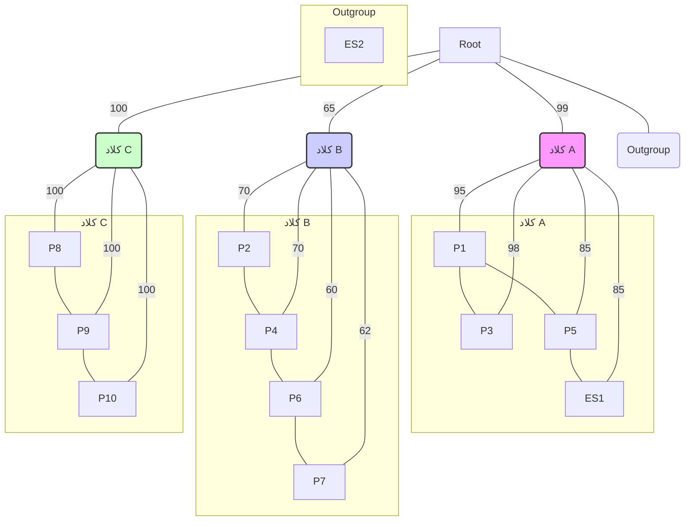

[← سناریو ۲: سوالات](./scenario-02-questions.md) | [سناریو ۴: سوالات →](./scenario-04-questions.md) | [پاسخنامه سناریو ۳](./scenario-03-answers.md)

### سناریو ۳: ردیابی یک ابر میکروب در بیمارستان

**مقدمه:** یک سویه مقاوم به چند دارو (MDR) از باکتری _Acinetobacter baumannii_ در بخش مراقبت‌های ویژه (ICU) یک بیمارستان شیوع پیدا کرده است. تیم کنترل عفونت بیمارستان برای ردیابی منشأ و مسیر انتقال این ابرمیکروب، نمونه‌هایی را از ۱۰ بیمار (P1 تا P10) و ۲ منبع محیطی مشکوک (سینک اتاق ایزوله (ES1) و دستگیره در بخش (ES2)) جمع‌آوری کرده است. پس از استخراج DNA و توالی‌یابی کل ژنوم، یک درخت فیلوژنتیک برای مقایسه این ۱۲ ایزوله ساخته شده است.

**داده‌های ارائه شده:**

۱. **درخت فیلوژنتیک:** درخت زیر روابط تکاملی بین ایزوله‌ها را نشان می‌دهد. طول شاخه‌ها متناسب با تعداد تفاوت‌های ژنتیکی (SNPs) است. مقادیر روی شاخه‌ها، **پشتیبانی بوت‌استرپ (bootstrap support)** را نشان می‌دهند که معیاری از قطعیت آن شاخه است.

_توجه: این یک نمایش ساده شده از درخت است. در یک درخت واقعی، گره‌ها نشان‌دهنده اجداد مشترک فرضی هستند._

۲. **جدول متا-داده:**

| ایزوله | تاریخ پذیرش در ICU | تاریخ نمونه‌برداری | نتیجه آنتی‌بیوگرام |
| :----- | :----------------- | :----------------- | :----------------- |
| P1     | 1 فروردین          | 5 فروردین          | MDR                |
| P2     | 2 فروردین          | 10 فروردین         | MDR                |
| P3     | 3 فروردین          | 6 فروردین          | MDR                |
| P4     | 4 فروردین          | 11 فروردین         | MDR                |
| P5     | 6 فروردین          | 10 فروردین         | MDR                |
| P6     | 8 فروردین          | 12 فروردین         | MDR                |
| P7     | 9 فروردین          | 13 فروردین         | MDR                |
| P8     | 15 فروردین         | 18 فروردین         | MDR                |
| P9     | 16 فروردین         | 19 فروردین         | MDR                |
| P10    | 17 فروردین         | 20 فروردین         | MDR                |
| ES1    | -                  | 11 فروردین         | MDR                |
| ES2    | -                  | 11 فروردین         | حساس (Susceptible) |

---

**سوالات:**

**۱. تحلیل ساختار درخت و کلادها:**

بر اساس درخت فیلوژنتیک، چند زنجیره انتقال (transmission chain) مجزا به احتمال زیاد در این شیوع وجود دارد؟

الف) یک زنجیره بزرگ؛ زیرا همه ایزوله‌ها از یک ریشه مشترک هستند.
ب) دو زنجیره؛ کلاد A و کلاد B.
ج) سه زنجیره؛ کلاد A، کلاد B و کلاد C.
د) چهار زنجیره؛ کلاد A، کلاد B، کلاد C و Outgroup.

**۲. تفسیر مقادیر بوت‌استرپ:**

شاخه اصلی که کلاد B را تعریف می‌کند، مقدار بوت‌استرپ ۶۵٪ دارد. این مقدار به چه معناست؟

الف) ۶۵٪ از ژن‌های ایزوله‌های کلاد B با یکدیگر یکسان هستند.
ب) این شاخه به احتمال ۶۵٪ صحیح است و در ۶۵٪ از درخت‌های ساخته شده در تکرارهای بوت‌استرپ، این گروه‌بندی مشاهده شده است. این یک پشتیبانی متوسط را نشان می‌دهد.
ج) این شاخه به احتمال ۳۵٪ صحیح نیست و بنابراین کلاد B باید نادیده گرفته شود.
د) ایزوله‌های کلاد B، ۶۵٪ کمتر از ایزوله‌های کلاد A به یکدیگر مرتبط هستند.

**۳. شناسایی منبع احتمالی شیوع (Source Tracking):**

کدام گزینه محتمل‌ترین منبع برای **کلاد A** است و چرا؟

الف) بیمار P1؛ زیرا اولین بیمار پذیرش شده در این کلاد است و نزدیک به ریشه کلاد قرار دارد.
ب) بیمار P3؛ زیرا کمترین فاصله را با P1 دارد.
ج) سینک (ES1)؛ زیرا نمونه‌های محیطی همیشه منشأ شیوع هستند.
د) سینک (ES1)؛ زیرا به صورت ژنتیکی با ایزوله بیمار P5 بسیار نزدیک است و می‌تواند یک مخزن (reservoir) محیطی باشد که باعث عفونت P5 و احتمالاً دیگران در آن کلاد شده است.

**۴. ادغام شواهد برای نتیجه‌گیری:**

با ترکیب همه شواهد (فیلوژنتیک، زمانی و آنتی‌بیوگرام)، کدام نتیجه‌گیری در مورد ایزوله **ES2** (دستگیره در) صحیح است؟

الف) ES2 منشأ اصلی کل شیوع در بیمارستان است، زیرا یک منبع محیطی است.
ب) ES2 بخشی از زنجیره انتقال کلاد B است اما در درخت نمایش داده نشده است.
ج) ES2 به احتمال زیاد به این شیوع **بی‌ارتباط** است؛ زیرا هم از نظر ژنتیکی یک outgroup (خارج از گروه) است و هم پروفایل مقاومت دارویی متفاوتی دارد (حساس است).
د) ES2 یک نسخه جهش‌یافته از ایزوله‌های کلاد C است که مقاومت دارویی خود را از دست داده است.
