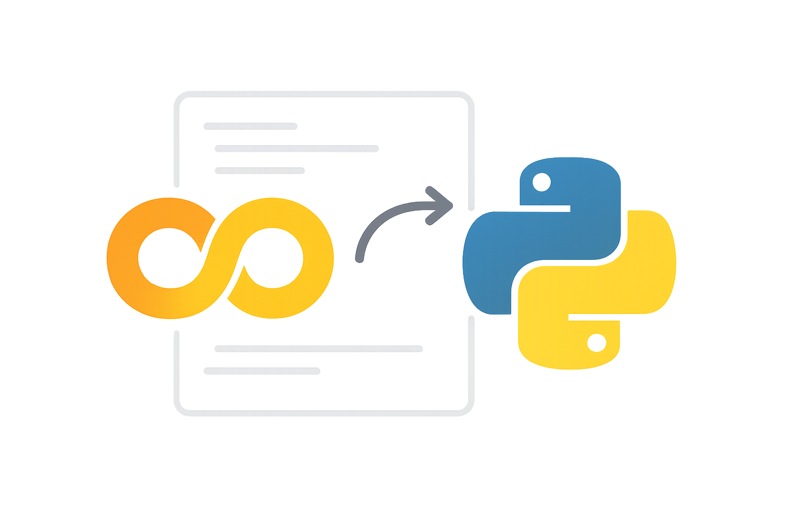
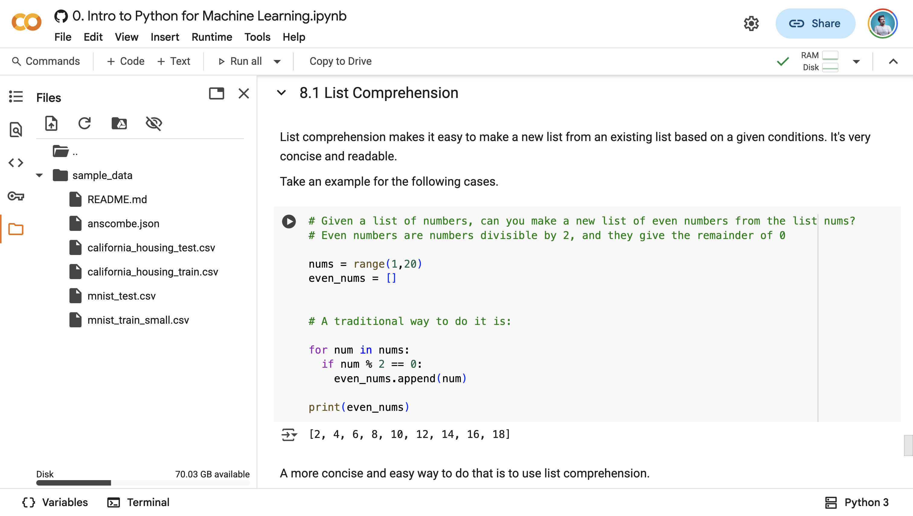

[→ مقدمه فصل چهارم](./00-introduction.md) | [بخش ۴-۲: متغیرها: قفسه‌هایی برای داده‌های زیستی ←](./02-variables-for-bio-data.md)

# فصل ۴: اولین جعبه ابزار شما: پایتون

تبریک می‌گویم! شما سه فصل اول را با موفقیت پشت سر گذاشتید و با مفاهیم بنیادی هوش مصنوعی و کاربرد آن در زیست‌شناسی آشنا شدید. شما اکنون می‌دانید که داده‌های زیستی چه پتانسیل عظیمی دارند و الگوریتم‌ها چگونه می‌توانند الگوهای پنهان در این داده‌ها را کشف کنند.

اکنون زمان آن رسیده است که از دنیای تئوری قدم به دنیای عمل بگذاریم. در این بخش از کتاب، شما یاد می‌گیرید که چگونه خودتان ابزارهای هوش مصنوعی را به کار بگیرید. برای این کار، ما به یک زبان برنامه‌نویسی نیاز داریم. و زبان انتخابی ما، **پایتون (Python)** است.

## بخش ۴-۱: سلام، دنیای پایتون! آشنایی با Python و Google Colab

برای شروع سفر عملی خود، ابتدا باید با دو ابزار اصلی آشنا شویم: زبان برنامه‌نویسی **پایتون** به عنوان وسیله ارتباط ما با کامپیوتر، و **Google Colab** به عنوان آزمایشگاه مجازی ما که در آن کدها را می‌نویسیم و اجرا می‌کنیم. در این بخش، ما دلایل انتخاب این ابزارها را بررسی کرده و اولین دستور خود را به کامپیوتر خواهیم داد.



### 🎯 مسئله محوری این بخش:

ما ایده‌های زیستی و سوالات علمی در ذهن داریم. کامپیوتر قدرت پردازش خام دارد. چگونه می‌توانیم این دو دنیا را به هم متصل کنیم؟ چطور یک سوال زیستی، مانند "توالی مکمل یک رشته DNA چیست؟"، را به مجموعه‌ای از دستورالعمل‌های دقیق و بدون ابهام تبدیل کنیم که یک ماشین بتواند آن را بفهمد و اجرا کند؟

### چرا پایتون؟

شاید بپرسید چرا از میان ده‌ها زبان برنامه‌نویسی، ما پایتون را انتخاب کردیم. دلایل بسیار خوبی برای این انتخاب وجود دارد:

1. **ساده و خوانا:** سینتکس (قواعد نوشتاری) پایتون بسیار به زبان انگلیسی نزدیک است[1][2]. این ویژگی باعث می‌شود که یادگیری آن برای مبتدیان بسیار آسان‌تر باشد و شما می‌توانید به جای تمرکز بر روی پیچیدگی‌های زبان، بر روی حل مسئله تمرکز کنید[3]. سادگی پایتون باعث شده که بتوان روی مفاهیم برنامه‌نویسی اصلی تمرکز کرد، نه بر پیچیدگی‌های نحوی[4].

2. **ابزاری برای دانشمندان:** پایتون زبان شماره یک در دنیای علم داده و هوش مصنوعی است[5][6]. بر اساس آمارهای ۲۰۲۴، پایتون در ردیف اول محبوب‌ترین زبان‌های برنامه‌نویسی برای دانشمندان علوم داده قرار دارد[5]. در نظرسنجی استک‌اورفلو ۲۰۲۴، ۵۱٪ از توسعه‌دهندگان از پایتون استفاده می‌کنند[6]. کتابخانه‌ها (مجموعه کدهای از پیش آماده شده) فوق‌العاده قدرتمندی مانند NumPy, Pandas, Scikit-learn و TensorFlow/PyTorch برای پایتون توسعه داده شده‌اند که تمام ابزارهای لازم برای تحلیل داده‌های پیچیده زیستی را در اختیار ما قرار می‌دهند[7][8][4].

3. **محبوبیت در زیست‌شناسی:** پایتون به طور گسترده در زیست‌شناسی محاسباتی و بیوانفورماتیک استفاده می‌شود[9][10]. BioPython، یکی از جامع‌ترین کتابخانه‌های تحلیل توالی‌های بیولوژیکی، برای پایتون توسعه یافته است[11]. در مقایسه با زبان‌های دیگر، پایتون ترکیب منحصربه‌فردی از سادگی یادگیری و قدرت تحلیلی را ارائه می‌دهد[12][13].

4. **جامعه بزرگ و فعال:** میلیون‌ها برنامه‌نویس و دانشمند در سراسر جهان از پایتون استفاده می‌کنند[5][8]. در سال ۲۰۲۴، پایتون برای چهارمین بار در دهه گذشته به عنوان زبان برنامه‌نویسی سال انتخاب شده است[14]. این یعنی اگر به مشکلی برخورد کنید، به احتمال زیاد شخص دیگری قبلاً با آن روبرو شده و راه‌حل آن در اینترنت موجود است[15].

5. **منبع آزاد و رایگان:** پایتون کاملاً رایگان است و نیازی به خرید مجوز ندارد[16][4]. برخلاف نرم‌افزارهای تجاری نظیر MATLAB، همه کتابخانه‌های علمی پایتون نیز رایگان هستند[17].

### آزمایشگاه مجازی شما: Google Colaboratory

برای شروع برنامه‌نویسی با پایتون، شما به هیچ نرم‌افزار خاصی نیاز ندارید و لازم نیست چیزی روی کامپیوتر خود نصب کنید! ما از یک ابزار فوق‌العاده به نام **Google Colaboratory** یا به اختصار **Colab** استفاده خواهیم کرد.


_تصویری از محیط کاربری Google Colab_

**Colab چیست؟**
Colab یک سرویس رایگان از طرف گوگل است که به شما اجازه می‌دهد کدهای پایتون را مستقیماً در مرورگر وب خود بنویسید و اجرا کنید[18][19]. آن را مانند یک دفترچه یادداشت دیجیتال در نظر بگیرید که می‌توانید در آن هم متن بنویسید (مانند همین متنی که می‌خوانید) و هم کدهای قابل اجرا[20].

**مزایای Colab:**

1. **بدون نیاز به نصب:** تنها چیزی که نیاز دارید یک حساب گوگل و یک مرورگر وب است[18][21]. Colab کاملاً در ابر اجرا می‌شود و نیازی به نصب پایتون یا کتابخانه‌های مختلف ندارید[20].

2. **دسترسی به سخت‌افزار قدرتمند:** گوگل به صورت رایگان به شما دسترسی به پردازنده‌های قوی (GPU و TPU) می‌دهد که برای آموزش مدل‌های پیچیده هوش مصنوعی ضروری هستند[18][22][21]. این امکان برای دانشجویان و محققین بسیار ارزشمند است.

3. **کتابخانه‌ها از پیش نصب شده:** تمام کتابخانه‌های علمی که در این کتاب به آنها نیاز داریم، از قبل بر روی Colab نصب شده‌اند[23][24]. این شامل NumPy، Pandas، Matplotlib، TensorFlow، PyTorch و BioPython می‌شود.

4. **همکاری آسان:** مانند سایر ابزارهای گوگل، Colab امکان همکاری بلادرنگ با دیگران را فراهم می‌کند[23][24]. شما می‌توانید notebook خود را با دیگران به اشتراک بگذارید و آن‌ها نیز می‌توانند به طور همزمان روی آن کار کنند.

5. **یکپارچگی با Google Drive:** تمام فایل‌های شما به صورت خودکار در Google Drive ذخیره می‌شوند[23][25]. این امکان دسترسی از هر مکان و هر دستگاه را فراهم می‌کند.

**محدودیت‌های Colab:**
مهم است بدانید که نسخه رایگان Colab دارای محدودیت‌هایی است، از جمله محدودیت زمانی اجرا (تا ۱۲ ساعت) و قطع شدن در صورت عدم فعالیت[26][19]. با این حال، برای یادگیری و پروژه‌های کوچک، این محدودیت‌ها مشکل‌ساز نخواهند بود.

### اولین کد شما: سلام، دنیا!

طبق یک سنت قدیمی در دنیای برنامه‌نویسی، اولین برنامه‌ای که هر کس می‌نویسد، برنامه‌ای است که عبارت "Hello, World!" (سلام، دنیا!) را چاپ می‌کند[27][28][2]. این یک راه ساده برای اطمینان از این است که همه چیز به درستی کار می‌کند و تاریخچه‌ای طولانی در جامعه برنامه‌نویسی دارد[28].

بیایید این کار را انجام دهیم.

**قدم اول: باز کردن Google Colab**
به وب‌سایت [colab.research.google.com](https://colab.research.google.com) بروید[18][29].

**قدم دوم: ساخت یک دفترچه (Notebook) جدید**
در پنجره‌ای که باز می‌شود، بر روی `New notebook` کلیک کنید[18][30]. یک صفحه جدید با یک سلول خالی کد برای شما باز می‌شود.

**قدم سوم: نوشتن کد**
درون سلول کد، دستور زیر را با دقت تایپ کنید:

```python
print("Hello, World!")
```

**قدم چهارم: اجرای کد**
برای اجرای کد، دو راه دارید[18][30]:

1. بر روی دکمه ▶️ در سمت چپ سلول کد کلیک کنید.
2. در حالی که نشانگر موس درون سلول قرار دارد، کلیدهای `Shift + Enter` را همزمان فشار دهید.

پس از چند لحظه، شما خروجی کد خود را دقیقاً در زیر سلول مشاهده خواهید کرد:

```
Hello, World!
```

**تبریک می‌گویم!** شما همین الان اولین برنامه پایتون خود را نوشتید و اجرا کردید[2]. شما به کامپیوتر یک دستور واضح دادید (`print`) و یک ورودی مشخص (`"Hello, World!"`) و کامپیوتر دقیقاً همان کاری را که از او خواسته بودید، انجام داد. شما اولین قدم را در سفر هیجان‌انگیز خود به دنیای برنامه‌نویسی برای زیست‌شناسی برداشتید.

**درک عمیق‌تر از دستور print():**
دستور `print()` یکی از بنیادی‌ترین ابزارهای پایتون است[31][32]. این تابع هر چیزی که درون پرانتزهایش قرار دهید را بر روی صفحه نمایش می‌دهد[31]. رشته‌های متنی (strings) همیشه باید درون علامت نقل قول قرار گیرند - می‌توانید از نقل قول‌های تک (`'`) یا دوگانه (`"`) استفاده کنید[33][34].

### 🔬 تمرین تحلیلی: اولین گفتگوی شما با زیست‌شناسی

حالا نوبت شماست. با استفاده از یک سلول کد جدید در Google Colab:

1. کدی بنویسید که نام پروتئین مورد علاقه شما را چاپ کند (مثلاً "Caspase-9").
2. در خط بعدی، کدی بنویسید که عملکرد اصلی آن پروتئین را در یک جمله چاپ کند (مثلاً "Initiator of apoptosis").

**نمونه کد:**

```python
print("Caspase-9")
print("Initiator of apoptosis")
```

**خروجی مورد انتظار:**

```
Caspase-9
Initiator of apoptosis
```

این تمرین ساده به شما نشان می‌دهد که چگونه می‌توانید چندین دستور را به ترتیب اجرا کرده و اطلاعات متنی را به کاربر نمایش دهید. این همان اصل بنیادی است که در تحلیل‌های پیچیده‌تر زیستی به کار خواهید برد.

### 🧬 نگاهی به آینده: پایتون در زیست‌شناسی

حالا که با اولین دستور پایتون آشنا شدید، بیایید نگاهی کوتاه به آینده‌ای که در پیش دارید بیندازیم. در فصل‌های آینده، شما یاد خواهید گرفت که:

- **توالی‌های DNA** را تجزیه و تحلیل کنید، مانند یافتن توالی مکمل یا ترجمه به پروتئین[35][36]
- از **الگوریتم BLAST** برای جستجوی توالی‌های مشابه استفاده کنید[37][38]
- **درختان فیلوژنتیک** بسازید تا روابط تکاملی گونه‌ها را درک کنید[39][40]
- **مدل‌های هوش مصنوعی** برای پیش‌بینی خواص بیولوژیکی آموزش دهید

همه این کارها با همین دستورات ساده پایتون که امروز یاد گرفتید، آغاز می‌شوند!

### 💡 نکات کلیدی این بخش

- **پایتون:** یک زبان برنامه‌نویسی **ساده، خوانا و قدرتمند** که به طور گسترده در علم داده و هوش مصنوعی استفاده می‌شود[5][9][1].
- **Google Colab:** آزمایشگاه مجازی و رایگان شما در مرورگر که نیاز به نصب هیچ نرم‌افزاری ندارد و ابزارهای لازم را در اختیار شما قرار می‌دهد[18][21].
- **دستور `print()`:** اولین و پایه‌ای‌ترین ابزار شما برای نمایش خروجی، اشکال‌زدایی کد و برقراری ارتباط با کاربر است[31][32].
- **برنامه‌نویسی:** فرآیند دادن دستورالعمل‌های دقیق و گام‌به‌گام به کامپیوتر برای انجام یک وظیفه مشخص است[1][3].
- **زیست‌شناسی محاسباتی:** پایتون ابزار اصلی برای تحلیل داده‌های زیستی و کشف الگوهای پنهان در آن‌هاست[9][10].

### 🚀 آماده برای گام بعدی

شما با موفقیت اولین دستور خود را به کامپیوتر دادید و دریچه‌ای به دنیای شگفت‌انگیز برنامه‌نویسی زیستی گشودید. اما برای انجام کارهای مفید، ما به راهی برای ذخیره و مدیریت داده‌ها، مانند توالی‌های ژنی یا نتایج اندازه‌گیری‌ها، نیاز داریم. در بخش بعدی، با "متغیرها"، یعنی قفسه‌های حافظه برای داده‌هایمان، آشنا خواهیم شد و خواهید دید که چگونه می‌توان اطلاعات زیستی را در کامپیوتر سازماندهی و پردازش کرد.

---

## **منابع**

[1] https://wiki.python.org/moin/BeginnersGuide
[2] https://www.datacamp.com/tutorial/python-hello-world-a-beginners-guide-to-programming
[3] https://www.python.org/about/gettingstarted/
[4] https://scipy-lectures.org/intro/intro.html
[5] https://www.datacamp.com/blog/top-programming-languages-for-data-scientists-in-2022
[6] https://www.statista.com/statistics/793628/worldwide-developer-survey-most-used-languages/
[7] https://www.geeksforgeeks.org/python/scientific-computing-with-python/
[8] https://www.98thpercentile.com/blog/python-in-scientific-computing/
[9] https://pmc.ncbi.nlm.nih.gov/articles/PMC4896647/
[10] https://www.biospace.com/the-top-programming-languages-to-learn-in-the-life-sciences-industry
[11] https://biopython.org/docs/1.84/Tutorial/chapter_introduction.html
[12] https://www.linkedin.com/pulse/r-versus-python-bioinformatics-research-shannon-alliance-mhslf
[13] https://bioinformatics.ccr.cancer.gov/btep/r-or-python-which-should-i-learn/
[14] https://www.heise.de/en/news/Tiobe-Index-Python-is-the-programming-language-of-the-year-2024-10230356.html
[15] https://www.reddit.com/r/Python/comments/taia48/why_is_python_used_by_lots_of_scientists_to/
[16] https://www.numberanalytics.com/blog/python-for-scientific-computing
[17] https://biology.stackexchange.com/questions/111421/which-programming-language-is-beneficial-for-a-cell-biologist-who-does-extensive
[18] https://www.geeksforgeeks.org/how-to-use-google-colab/
[19] https://research.google.com/colaboratory/faq.html
[20] https://www.youtube.com/watch?v=dYrlpwnUvMI
[21] https://www.techtarget.com/searchenterpriseai/tutorial/Why-and-how-to-use-Google-Colab
[22] https://www.youtube.com/watch?v=Xi9-W26cDBs
[23] https://nofluffjobs.com/log/business-en/google-colaboratory-and-its-benefits-for-python-developers/
[24] https://python.plainenglish.io/7-advantages-of-using-google-colab-for-python-82ac5166fd4b
[25] https://www.geeksforgeeks.org/choosing-the-best-python-notebook-google-colab-vs-jupyter/
[26] https://vast.ai/article/google-collab-explained-simplifying-your-workflow-with-cloud-tools
[27] https://docs.vultr.com/python/examples/print-hello-world
[28] https://www.digitalocean.com/community/tutorials/how-to-write-your-first-python-3-program
[29] https://www.youtube.com/watch?v=8KeJZBZGtYo
[30] https://www.marqo.ai/blog/getting-started-with-google-colab-a-beginners-guide
[31] https://www.w3schools.com/python/ref_func_print.asp
[32] https://www.geeksforgeeks.org/python/python-output-using-print-function/
[33] https://labex.io/questions/what-is-the-syntax-to-print-in-python-61
[34] https://www.geeksforgeeks.org/python/python-program-to-print-hello-world/
[35] https://eeob-biodata.github.io/BCB546X-python/06-biopython/
[36] https://blog.adnansiddiqi.me/python-for-bioinformatics-getting-started-with-sequence-analysis-in-python/
[37] https://www.nature.com/scitable/topicpage/basic-local-alignment-search-tool-blast-29096/
[38] https://en.wikipedia.org/wiki/BLAST_(biotechnology)
[39] https://en.wikipedia.org/wiki/Computational_phylogenetics
[40] https://pmc.ncbi.nlm.nih.gov/articles/PMC3855310/
[41] https://www.tiobe.com/tiobe-index/
[42] https://people.duke.edu/~ccc14/cspy/index.html
[43] https://www.reddit.com/r/AskProgramming/comments/17ex3lg/programming_languages_with_the_highest_labor/
[44] https://survey.stackoverflow.co/2024/technology
[45] https://www.reddit.com/r/Python/comments/qkb4k6/has_someone_of_biology_background_switched_from_r/
[46] https://python-programming.quantecon.org/need_for_speed.html
[47] https://newsletter.techworld-with-milan.com/p/trends-6-python-is-the-most-popular
[48] https://www.youtube.com/watch?v=ihn7lk3WXmw
[49] https://www.tutorialspoint.com/google_colab/index.htm
[50] https://stackoverflow.com/questions/66446056/different-results-on-google-colab-than-local
[51] https://www.reddit.com/r/learnmachinelearning/comments/lyg457/beginners_tutorial_how_to_use_google_colab_for/
[52] https://www.reddit.com/r/PygmalionAI/comments/11cuxdw/whats_the_benefit_of_running_locally_instead_of/
[53] https://algotrading101.com/learn/google-colab-guide/
[54] https://www.reddit.com/r/learnpython/comments/lwdte7/is_google_colab_good_enough/
[55] https://www.techrepublic.com/article/google-colab-vs-jupyter-notebook/
[56] https://www.louisbouchard.ai/colab-vs-jupyter/
[57] https://cloud.google.com/colab/docs/introduction
[58] https://www.youtube.com/watch?v=kqtD5dpn9C8
[59] https://www.datacamp.com/tutorial/python-print-function
[60] https://forum.freecodecamp.org/t/how-to-learn-python-as-a-beginner/669006
[61] https://docs.python.org/3/tutorial/introduction.html
[62] https://support.cs.wm.edu/index.php/tips-and-tricks/c-c-python-java-hello-world-programs-in-linux
[63] https://www.w3schools.com/python/
[64] https://realpython.com/python-print/
[65] https://www.programiz.com/python-programming/examples/hello-world
[66] https://www.youtube.com/watch?v=K5KVEU3aaeQ
[67] https://www.youtube.com/watch?v=UsCQXe1OHZk
[68] https://exercism.org/tracks/python/exercises/hello-world
[69] https://www.numberanalytics.com/blog/advanced-sequence-analysis-python
[70] https://www.geeksforgeeks.org/python/dna-protein-python-3/
[71] https://ccbbatut.github.io/Biocomputing_Spring2016/python5_biopython/
[72] http://www.rpgroup.caltech.edu/bige105/2018/code/t01_sequence_analysis_enamel.html
[73] https://biopython.org/docs/dev/Tutorial/chapter_quick_start.html
[74] https://www.numberanalytics.com/blog/mastering-sequence-analysis-python
[75] https://decodingbiology.substack.com/p/introduction-to-python-for-bioinformatics
[76] https://www.tutorialspoint.com/biopython/index.htm
[77] https://biopython.org/wiki/Seq
[78] http://biopython.org/DIST/docs/tutorial/Tutorial-1.83.pdf
[79] https://biopython.org/wiki/ProtParam
[80] https://pypi.org/project/easy-dna/
[81] https://github.com/hdashnow/python_for_bioinformatics
[82] http://mcb112.org
[83] https://github.com/vappiah/Python-for-Bioinformatics/blob/main/Session%202%20DNA%20sequence%20manipulation%20using%20Strings.ipynb
[84] https://biopython.org/DIST/docs/tutorial/Tutorial.html
[85] https://github.com/zaneveld/full_spectrum_bioinformatics/blob/master/content/06_biological_sequences/using_for_loops_to_analyze_biological_sequences.ipynb
[86] https://www.techrepublic.com/article/tiobe-index-commentary-dec-24/
[87] https://sequenceserver.com/blog/identifying-gene-sequences-from-genome-assembly-using-BLAST/
[88] https://www.youtube.com/watch?v=_KduKR6IXcA
[89] https://www.eevblog.com/forum/programming/tiobe-index-of-programming-languages/
[90] https://blast.ncbi.nlm.nih.gov/Blast.cgi
[91] https://resjournals.onlinelibrary.wiley.com/doi/10.1111/syen.12406
[92] https://github.com/toUpperCase78/tiobe-index-ratings
[93] https://www.ncbi.nlm.nih.gov/geo/query/blast.html
[94] https://www.cs.utexas.edu/~tandy/394C-2013-textbook.pdf
[95] https://microscope.readthedocs.io/en/stable/content/search/blast.html
[96] https://academic.oup.com/mbe/article/40/7/msad165/7226636
[97] https://www.reddit.com/r/java/comments/1huwgjg/new_tiobe_index_is_here_and_what_is_it_for_java/
[98] https://www.sciencedirect.com/science/article/pii/S0378111900004315
[99] https://www.bionity.com/en/encyclopedia/Computational_phylogenetics.html
