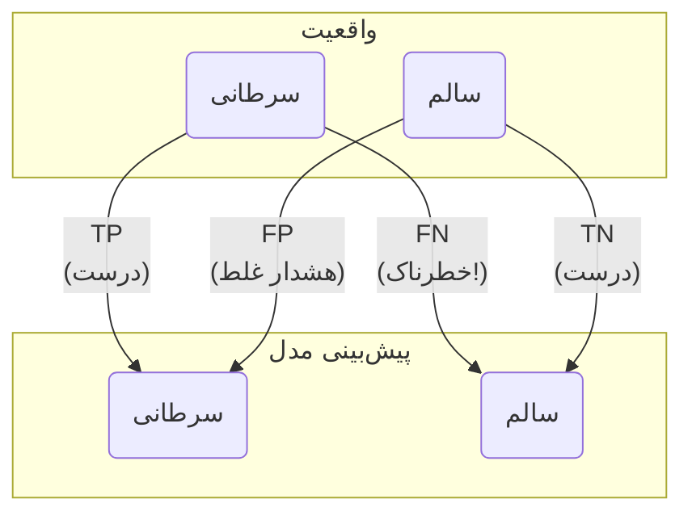

# فصل ۵: ساخت اولین مدل‌های پیش‌بینی: از داده تا تشخیص

## بخش ۵-۴: ارزیابی مدل: آیا به پیش‌بینی‌ها می‌توان اعتماد کرد؟

[→ بخش ۵-۳: اولین مدل طبقه‌بندی: آموزش یک تصمیم‌گیرنده دیجیتال](./03-first-classification-model-knn.md) | [بخش ۵-۵: پروژه: ساخت مدل تشخیص سرطان ←](./05-project-cancer-detection-model.md)

در بخش قبل، ما اولین مدل خود را آموزش دادیم و با استفاده از آن پیش‌بینی‌هایی انجام دادیم. اما چگونه می‌توانیم به طور دقیق و کمی بگوییم که این مدل چقدر خوب است؟ صرفاً نگاه کردن به لیست پیش‌بینی‌ها و مقایسه چشمی آنها با واقعیت کافی نیست، به خصوص وقتی با هزاران نقطه داده کار می‌کنیم. در این بخش، ما یاد می‌گیریم که چگونه عملکرد مدل را با معیارهای استاندارد بسنجیم.

### 🎯 مسئله محوری: چگونه به مدل خود "نمره" بدهیم و بفهمیم در چه چیزی خوب و در چه چیزی ضعیف است؟

مدل ما پیش‌بینی‌هایی انجام داده است. اما آیا دقت ۹۰٪ همیشه به معنای یک مدل عالی است؟ تصور کنید یک مدل تشخیص سرطان دارید که از هر ۱۰۰ نفر، ۹۹ نفر را سالم تشخیص می‌دهد. اگر در جمعیت مورد آزمایش، فقط ۱ نفر واقعاً بیمار باشد، این مدل با تشخیص "همه سالم هستند" به دقت ۹۹٪ می‌رسد، اما بیمار اصلی را از دست می‌دهد! اینجاست که می‌فهمیم صرفاً "درصد پیش‌بینی‌های درست" کافی نیست. چگونه می‌توانیم به شکلی عمیق‌تر، خطاهای مدل را تحلیل کنیم؟ چگونه می‌توانیم بفهمیم که مدل ما در شناسایی بیماران واقعی چقدر حساس است (Recall) و زمانی که "بیمار" را تشخیص می‌دهد، چقدر می‌توان به آن اعتماد کرد (Precision)؟ در این بخش، ما یاد می‌گیریم که با استفاده از ماتریس درهم‌ریختگی و معیارهای پیشرفته‌تر، عملکرد مدل خود را مانند یک دانشمند دقیق، کالبدشکافی کنیم.

---

ما به **معیارهای ارزیابی (Evaluation Metrics)** نیاز داریم تا عملکرد مدل را به صورت عددی و استاندارد بسنجیم.

### ساده‌ترین معیار: دقت (Accuracy)

ساده‌ترین و مستقیم‌ترین معیار، دقت است. دقت به سادگی می‌گوید: "مدل ما چند درصد از پیش‌بینی‌ها را درست انجام داده است؟"

\[ \text{Accuracy} = \frac{\text{تعداد پیش‌بینی‌های درست}}{\text{تعداد کل پیش‌بینی‌ها}} \]

کتابخانه Scikit-learn تابعی برای محاسبه مستقیم آن دارد.

```python
# ادامه کد از بخش قبل...
# فرض می‌کنیم y_test و predictions از قبل موجود هستند
from sklearn.metrics import accuracy_score

# محاسبه دقت
accuracy = accuracy_score(y_test, predictions)

print(f"دقت مدل ما: {accuracy * 100:.2f}%")
```

دقت یک معیار عالی برای شروع است، اما همیشه کل داستان را روایت نمی‌کند، به خصوص در مسائل پزشکی. چرا؟ چون **نوع خطاها** نیز اهمیت زیادی دارد.

### ماتریس درهم‌ریختگی (Confusion Matrix): نگاهی عمیق‌تر به خطاها

ماتریس درهم‌ریختگی یک جدول کوچک و قدرتمند است که عملکرد یک مدل طبقه‌بندی را به طور کامل نشان می‌دهد. این ماتریس به ما می‌گوید که مدل در کجاها درست عمل کرده و در کجاها دچار سردرگمی (confusion) شده است.

این ماتریس چهار بخش دارد:

- **مثبت واقعی (True Positive - TP):** بیمار سرطانی بوده و مدل به درستی تشخیص "سرطانی" داده است. (بهترین حالت)
- **منفی واقعی (True Negative - TN):** بیمار سالم بوده و مدل به درستی تشخیص "سالم" داده است. (خوب)
- **مثبت کاذب (False Positive - FP):** بیمار سالم بوده اما مدل به اشتباه تشخیص "سرطانی" داده است. (خطای نوع اول - هشدار غلط)
- **منفی کاذب (False Negative - FN):** بیمار سرطانی بوده اما مدل به اشتباه تشخیص "سالم" داده است. (خطای نوع دوم - خطرناک‌ترین خطا)



در مسائل پزشکی، خطای **منفی کاذب (FN)** معمولاً بسیار پرهزینه‌تر از خطای **مثبت کاذب (FP)** است. یک FN به این معنی است که یک بیمار واقعی از دست رفته و درمانش به تأخیر می‌افتد.

```python
from sklearn.metrics import confusion_matrix
import seaborn as sns
import matplotlib.pyplot as plt

# محاسبه ماتریس
cm = confusion_matrix(y_test, predictions)

# رسم ماتریس برای درک بهتر
plt.figure(figsize=(6, 4))
sns.heatmap(cm, annot=True, fmt='d', cmap='Blues',
            xticklabels=['سالم (0)', 'سرطانی (1)'],
            yticklabels=['سالم (0)', 'سرطانی (1)'])
plt.xlabel('پیش‌بینی مدل')
plt.ylabel('برچسب واقعی')
plt.title('ماتریس درهم‌ریختگی')
plt.show()
```

### فراتر از دقت: Precision و Recall

ماتریس درهم‌ریختگی به ما اجازه می‌دهد معیارهای دقیق‌تری را محاسبه کنیم:

- **Precision (دقت):** از بین تمام مواردی که مدل "سرطانی" پیش‌بینی کرده، چند درصد واقعاً سرطانی بوده‌اند؟ (چقدر می‌توانیم به پیش‌بینی‌های مثبت مدل اعتماد کنیم؟)
  \[ \text{Precision} = \frac{TP}{TP + FP} \]
- **Recall (بازیابی یا حساسیت):** از بین تمام بیماران سرطانی واقعی، مدل چند درصد را به درستی شناسایی کرده است؟ (مدل ما چقدر در پیدا کردن موارد مثبت خوب است؟)
  \[ \text{Recall} = \frac{TP}{TP + FN} \]

در تشخیص بیماری، **Recall بالا** اغلب اولویت اصلی است. خوشبختانه، Scikit-learn یک گزارش کامل از این معیارها را با یک دستور ساده به ما می‌دهد.

```python
from sklearn.metrics import classification_report

# نمایش گزارش کامل طبقه‌بندی
report = classification_report(y_test, predictions, target_names=['سالم (0)', 'سرطانی (1)'])

print(report)
```

این گزارش به شما یک دید جامع از نقاط قوت و ضعف مدل‌تان می‌دهد.

---

### 🔬 تمرین تحلیلی: تحلیل گزارش طبقه‌بندی

گزارش طبقه‌بندی زیر را که برای یک مدل تشخیص بیماری دیگر تولید شده است، تحلیل کنید.

```
              precision    recall  f1-score   support

     سالم (0)       0.98      0.95      0.96       100
   بیمار (1)       0.85      0.93      0.89        30

    accuracy                           0.94       130
   macro avg       0.91      0.94      0.93       130
weighted avg       0.95      0.94      0.95       130
```

**به سوالات زیر پاسخ دهید:**

1.  **Recall** برای کلاس "بیمار" چقدر است؟ این عدد به چه معناست؟
2.  **Precision** برای کلاس "بیمار" چقدر است؟ این عدد چه مفهومی دارد؟
3.  با توجه به این دو معیار، آیا این مدل در شناسایی بیماران بهتر عمل می‌کند یا در اطمینان از صحت تشخیص‌های "بیمار" خود؟
4.  اگر هدف اصلی، از دست ندادن حتی یک بیمار باشد (حتی به قیمت چند هشدار غلط)، آیا این مدل عملکرد قابل قبولی دارد؟ چرا؟

### 💡 نکات کلیدی این بخش

- **دقت (Accuracy):** یک معیار ساده اما گاهی گمراه‌کننده، به خصوص برای داده‌های نامتوازن.
- **ماتریس درهم‌ریختگی:** ابزاری قدرتمند برای کالبدشکافی انواع خطاهای مدل (TP, TN, FP, FN).
- **خطای منفی کاذب (FN):** خطرناک‌ترین نوع خطا در بسیاری از کاربردهای پزشکی که به معنی از دست دادن یک بیمار واقعی است.
- **Precision:** معیاری برای سنجش "اعتبار" پیش‌بینی‌های مثبت مدل.
- **Recall (حساسیت):** معیاری برای سنجش "توانایی" مدل در شناسایی تمام موارد مثبت واقعی.
- در کاربردهای حساس، اغلب یک توازن بین Precision و Recall جستجو می‌شود، اما معمولاً به Recall وزن بیشتری داده می‌شود.

اکنون شما نه تنها می‌توانید یک مدل بسازید، بلکه می‌توانید عملکرد آن را به صورت حرفه‌ای و دقیق ارزیابی کنید. در بخش بعدی، این پروژه را با جمع‌بندی آموخته‌هایمان به پایان می‌رسانیم.
