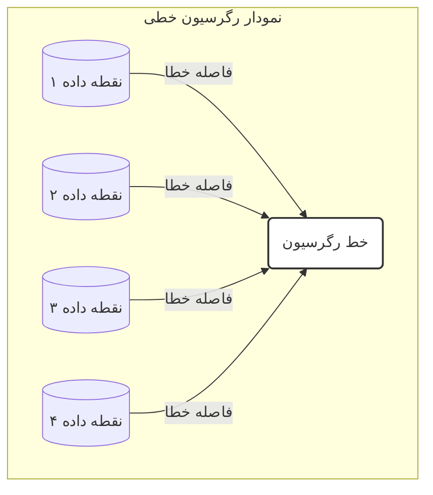

[← فصل ۶: مقدمه](./00-introduction.md) | [بخش ۶-۲: شیرجه به عمق: مقدمه‌ای بر یادگیری عمیق →](./02-deep-dive-into-deep-learning.md)

# فصل ۶: مباحث پیشرفته و کاربردهای دنیای واقعی

## بخش ۶-۱: پیش‌بینی مقادیر پیوسته: مدل‌های رگرسیون

### 🎯 مسئله محوری: اگر پاسخ یک سوال، یک "برچسب" نباشد و یک "عدد" باشد، چه کنیم؟

تاکنون ما به ماشین یاد داده‌ایم که به سوالاتی با پاسخ‌های گسسته پاسخ دهد: "آیا این بیمار سرطانی است؟" (بله/خیر)، "این پروتئین در کدام بخش سلول قرار دارد؟" (هسته/سیتوپلاسم/غشا). اما بسیاری از مهم‌ترین سوالات در زیست‌شناسی، پاسخ‌های عددی و پیوسته دارند: "فشار خون این بیمار فردا چقدر خواهد بود؟"، "میزان بیان این ژن پس از مصرف دارو چقدر تغییر خواهد کرد؟"، "اثربخشی این داروی جدید در مهار آنزیم هدف، دقیقاً چه عددی است؟". در این بخش، ما از دنیای طبقه‌بندی فراتر رفته و با "رگرسیون" آشنا می‌شویم: هنر پیش‌بینی مقادیر عددی، که درهای جدیدی را برای مدل‌سازی سیستم‌های بیولوژیکی به روی ما باز می‌کند.

---

## بخش ۶-۱: فراتر از طبقه‌بندی: مدل‌های رگرسیون

تا به حال، تمرکز ما بر روی مسائل **طبقه‌بندی (Classification)** بوده است: پیش‌بینی یک برچسب یا دسته از میان چند گزینه محدود (مانند "سالم" در مقابل "سرطانی").

اما اگر بخواهیم یک **مقدار پیوسته و عددی** را پیش‌بینی کنیم چه؟

- پیش‌بینی **میزان فشار خون** یک بیمار.
- پیش‌بینی **غلظت** یک پروتئین خاص در خون.
- پیش‌بینی **میزان تمایل اتصال (Binding Affinity)** یک مولکول دارو به هدفش.

این نوع مسائل، که در آنها هدف پیش‌بینی یک عدد است، به عنوان **رگرسیون (Regression)** شناخته می‌شوند.

### رگرسیون خطی: پیدا کردن بهترین خط

ساده‌ترین الگوریتم رگرسیون، **رگرسیون خطی (Linear Regression)** است. ایده اصلی آن پیدا کردن یک خط مستقیم است که به بهترین شکل ممکن از میان نقاط داده عبور کند، به طوری که مجموع مربع فاصله‌ها (خطاها) بین نقاط داده واقعی و مقادیر پیش‌بینی شده روی خط به حداقل برسد.



### پیاده‌سازی با Scikit-learn

API کتابخانه Scikit-learn برای مدل‌های رگرسیون دقیقاً مشابه مدل‌های طبقه‌بندی است. بیایید با استفاده از داده‌های دارویی فصل قبل، یک مدل بسازیم که `binding_affinity` را بر اساس `molecular_weight` و `solubility` پیش‌بینی کند.

```python
# فرض می‌کنیم دیتافریم df_drugs از قبل آماده و پاک‌سازی شده است
# X شامل 'molecular_weight' و 'solubility'
# y شامل 'binding_affinity'

from sklearn.model_selection import train_test_split
from sklearn.linear_model import LinearRegression

# جدا کردن ویژگی‌ها و هدف
X = df_drugs[['molecular_weight', 'solubility']]
y = df_drugs['binding_affinity']

# تقسیم داده‌ها
X_train, X_test, y_train, y_test = train_test_split(X, y, test_size=0.3, random_state=42)

# ۱. انتخاب و نمونه‌سازی مدل
linear_model = LinearRegression()

# ۲. آموزش مدل
linear_model.fit(X_train, y_train)

# ۳. پیش‌بینی
predictions = linear_model.predict(X_test)

print("مقادیر واقعی (y_test):\n", y_test.values)
print("\nپیش‌بینی‌های مدل:\n", predictions)
```

### ارزیابی مدل‌های رگرسیون

معیارهایی مانند دقت برای رگرسیون معنایی ندارند. در عوض، ما میزان "خطا" بین پیش‌بینی‌های عددی و مقادیر واقعی را اندازه‌گیری می‌کنیم.

دو معیار رایج عبارتند از:

1.  **میانگین قدرمطلق خطا (Mean Absolute Error - MAE):** میانگین قدرمطلق تفاوت بین مقادیر پیش‌بینی شده و واقعی.
    \[ \text{MAE} = \frac{1}{n} \sum\_{i=1}^{n} |y_i - \hat{y}\_i| \]
2.  **میانگین مربعات خطا (Mean Squared Error - MSE):** میانگین مربع تفاوت‌ها. این معیار به خطاهای بزرگتر وزن بیشتری می‌دهد.
    \[ \text{MSE} = \frac{1}{n} \sum\_{i=1}^{n} (y_i - \hat{y}\_i)^2 \]

مقادیر کمتر برای MAE و MSE نشان‌دهنده عملکرد بهتر مدل است.

```python
from sklearn.metrics import mean_absolute_error, mean_squared_error

# محاسبه خطاها
mae = mean_absolute_error(y_test, predictions)
mse = mean_squared_error(y_test, predictions)

print(f"\nمیانگین قدرمطلق خطا (MAE): {mae:.2f}")
print(f"میانگین مربعات خطا (MSE): {mse:.2f}")
```

---

### 🔬 تمرین تحلیلی: تفسیر خطاهای رگرسیون

فرض کنید دو مدل برای پیش‌بینی سطح کلسترول خون (بر حسب mg/dL) ساخته‌ایم و نتایج زیر را روی مجموعه آزمون به دست آورده‌ایم:

- **مدل A:**
  - MAE = 5.2
  - MSE = 35.8
- **مدل B:**
  - MAE = 4.8
  - MSE = 45.1

**به سوالات زیر پاسخ دهید:**

1.  کدام مدل بر اساس معیار MAE بهتر است؟ این به چه معناست؟
2.  کدام مدل بر اساس معیار MSE بهتر است؟
3.  چرا ممکن است MSE مدل B با وجود MAE بهتر، بالاتر باشد؟ این موضوع چه چیزی را در مورد خطاهای مدل B به ما می‌گوید؟ (راهنمایی: به تعریف MSE و تاثیر خطاهای بزرگ فکر کنید).
4.  اگر برای یک سیستم هشدار بالینی، خطاهای بزرگ (مثلاً پیش‌بینی ۲۰۰ برای مقدار واقعی ۲۵۰) بسیار خطرناک‌تر از خطاهای کوچک متعدد باشند، کدام مدل را ترجیح می‌دهید؟ چرا؟

### 💡 نکات کلیدی این بخش

- **رگرسیون (Regression):** задачаی یادگیری ماشین برای پیش‌بینی یک مقدار عددی و پیوسته.
- **رگرسیون خطی:** یک الگوریتم رگرسیون پایه که سعی می‌کند بهترین خط را از میان داده‌ها برازش دهد.
- **API یکپارچه:** Scikit-learn از همان الگوی `.fit()` و `.predict()` برای مدل‌های رگرسیون نیز استفاده می‌کند.
- **معیارهای ارزیابی رگرسیون:** به جای دقت، از معیارهایی مانند **MAE** (میانگین قدرمطلق خطا) و **MSE** (میانگین مربعات خطا) برای سنجش عملکرد مدل استفاده می‌شود.
- **تفسیر خطا:** MAE میانگین خطای کلی را نشان می‌دهد، در حالی که MSE به خطاهای بزرگ حساس‌تر است و آن‌ها را بیشتر جریمه می‌کند.

با یادگیری رگرسیون، شما ابزار قدرتمند دیگری را به جعبه ابزار خود اضافه کرده‌اید و می‌توانید طیف وسیع‌تری از مسائل بیولوژیکی را حل کنید.
