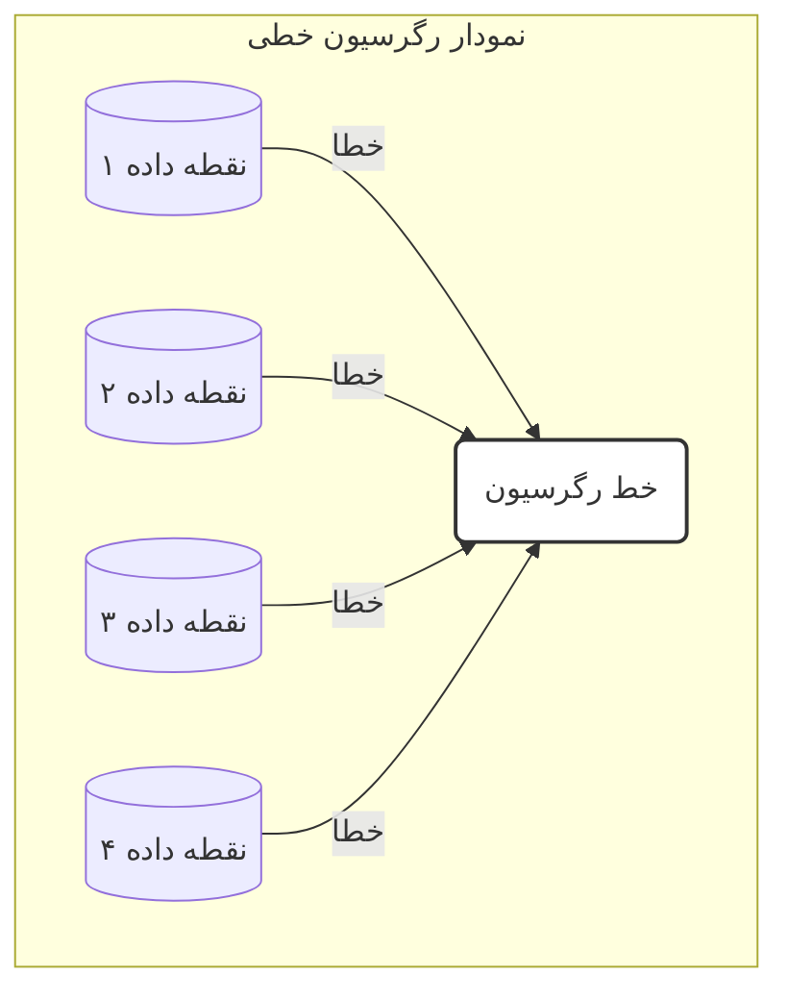

[→ فصل ۶: مقدمه](./00-introduction.md) | [بخش ۶-۲: شیرجه به عمق: مقدمه‌ای بر یادگیری عمیق ←](./02-deep-dive-into-deep-learning.md)

# فصل ۶: مباحث پیشرفته و کاربردهای دنیای واقعی

## بخش ۶-۱: پیش‌بینی مقادیر پیوسته: مدل‌های رگرسیون

### 🎯 مسئله‌محوری: وقتی پاسخ یک سؤال عددی و پیوسته باشد

تا کنون به مسائل **طبقه‌بندی (Classification)** پرداختیم؛ یعنی پیش‌بینی برچسب‌های گسسته مانند «سالم/سرطانی» یا «هسته/سیتوپلاسم/غشا». اما در زیست‌شناسی بسیاری از سؤال‌ها پاسخ عددی و پیوسته دارند:

- فشار خون فرد در روزهای آینده چقدر خواهد بود؟
- غلظت یک پروتئین خاص در خون چه میزانی دارد؟
- میزان **binding affinity** یک دارو به هدفش چقدر است؟

این نوع مسائل در یادگیری ماشین با عنوان **رگرسیون (Regression)** شناخته می‌شوند: هنر پیش‌بینی مقادیر عددی پیوسته[1].

## فراتر از طبقه‌بندی: معرفی رگرسیون

در مسائل رگرسیون، هدف پیش‌بینی یک مقدار $$y\in \mathbb{R}$$ به ازای هر نمونه ورودی $$X$$ است؛ برخلاف طبقه‌بندی که $$y$$ می‌تواند تنها از مجموعهٔ محدودی از برچسب‌ها انتخاب شود.

### مثال‌های کاربردی در زیست‌شناسی

1. پیش‌بینی فشار خون بر حسب میلی‌متر جیوه (mmHg)
2. پیش‌بینی غلظت پروتئین (mg/dL)
3. پیش‌بینی **binding affinity** دارو (kcal/mol)

## رگرسیون خطی: یافتن بهترین خط

ساده‌ترین و پایه‌ای‌ترین الگوریتم رگرسیون، **رگرسیون خطی (Linear Regression)** است. فرض کنید داده‌های آموزشی شامل زوج‌های $$(\mathbf{x}_i,y_i)$$ هستند که $$\mathbf{x}_i\in\mathbb{R}^p$$ بردار ویژگی‌ها و $$y_i\in\mathbb{R}$$ مقدار هدف است. رگرسیون خطی سعی می‌کند ضرایب $$\boldsymbol{\beta}$$ و عرض از مبدأ $$\beta_0$$ را پیدا کند تا تابع:

$$
\hat{y} = \beta_0 + \sum_{j=1}^{p}\beta_j\,x_j
$$

مجموع مربع خطاها $$\sum_i (y_i - \hat{y}_i)^2$$ را کمینه کند (روش **Ordinary Least Squares**)‌[2][3].



## پیاده‌سازی با Scikit-learn

کتابخانه‌ی Scikit-learn همان API یکپارچه‌ی `.fit()` و `.predict()` را برای رگرسیون نیز ارائه می‌دهد. فرض کنید دیتافریم `df_drugs` شامل ویژگی‌های `molecular_weight` و `solubility` و هدف `binding_affinity` باشد:

```python
from sklearn.model_selection import train_test_split
from sklearn.linear_model import LinearRegression

# آماده‌سازی X و y
X = df_drugs[['molecular_weight', 'solubility']]
y = df_drugs['binding_affinity']

# تقسیم داده‌ها به مجموعهٔ آموزش و آزمون
X_train, X_test, y_train, y_test = train_test_split(
    X, y, test_size=0.3, random_state=42
)

# ۱. نمونه‌سازی مدل
linear_model = LinearRegression()

# ۲. آموزش مدل
linear_model.fit(X_train, y_train)

# ۳. پیش‌بینی روی داده‌های آزمون
predictions = linear_model.predict(X_test)

print("مقادیر واقعی (y_test):", y_test.values)
print("پیش‌بینی‌های مدل:", predictions)
```

- `fit_intercept=True` پیش‌فرض است؛ بنابراین عرض از مبدأ ($$\beta_0$$) محاسبه می‌شود[3].
- `coef_` و `intercept_` پس از آموزش در مدل در دسترس‌اند.

## ارزیابی مدل‌های رگرسیون

در رگرسیون از **دقت (accuracy)** استفاده نمی‌شود و به جای آن **خطا** اندازه‌گیری می‌شود. دو معیار رایج:

1. **میانگین قدرمطلق خطا (MAE)**

   $$
   \mathrm{MAE} = \frac{1}{n}\sum_{i=1}^n \bigl|y_i - \hat{y}_i\bigr|
   $$

   حداقل مقدار: ۰ (بدون خطا)[2][4].

2. **میانگین مربعات خطا (MSE)**
   $$
   \mathrm{MSE} = \frac{1}{n}\sum_{i=1}^n \bigl(y_i - \hat{y}_i\bigr)^2
   $$
   نسبت به خطاهای بزرگ حساس‌تر است و آن‌ها را بیشتر جریمه می‌کند[5][6].

### محاسبه با Scikit-learn

```python
from sklearn.metrics import mean_absolute_error, mean_squared_error

mae = mean_absolute_error(y_test, predictions)
mse = mean_squared_error(y_test, predictions)

print(f"میانگین قدرمطلق خطا (MAE): {mae:.2f}")
print(f"میانگین مربعات خطا (MSE): {mse:.2f}")
```

### 🔬 تمرین تحلیلی: تفسیر خطاهای رگرسیون

فرض کنید دو مدل برای پیش‌بینی سطح کلسترول خون (mg/dL) داریم:

| مدل   | MAE | MSE  |
| ----- | --- | ---- |
| **A** | 5.2 | 35.8 |
| **B** | 4.8 | 45.1 |

**سؤال‌ها:**

1. کدام مدل بر اساس MAE بهتر است؟
2. بر اساس MSE کدام مدل عملکرد بهتری دارد؟
3. چرا ممکن است مدل B با وجود MAE بهتر، MSE بزرگ‌تری داشته باشد؟
4. اگر خطاهای بزرگ برای هشدار بالینی بسیار خطرناک باشند، کدام مدل را ترجیح می‌دهید؟

> **راهنمایی:** MAE خطای متوسط را نشان می‌دهد، اما MSE وزن بیشتری به خطاهای بزرگ می‌دهد. اگر از وقوع خطاهای بزرگ وحشت دارید، از مدلی استفاده کنید که MSE آن کمتر باشد.

### 💡 نکات کلیدی

- **رگرسیون:** پیش‌بینی مقادیر عددی و پیوسته[1].
- **رگرسیون خطی:** برازش خط بهینه با کمینه‌سازی مجموع مربعات خطا (OLS)[2][3].
- **API یکپارچه:** همان متدهای `.fit()` و `.predict()` در طبقه‌بندی و رگرسیون.
- **معیارهای ارزیابی:** از MAE و MSE استفاده می‌کنیم؛ مقادیر کمتر به معنای عملکرد بهتر است[2][5].
- **تفسیر خطا:** MAE نمایانگر خطای متوسط است، MSE به خطاهای بزرگ حساس‌تر است.

با افزودن رگرسیون به ابزارهای خود، اکنون می‌توانید طیف گسترده‌تری از مسائل بیولوژیکی پیوسته را مدل‌سازی و پیش‌بینی کنید.

---

## **منابع**

[1] https://education.molssi.org/python-data-science-chemistry/data_fitting/linear-scikitlearn.html
[2] https://scikit-learn.org/stable/modules/generated/sklearn.metrics.mean_absolute_error.html
[3] https://scikit-learn.org/stable/modules/generated/sklearn.linear_model.LinearRegression.html
[4] https://www.simplilearn.com/tutorials/scikit-learn-tutorial/sklearn-linear-regression-with-examples
[5] https://scikit-learn.ru/stable/modules/generated/sklearn.metrics.mean_squared_error.html
[6] https://scikit-learn.org/stable/modules/generated/sklearn.metrics.mean_squared_error.html
[7] https://scikit-learn.org/0.15/modules/generated/sklearn.metrics.mean_absolute_error.html
[8] https://scikit-learn.org/0.15/modules/generated/sklearn.linear_model.LinearRegression.html
[9] https://stackoverflow.com/questions/61907068/sklearn-metrics-mean-absolute-error-calculation
[10] https://www.geeksforgeeks.org/python/python-mean-squared-error/
[11] https://docs3.w3cub.com/scikit_learn/modules/generated/sklearn.metrics.mean_absolute_error/
[12] https://scikit-learn.org/stable/modules/generated/sklearn.metrics.root_mean_squared_error.html
[13] https://www.activestate.com/resources/quick-reads/how-to-run-linear-regressions-in-python-scikit-learn/
[14] https://scikit-learn.org/stable/modules/generated/sklearn.metrics.mean_absolute_percentage_error.html
[15] https://stackoverflow.com/questions/79107149/pylance-incorrectly-flagging-sklearn-mean-squared-error-function-as-deprecated
[16] https://www.datacamp.com/tutorial/sklearn-linear-regression
[17] https://www.geeksforgeeks.org/how-to-calculate-mean-absolute-error-in-python/
[18] https://github.com/scikit-learn/scikit-learn/issues/25298
[19] https://www.youtube.com/watch?v=A2zlm3NkeDk
[20] https://github.com/scikit-learn/scikit-learn/blob/main/sklearn/metrics/_regression.py
