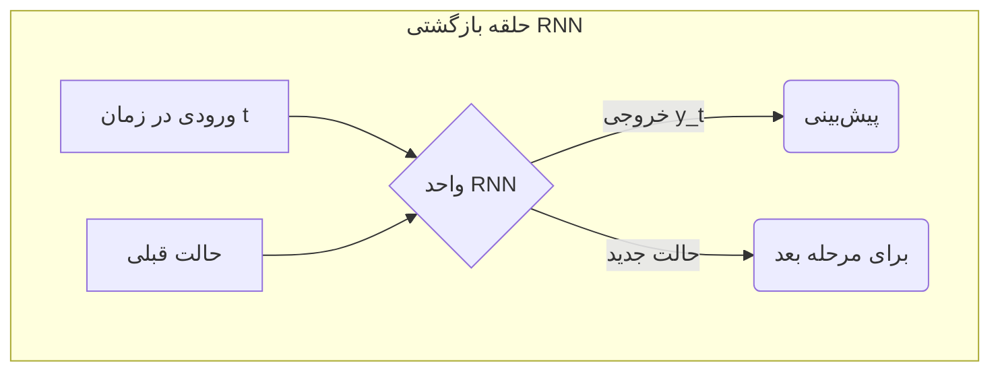

# فصل ۶: مباحث پیشرفته و کاربردهای دنیای واقعی

## بخش ۶-۲: شیرجه به عمق: مقدمه‌ای بر یادگیری عمیق (Deep Learning)

[→ بخش ۶-۱: پیش‌بینی مقادیر پیوسته: مدل‌های رگرسیون](./01-predicting-continuous-values-regression.md) | [بخش ۶-۳: مطالعه موردی: طراحی مولکول‌های دارو با هوش مصنوعی ←](./03-case-study-drug-molecule-design.md)

مدل‌هایی که تا به حال با آنها کار کرده‌ایم (مانند KNN و رگرسیون خطی) به عنوان مدل‌های "کم‌عمق" شناخته می‌شوند. این مدل‌ها برای داده‌های ساختاریافته و جدولی بسیار کارآمد هستند، اما زمانی که با داده‌های بسیار پیچیده و با ابعاد بالا مانند تصاویر پزشکی یا توالی‌های ژنومی مواجه می‌شوند، قدرت آن‌ها محدود می‌شود. برای تحلیل این نوع داده‌ها، ما به ابزار قدرتمندتری نیاز داریم.

### 🎯 مسئله محوری: چگونه می‌توانیم به ماشین یاد بدهیم که مانند یک متخصص پاتولوژیست، یک تصویر را "ببیند" یا مانند یک متخصص ژنتیک، یک توالی DNA را "بخواند"؟

چگونه می‌توانیم یک مدل را وادار کنیم تا از میلیون‌ها پیکسل یک تصویر پزشکی، یک تومور را تشخیص دهد؟ یا از میلیاردها باز یک ژنوم، یک الگوی مرتبط با بیماری را پیدا کند؟ این داده‌ها دیگر در یک جدول شسته‌رفته قرار نمی‌گیرند. آن‌ها خام، بسیار پیچیده و دارای ابعاد عظیمی هستند. برای حل این مسائل، ما نیاز به الگوریتم‌هایی داریم که از ساختار خود مغز انسان الهام گرفته‌اند و می‌توانند به صورت سلسله‌مراتبی، الگوهای پیچیده را از دل داده‌های خام استخراج کنند. در این بخش، ما به دنیای شگفت‌انگیز "یادگیری عمیق" قدم می‌گذاریم.

---

**یادگیری عمیق (Deep Learning)** زیرشاخه‌ای از یادگیری ماشین است که بر اساس **شبکه‌های عصبی مصنوعی (Artificial Neural Networks)** با لایه‌های متعدد ساخته شده است. صفت **"عمیق"** به این واقعیت اشاره دارد که ما چندین (گاهی صدها) لایه از نورون‌ها را روی هم قرار می‌دهیم. این ساختار عمیق به شبکه اجازه می‌دهد تا یک **سلسله‌مراتب از ویژگی‌ها (Hierarchy of Features)** را یاد بگیرد.

> **آنالوژی:** تصور کنید یک شبکه عمیق در حال یادگیری تشخیص یک "سلول سرطانی" از روی تصاویر میکروسکوپی است:
>
> - **لایه اول:** ویژگی‌های بسیار ساده‌ای مانند لبه‌ها و گرادیان‌های رنگی را یاد می‌گیرد.
> - **لایه دوم:** ویژگی‌های لایه اول را با هم ترکیب می‌کند تا اشکال ساده‌تری مانند دایره‌ها را تشخیص دهد.
> - **لایه‌های میانی:** این اشکال ساده را با هم ترکیب می‌کنند تا ساختارهای پیچیده‌تری مانند "هسته سلول" را یاد بگیرند.
> - **لایه آخر:** با ترکیب ویژگی‌های سطح بالا، در نهایت تصمیم می‌گیرد که آیا تصویر ورودی نمایانگر یک "سلول سرطانی" است یا "سلول سالم".

### معماری‌های کلیدی برای کاربردهای بیولوژیکی

دو نوع معماری شبکه عصبی عمیق به طور خاص در بیوانفورماتیک بسیار تأثیرگذار بوده‌اند:

#### ۱. شبکه‌های عصبی کانولوشنی (Convolutional Neural Networks - CNNs)

CNNها استادان تحلیل داده‌های شبکه‌ای (Grid-like data) مانند تصاویر هستند. آنها از فیلترهای کوچکی به نام "کرنل" (Kernel) استفاده می‌کنند که بر روی تصویر حرکت کرده و ویژگی‌های محلی را استخراج می‌کنند.

- **کاربردهای بیولوژیکی:**
  - **تحلیل تصاویر پزشکی:** تشخیص تومور در تصاویر رادیولوژی.
  - **تحلیل داده‌های ژنومی:** پیدا کردن الگوهای مرتبط با بیماری در توالی DNA.
  - **کشف دارو:** پیش‌بینی برهم‌کنش دارو-هدف از روی نمایش‌های دوبعدی مولکول‌ها.

```mermaid
graph TD
    A[تصویر ورودی] --> B{لایه کانولوشن<br/>(استخراج ویژگی)}
    B --> C{لایه تجمعی (Pooling)<br/>(کاهش ابعاد)}
    C --> B
    C --> D[لایه کاملاً متصل<br/>(تصمیم‌گیری نهایی)]
    D --> E[خروجی: "سرطانی" یا "سالم"]
```

#### ۲. شبکه‌های عصبی بازگشتی (Recurrent Neural Networks - RNNs)

RNNها برای داده‌های **ترتیبی (Sequential data)** طراحی شده‌اند. آنها نوعی "حافظه" داخلی دارند که به آنها اجازه می‌دهد اطلاعات مراحل قبلی یک توالی را در هنگام پردازش مرحله فعلی به خاطر بسپارند.

- **کاربردهای بیولوژیکی:**
  - **تحلیل توالی:** پیش‌بینی عملکرد یک ژن از روی توالی DNA آن.
  - **پیش‌بینی ساختار ثانویه پروتئین:** پیش‌بینی ساختار یک پروتئین از روی توالی آمینواسیدهای آن.
  - **پردازش زبان طبیعی بیومدیکال:** استخراج اطلاعات از میلیون‌ها مقاله علمی.



### ابزارها و آینده

برای ساخت مدل‌های یادگیری عمیق، از کتابخانه‌های تخصصی مانند **TensorFlow** و **PyTorch** استفاده می‌شود. یادگیری عمیق با توانایی خود در یادگیری خودکار الگوهای پیچیده از داده‌های خام و بدون ساختار، انقلابی در علوم زیستی ایجاد کرده است.

---

### 🔬 تمرین تحلیلی: انتخاب معماری مناسب

برای هر یک از سناریوهای بیوانفورماتیکی زیر، مشخص کنید که کدام معماری یادگیری عمیق (**CNN** یا **RNN**) مناسب‌تر است و دلیل انتخاب خود را در یک جمله توضیح دهید.

1.  **سناریو ۱:** شما یک مجموعه داده بزرگ از تصاویر اسلایدهای بافت ریه دارید و می‌خواهید مدلی بسازید که به صورت خودکار سلول‌های سرطانی را از سلول‌های سالم تشخیص دهد.
2.  **سناریو ۲:** شما به توالی کامل ژنوم هزاران بیمار مبتلا به دیابت و افراد سالم دسترسی دارید و می‌خواهید الگوهای تکرارشونده‌ای در DNA را پیدا کنید که با بیماری مرتبط هستند.
3.  **سناریو ۳:** شما یک پایگاه داده بزرگ از توالی آمینواسیدی پروتئین‌ها و ساختار سه‌بعدی متناظر با آن‌ها را در اختیار دارید. هدف، ساخت مدلی است که بتواند ساختار یک پروتئین جدید را فقط از روی توالی آمینواسیدی آن پیش‌بینی کند.
4.  **سناریو ۴:** شما یک دیتاست از تصاویر شبکیه چشم بیماران دیابتی دارید و می‌خواهید شدت بیماری "رتینوپاتی دیابتی" را بر اساس این تصاویر در یک مقیاس ۰ تا ۴ درجه‌بندی کنید.

**پاسخ و راه حل:**

1.  **معماری مناسب: CNN.** دلیل: داده‌های ورودی تصاویر هستند و CNN برای تحلیل داده‌های تصویری و استخراج ویژگی‌های مکانی از آن‌ها بهینه شده است.
2.  **معماری مناسب: CNN.** دلیل: اگرچه DNA یک توالی است، اما در این سناریو هدف پیدا کردن "الگوهای" (motifs) تکرارشونده است که می‌توان آن‌ها را مانند ویژگی‌های محلی در یک داده یک‌بعدی در نظر گرفت. CNNها برای این نوع شناسایی الگو بسیار قدرتمند هستند.
3.  **معماری مناسب: RNN.** دلیل: توالی آمینواسید یک داده کاملاً ترتیبی است و پیش‌بینی ساختار به درک روابط دوربرد بین آمینواسیدها بستگی دارد که "حافظه" RNN برای آن ایده‌آل است.
4.  **معماری مناسب: CNN.** دلیل: ورودی مدل، تصاویر شبکیه چشم است و وظیفه مدل، تحلیل این تصاویر برای درجه‌بندی بیماری است که یک کاربرد کلاسیک برای CNNها محسوب می‌شود.

### 💡 نکات کلیدی این بخش

- **یادگیری عمیق (Deep Learning):** استفاده از شبکه‌های عصبی با لایه‌های متعدد برای یادگیری **سلسله‌مراتبی از ویژگی‌ها** از داده‌های خام و پیچیده.
- **CNN (شبکه عصبی کانولوشنی):** بهترین ابزار برای داده‌های **شبکه‌ای و تصویری**. با استفاده از فیلترهای متحرک، الگوهای محلی را استخراج می‌کند.
- **RNN (شبکه عصبی بازگشتی):** بهترین ابزار برای داده‌های **ترتیبی (Sequential)**. با داشتن "حافظه"، اطلاعات مراحل قبلی را در نظر می‌گیرد.
- **کاربردهای کلیدی:** CNNها در تحلیل تصاویر پزشکی و RNNها در تحلیل توالی‌های ژنتیکی و پروتئینی بسیار موفق بوده‌اند.
- **ابزارهای اصلی:** کتابخانه‌های **TensorFlow** و **PyTorch** استانداردهای صنعتی برای ساخت مدل‌های یادگیری عمیق هستند.

یادگیری عمیق به دانشمندان اجازه می‌دهد تا به سوالاتی پاسخ دهند که تا چند سال پیش غیرقابل حل به نظر می‌رسیدند.
