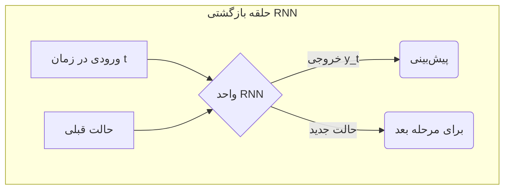

[→ بخش ۶-۱: پیش‌بینی مقادیر پیوسته: مدل‌های رگرسیون](./01-predicting-continuous-values-regression.md) | [بخش ۶-۳: مطالعه موردی: طراحی مولکول‌های دارو با هوش مصنوعی ←](./03-case-study-drug-molecule-design.md)

# فصل ۶: مباحث پیشرفته و کاربردهای دنیای واقعی

## بخش ۶-۲: شیرجه به عمق: مقدمه‌ای بر یادگیری عمیق (Deep Learning)

مدل‌هایی که تا به حال با آن‌ها کار کرده‌ایم (مانند KNN و رگرسیون خطی) به عنوان مدل‌های «کم‌عمق» شناخته می‌شوند. این روش‌ها برای داده‌های ساختاریافته و جدول‌بندی‌شده بسیار مناسب‌اند، اما وقتی با داده‌های پیچیده و با ابعاد بالا مانند تصاویر پزشکی یا توالی‌های ژنومی سروکار داریم، به محدودیت برمی‌خورند. برای تحلیل این نوع داده‌ها، نیاز به ابزار قدرتمندتری داریم.

### 🎯 مسئله محوری

چگونه می‌توانیم به ماشین یاد بدهیم که مانند یک متخصص پاتولوژیست، یک تصویر را «ببیند» یا مانند یک متخصص ژنتیک، یک توالی DNA را «بخواند»؟ چگونه می‌توانیم از میلیون‌ها پیکسل یک تصویر پزشکی، یک تومور را تشخیص دهیم یا از میلیاردها باز یک ژنوم، الگوی مرتبط با بیماری را استخراج کنیم؟

این داده‌ها دیگر در یک جدول شسته‌رفته قرار نمی‌گیرند؛ بلکه خام، بسیار پیچیده و دارای ابعاد عظیم هستند. برای حل این مسائل به الگوریتم‌هایی نیاز داریم که از ساختار مغز انسان الهام گرفته باشند و بتوانند به‌صورت سلسله‌مراتبی، ویژگی‌های پیچیده را از دل داده‌های خام استخراج کنند. در این بخش، به دنیای شگفت‌انگیز «یادگیری عمیق» قدم می‌گذاریم.

**یادگیری عمیق (Deep Learning)** زیرشاخه‌ای از یادگیری ماشین است که بر **شبکه‌های عصبی مصنوعی (Artificial Neural Networks)** با لایه‌های متعدد تکیه دارد. صفت «عمیق» به استفاده از سه یا چند لایه پنهان (و تا گاهی صدها یا هزاران لایه) اشاره دارد که باعث می‌شود شبکه بتواند سلسله‌مراتب پیچیده‌ای از ویژگی‌ها را بیاموزد[1].

> ‌‌**آنالوژی:**  
> تصور کنید یک شبکه عمیق می‌خواهد «سلول سرطانی» را از روی تصاویر میکروسکوپی بشناسد:
>
> - **لایه اول:** لبه‌ها و گرادیان‌های رنگی را تشخیص می‌دهد.
> - **لایه دوم:** از این لبه‌ها، اشکال ساده‌ای مانند دایره‌ها می‌سازد.
> - **لایه‌های میانی:** اشکال ساده را ترکیب می‌کنند تا ساختارهایی مانند «هسته سلول» را بشناسند.
> - **لایه آخر:** ویژگی‌های سطح‌بالا را ترکیب کرده و تصمیم می‌گیرد تصویر «سرطانی» است یا «سالم».

### معماری‌های کلیدی برای کاربردهای بیولوژیکی

دو معماری اصلی شبکه عصبی عمیق که در بیوانفورماتیک کاربرد فراوانی دارند عبارت‌اند از:

#### ۱. شبکه‌های عصبی کانولوشنی (Convolutional Neural Networks – CNN)

CNNها برای تحلیل داده‌های شبکه‌ای (Grid-like data) مانند تصاویر تصویری طراحی شده‌اند. در این شبکه‌ها، فیلترهای کوچک (Kernel) روی تصویر حرکت می‌کنند و ویژگی‌های محلی را استخراج می‌کنند[2].

– **کاربردهای بیولوژیکی:**  
 – تحلیل تصاویر پزشکی: تشخیص تومور در رادیولوژی و پاتولوژی[3].  
 – استخراج موتیف‌های ژنومی: مدل‌هایی مانند **DeepBind** از یک لایه کانولوشن برای پیش‌بینی موتیف‌های DNA/RNA استفاده می‌کنند[4].  
 – کشف دارو: پیش‌بینی برهم‌کنش دارو-هدف از روی نمایش دوبعدی مولکول‌ها.

```mermaid
graph TD
    A[تصویر ورودی] --> B{لایه کانولوشن(استخراج ویژگی)}
    B --> C{لایه تجمعی (Pooling)(کاهش ابعاد)}
    C --> B
    C --> D[لایه کاملاً متصل(تصمیم‌گیری نهایی)]
    D --> E[خروجی: "سرطانی" یا "سالم"]
```

#### ۲. شبکه‌های عصبی بازگشتی (Recurrent Neural Networks – RNN)

RNNها برای داده‌های ترتیبی طراحی شده‌اند. این شبکه‌ها دارای یک «حافظه» داخلی هستند که می‌تواند اطلاعات مراحل قبلی توالی را مدیریت کند[1].

– **کاربردهای بیولوژیکی:**  
 – تحلیل توالی ژن: پیش‌بینی عملکرد ژن از روی توالی[4].  
 – پیش‌بینی ساختار ثانویه پروتئین: تشخیص تعاملات دوربرد بین آمینواسیدها.  
 – پردازش زبان طبیعی بیومدیکال: استخراج داده از متون علمی.



### ابزارها و چشم‌انداز آینده

برای پیاده‌سازی یادگیری عمیق، دو کتابخانه اصلی صنعتی مورد استفاده قرار می‌گیرند:

- **TensorFlow** (Google)
- **PyTorch** (Meta)

این فریم‌ورک‌ها امکانات گسترده‌ای برای تعریف شبکه‌های پیچیده، مدیریت GPU/TPU و بهینه‌سازی سریع فراهم می‌کنند[5][6].

## 🔬 تمرین تحلیلی: انتخاب معماری مناسب

برای هر یک از سناریوهای زیر، مشخص کنید کدام معماری (**CNN** یا **RNN**) مناسب‌تر است و در یک جمله دلیل خود را بنویسید.

| سناریو                                                               | معماری پیشنهاد شده | دلیل انتخاب                                                                                   |
| -------------------------------------------------------------------- | ------------------ | --------------------------------------------------------------------------------------------- |
| ۱. مجموعه‌ای از تصاویر اسلایدهای بافت ریه برای تشخیص سلول‌های سرطانی | CNN                | تصاویر دادهٔ شبکه‌ای‌اند و CNN برای استخراج ویژگی‌های مکانی بهینه است.                        |
| ۲. توالی کامل ژنوم هزار بیمار برای یافتن موتیف‌های مرتبط با دیابت    | CNN                | موتیف‌های ژنومی مانند الگوهای محلی در داده‌های یک‌بعدی قابل شناسایی با فیلتر کانولوشن‌اند[4]. |
| ۳. پیش‌بینی ساختار سه‌بعدی پروتئین از توالی آمینواسیدی               | RNN                | توالی آمینواسیدی دادهٔ ترتیبی است و RNN حافظهٔ دوربرد را مدیریت می‌کند.                       |
| ۴. درجه‌بندی شدت رتینوپاتی دیابتی از تصاویر شبکیه چشم                | CNN                | تحلیل تصاویر شبکیه نیازمند استخراج ویژگی‌های مکانی است که تخصص CNN است.                       |

### 💡 نکات کلیدی این بخش

- **یادگیری عمیق (Deep Learning):** شبکه‌های عصبی با چندین لایه برای یادگیری سلسله‌مراتبی ویژگی‌ها از داده‌های پیچیده[1].
- **CNN:** مناسب برای داده‌های تصویری و شبکه‌ای.
- **RNN:** مناسب برای داده‌های ترتیبی با نیاز به حافظه داخلی.
- **نمونه‌های موفق:** DeepBind برای موتیف‌یابی ژنومی[4]، مدل‌های AlexNet و ResNet در تصویربرداری پزشکی[3].
- **ابزارها:** TensorFlow و PyTorch استانداردهای فعلی در توسعه مدل‌های یادگیری عمیق هستند[5][6].

یادگیری عمیق، با الهام از مغز انسان و بهره‌گیری از قدرت محاسباتی بالا، به زیست‌شناسان کمک می‌کند تا به مسائلی پاسخ دهند که تا چند سال پیش غیرقابل حل به نظر می‌رسیدند.

---

## **منابع**

[1] https://en.wikipedia.org/wiki/Deep_learning
[2] https://cloud.google.com/discover/what-is-deep-learning
[3] https://pmc.ncbi.nlm.nih.gov/articles/PMC10658730/
[4] https://pmc.ncbi.nlm.nih.gov/articles/PMC8293829/
[5] https://www.ibm.com/think/topics/deep-learning
[6] https://www.mdpi.com/2078-2489/16/3/195
[7] https://arxiv.org/abs/2101.08385
[8] https://www.oracle.com/europe/data-science/machine-learning/what-is-deep-learning/
[9] https://www.jneonatalsurg.com/index.php/jns/article/view/5117
[10] https://pmc.ncbi.nlm.nih.gov/articles/PMC7570704/
[11] https://www.biorxiv.org/content/10.1101/163220v3.full-text
[12] https://academic.oup.com/bioinformatics/article/32/12/i121/2240609
[13] https://aws.amazon.com/compare/the-difference-between-deep-learning-and-neural-networks/
[14] https://www.sciencedirect.com/science/article/abs/pii/S0010482524015920
[15] https://pmc.ncbi.nlm.nih.gov/articles/PMC6941814/
[16] https://en.wikipedia.org/wiki/Neural_network_(machine_learning)
[17] https://dl.acm.org/doi/10.1016/j.compbiomed.2024.109507
[18] https://juweipku.github.io/files/ICTAI-21.pdf
[19] https://3bplus.nl/machine-learning-neural-networks-and-deep-learning-explained/
[20] https://www.sciencedirect.com/science/article/pii/S2772442523000837
