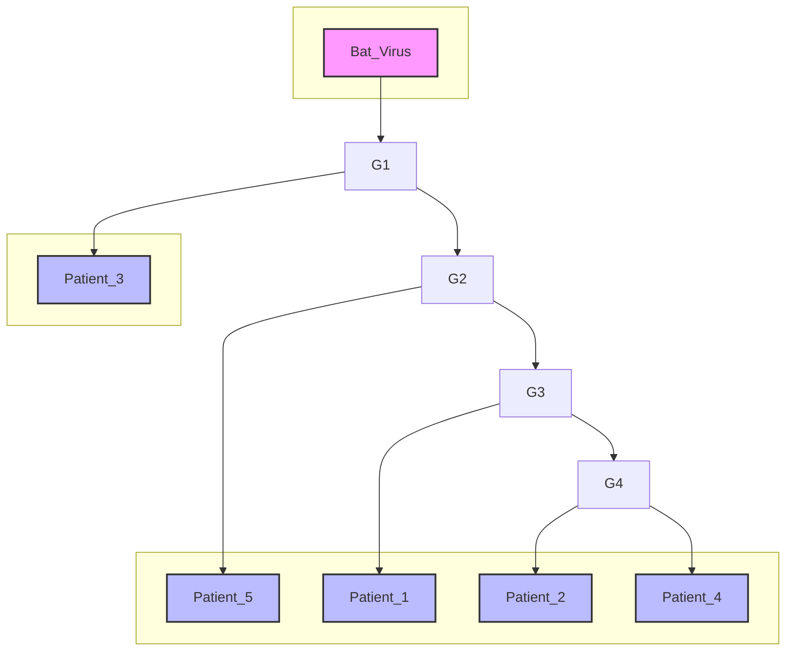

[← سناریو ۱: سوالات](./scenario-01-questions.md) | [سناریو ۳: سوالات →](./scenario-03-questions.md) | [پاسخنامه سناریو ۲](./scenario-02-answers.md)

# سناریو ۲: همه‌گیرشناسی ویروسی و تحلیل فیلوژنتیک

یک ویروس تنفسی جدید و ناشناخته در یک منطقه جغرافیایی در حال شیوع است. شما به عنوان یک متخصص بیوانفورماتیک در یک سازمان بهداشت جهانی، وظیفه دارید منشا، روابط تکاملی و الگوهای شیوع این ویروس را با استفاده از داده‌های ژنومی تحلیل کنید.

---

### **بخش ۲-۱: تحلیل محاسباتی توالی‌ها**

تیم میدانی موفق به استخراج توالی یک ژن کلیدی به نام `S-Gene` از پنج بیمار (`Patient_1` تا `Patient_5`) و همچنین از یک ویروس خفاش نزدیک (`Bat_Virus`) شده است.

**داده‌های توالی:**

- `Seq_P1`: `ATGTTCAGTTTGTGGCCAACTAT`
- `Seq_P2`: `ATGTTCAGTTTGTGGCCAACTAC`
- `Seq_P3`: `ATGTTCAGCTTGTGGCCAACATC`
- `Seq_P4`: `ATGTTCAGTTTGTGGCCAACTAC`
- `Seq_P5`: `ATGTTTAGTTTGTGGCCAACTAT`
- `Seq_Bat`: `ATGTTCAGTTTGTGGCCAACAAA`

**سوال ۶:**
در تحلیل تکاملی، نسبت **گذار (Transition)** به **جانشینی عرضی (Transversion)** یا **Ti/Tv ratio** یک معیار مهم است. گذار (Ti) جهش بین پورین‌ها (A↔G) یا پیریمیدین‌ها (C↔T) است. جانشینی عرضی (Tv) جهش بین یک پورین و یک پیریمیدین است.
با مقایسه توالی `Seq_P1` و `Seq_P3`، نسبت Ti/Tv چقدر است؟ (اگر تعداد Tv صفر بود، نسبت را تعریف‌نشده در نظر بگیرید).

الف) 1.0
ب) 0.5
ج) 3.0
د) 0.33

**سوال ۷:**
برای پیدا کردن منشا احتمالی ویروس، شما توالی `Seq_P1` را در یک پایگاه داده بزرگ با استفاده از ابزار **BLAST** جستجو می‌کنید. نتایج زیر به دست می‌آید که بر اساس E-value مرتب شده‌اند:

| Subject (توالی پیدا شده) | Percent Identity | E-value |
| ------------------------ | ---------------- | ------- |
| Bat Coronavirus RaTG13   | 96.3%            | 3e-70   |
| Bat Virus ZC45           | 99.1%            | 8e-68   |
| Human SARS-CoV-1         | 88.0%            | 2e-45   |
| MERS-CoV                 | 75.2%            | 5e-20   |

کدام یک از نتایج زیر بهترین و محتاطانه‌ترین تفسیر این خروجی BLAST است؟

الف) `Bat Virus ZC45` محتمل‌ترین منشا است، زیرا بیشترین درصد تشابه (Percent Identity) را دارد.
ب) `Bat Coronavirus RaTG13` محتمل‌ترین منشا است، زیرا کمترین E-value را دارد و نشان‌دهنده بیشترین معناداری آماری است.
ج) نمی‌توان به طور قطعی نظر داد؛ `RaTG13` از نظر آماری معنادارتر است، اما `ZC45` هم‌ترازی بهتری در منطقه تطبیق‌داده‌شده دارد. این نتایج متناقض نیازمند تحلیل فیلوژنتیک است.
د) `Human SARS-CoV-1` منشا ویروس نیست، زیرا درصد تشابه آن زیر 90% است.

---

### **بخش ۲-۲: ساخت و تفسیر درخت فیلوژنتیک**

با استفاده از توالی‌های کامل ژنوم هر شش نمونه، شما یک درخت فیلوژنتیک برای نمایش روابط تکاملی آن‌ها ساخته‌اید.



_توجه: این یک درخت ریشه‌دار (rooted) است و طول شاخه‌ها متناسب با میزان تغییرات تکاملی است._

**سوال ۸:**
بر اساس توپولوژی و طول شاخه‌های این درخت، کدام گزاره از نظر فیلوژنتیکی صحیح است؟

الف) ویروس‌های جداشده از `Patient_2` و `Patient_4` یک گروه تک‌نیایی (Monophyletic Group) را تشکیل می‌دهند.
ب) `Bat_Virus` به `Patient_3` نزدیک‌تر است تا به `Patient_1`.
ج) جد مشترک `Patient_1` و `Patient_5` همان جد مشترک `Patient_1` و `Patient_3` است.
د) `Patient_3` یک "outgroup" نسبت به کلاد (clade) شامل سایر بیماران (`P1, P2, P4, P5`) محسوب می‌شود.

**سوال ۹:**
با مشاهده این درخت، یک اپیدمیولوژیست به شما می‌گوید که احتمالاً دو خط انتقال ویروس (transmission lines) کاملاً مجزا و همزمان وارد این منطقه شده‌اند. کدام ویژگی درخت به بهترین شکل این فرضیه را پشتیبانی می‌کند؟

الف) `Patient_2` و `Patient_4` توالی‌های یکسانی دارند.
ب) شاخه‌ای که به `Patient_3` منجر می‌شود و شاخه‌ای که به کلاد `P1/P2/P4/P5` منجر می‌شود، هر دو مستقیماً از یک گره عمیق و مشترک نزدیک به ریشه منشعب شده‌اند.
ج) `Bat_Virus` به عنوان ریشه درخت انتخاب شده است.
د) طول شاخه `Patient_5` کمی بلندتر از `Patient_1` است که نشان‌دهنده نرخ جهش بالاتر است.

**سوال ۱۰:**
یک برنامه‌نویس تازه‌کار تابعی برای محاسبه محتوای GC نوشته است اما یک اشتباه منطقی در آن وجود دارد.

```python
def calculate_gc_content_buggy(sequence):
    """Calculates GC content, but contains a logical bug."""
    g_count = sequence.upper().count('G')
    c_count = sequence.upper().count('C')
    gc_count = g_count + c_count
    # BUG: The programmer forgot to handle the case of empty sequences.
    if len(sequence) > 0:
        return (gc_count / len(sequence)) * 100
    # No return statement for empty string, will implicitly return None
```

اگر این تابع را بر روی توالی `Seq_P3` (`ATGTTCAGCTTGTGGCCAACATC`) اجرا کنیم، چه خروجی‌ای تولید می‌کند و اگر یک رشته خالی (`""`) به عنوان ورودی به آن بدهیم، چه اتفاقی در پایتون رخ می‌دهد؟

الف) خروجی برای `Seq_P3` حدود 43.5% است و برای رشته خالی، خطای `ZeroDivisionError` رخ می‌دهد.
ب) خروجی برای `Seq_P3` حدود 43.5% است و برای رشته خالی، تابع مقدار `None` را برمی‌گرداند.
ج) خروجی برای `Seq_P3` حدود 47.8% است و برای رشته خالی، تابع مقدار `None` را برمی‌گرداند.
د) خروجی برای `Seq_P3` حدود 47.8% است و برای رشته خالی، خطای `ZeroDivisionError` رخ می‌دهد.
