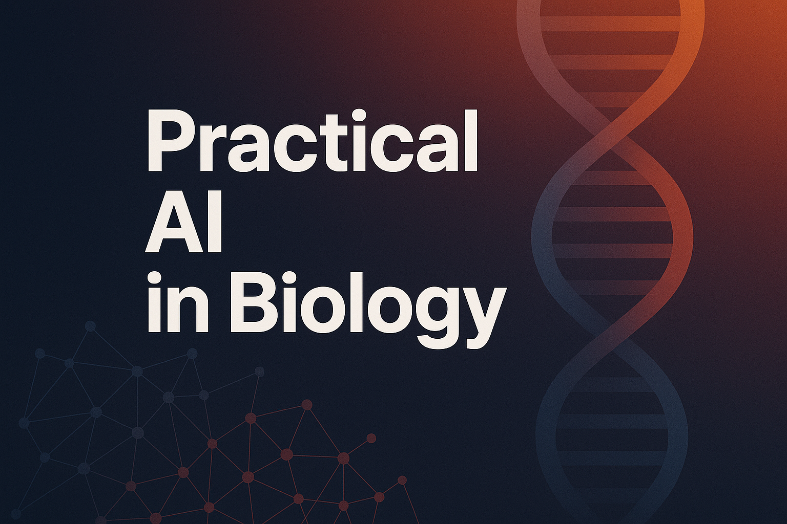

  
   
  <h1>هوش مصنوعی کاربردی در زیست‌شناسی</h1>
   
  
<strong>نسخه ۱.۰</strong>

  
تابستان ۱۴۰۴

 

**رضا شاه‌نظر نژاد خالصی**

- مدال طلای کشوری المپیاد زیست‌شناسی سال ۱۳۸۷
- پزشک، متخصص قلب و عروق - دانشگاه علوم پزشکی تهران
- مدیر فنی و مهندس محصولات هوش مصنوعی

---

# پیشگفتار

## چرا هوش مصنوعی؟

دوست دانش‌پژوه و کنجکاو من،

به دوره تابستان المپیاد زیست‌شناسی خوش آمدی. تو در مسیری قدم گذاشته‌ای که به ذهنی پرسشگر، نگاهی دقیق و روحیه‌ای خستگی‌ناپذیر نیاز دارد و به عنوان یکی از بهترین‌های کشور در درک عمیق مفاهیم حیات، انتخاب شدی. برای من هم که پس از سال‌ها دوری، به فضای شیرین المپیاد زیست‌شناسی برگشته‌ام، فرصت همراهی با تو و امثال تو بسیار ارزشمند و هیجان‌انگیز است. در این مسیر، قرار است با تحولی بزرگ آشنا شویم که احتمالاً چهره زیست‌شناسی پژوهشی و کاربردی را برای همیشه تغییر خواهد داد: تحول دنیای زیست‌شناسی با **هوش مصنوعی**.

شاید از خودت بپرسی که یک زیست‌شناس با دنیای الگوریتم‌ها و کامپیوترها چه کار دارد؟ پاسخ ساده است: زیست‌شناسی دیگر فقط یک علم آزمایشگاهی نیست. ما در عصری زندگی می‌کنیم که حجم داده‌های تولیدی سر به فلک می‌کشد. از توالی کامل ژنوم یک فرد که در چند ساعت و با هزینه‌ای ناچیز به دست می‌آید، تا تصاویر میکروسکوپی با وضوح باورنکردنی؛ ما در اقیانوسی از داده‌های زیستی شناوریم.

مغز انسان، با تمام شگفتی‌هایش، برای تحلیل این حجم از اطلاعات طراحی نشده. ما نمی‌توانیم الگوهای پنهان در میان میلیون‌ها جهش ژنتیکی بیماران سرطانی را با چشم غیرمسلح پیدا کنیم یا از میان میلیاردها ترکیب شیمیایی، آن مولکولی که می‌تواند داروی یک بیماری باشد را به سادگی حدس بزنیم. اینجاست که هوش مصنوعی (AI) مثل یک همکار جدید و فوق‌العاده قدرتمند وارد میدان می‌شود.

هوش مصنوعی برای یک زیست‌شناس، مثل یک میکروسکوپ در قرن هفدهم است. همان‌طور که میکروسکوپ به ما اجازه داد برای اولین بار دنیای میکروارگانیسم‌ها را ببینیم، هوش مصنوعی هم به ما اجازه می‌دهد الگوهایی را ببینیم که تا پیش از این از چشم‌مان پنهان بودند. این یک "میکروسکوپ محاسباتی" است که به ما قدرت تحلیل، پیش‌بینی و حتی طراحی در مقیاسی را می‌دهد که قبلاً فقط در داستان‌های علمی-تخیلی ممکن بود.

با اینکه هوش مصنوعی پدیده کاملاً جدیدی نیست، اما پیشرفت‌های چشمگیرش در سال‌های اخیر و تأثیر عمیق آن بر زیست‌شناسی، اتفاقی نسبتاً تازه است. به همین دلیل، منابع و کتاب‌های خوب میان‌رشته‌ای که با زبان ما زیست‌شناسی‌دوست‌ها (!) حرف بزنند، هنوز خیلی کم هستند. برای همین، با خودم فکر کردم که شاید با ترکیب تجربه‌هایم در هر دو دنیای علوم زیستی و علوم کامپیوتر، بتوانم این کتاب را بنویسم. هدفم این بود که این کتاب هم محتوای اصلی کلاس‌های دوره تابستان‌مان باشد و هم منبعی کاربردی برای هر علاقه‌مند دیگری که می‌خواهد وارد این حوزه شود.

این دوره (و این کتاب) قرار نیست از تو یک برنامه‌نویس حرفه‌ای بسازد. هدف خیلی بزرگ‌تر است! هدف این است که تو به یک **متفکر محاسباتی** تبدیل شوی. یعنی یاد بگیری چطور:

- یک مسئله پیچیده زیستی را به بخش‌های کوچک‌تر و قابل تحلیل تقسیم کنی.
- با نگاهی نقادانه به داده‌ها نگاه کنی و الگوهای اولیه را در آن‌ها کشف کنی.
- منطق پشت الگوریتم‌های یادگیری ماشین را به زبان ساده درک کنی.
- و از همه مهم‌تر، **یاد بگیری که سوال درست را به شیوه درست بپرسی تا هوش مصنوعی بهترین و مفیدترین پاسخ را به تو بدهد.**

این دوره دو بخش اصلی دارد. در نیمه اول (فصل‌های ۱ تا ۳)، بدون نوشتن حتی یک خط کد، با مفاهیم اصلی، کاربردهای شگفت‌انگیز و منطق پشت هوش مصنوعی در زیست‌شناسی آشنا می‌شوی. در سه فصل دوم، آستین‌ها را بالا می‌زنیم و با زبان برنامه‌نویسی پایتون، ابزارهای ساده‌ای می‌سازیم تا قدرت این علم را با دست‌های خودت لمس کنی.

دوست خوب من، آینده زیست‌شناسی در پیوند عمیق آن با علوم کامپیوتر رقم می‌خورد. پزشکی شخصی‌سازی شده، کشف داروهای جدید، مبارزه با پاندمی‌ها و درک عمیق‌تر تکامل، همگی به توانایی ما در استفاده هوشمندانه از داده‌ها بستگی دارد. تو به عنوان یکی از دانشمندان نسل آینده این حوزه، نه تنها باید زیست‌شناسی را عمیقاً بشناسی، بلکه باید به زبان داده‌ها هم مسلط باشی.

این کتاب، یک دعوت‌نامه است برای ورود به این دنیای جدید. سفری که در آن، تو فقط یک مصرف‌کننده دانش نیستی، بلکه خالق راه‌حل‌های نوآورانه برای بزرگترین چالش‌های پیش روی سلامت انسان و حیات روی این سیاره خواهی بود.

## ساختار کتاب: راهنمای سفر تو

این کتاب طوری طراحی شده که تو را قدم به قدم از مفاهیم اولیه تا انجام پروژه‌های واقعی راهنمایی کند.

- **بخش اول (فصل‌های ۱ تا ۳):** در این بخش، روی درک شهودی و مفهومی تمرکز می‌کنیم. تو با داستان‌های واقعی از کاربرد AI در پزشکی و زیست‌شناسی آشنا می‌شوی، منطق انواع روش‌های یادگیری ماشین را درک می‌کنی و یاد می‌گیری که مثل یک کارآگاه، الگوها را در داده‌ها پیدا کنی. در این بخش به کامپیوتر یا کدنویسی نیازی نداری.

- **بخش دوم (فصل‌های ۴ تا ۶):** در این بخش، وارد دنیای عملی می‌شویم. با ابزار اصلی‌مان یعنی زبان برنامه‌نویسی **پایتون** در محیط **Google Colab** (که رایگان و در دسترس همه است) آشنا می‌شوی. یاد می‌گیری که چطور داده‌های زیستی را تحلیل کنی، مدل‌های پیش‌بینی‌کننده بسازی و در نهایت، یک پروژه تحقیقاتی کوچک را از صفر تا صد پیش ببری.

- **آزمون‌های فصلی:** در پایان هر فصل، یک آزمون تحلیلی بر اساس سناریوهای واقعی قرار دارد. این آزمون‌ها شامل چند سناریوی مستقل هستند که هر کدام، جنبه‌ای چالش‌برانگیز از کاربرد هوش مصنوعی در زیست‌شناسی را پوشش می‌دهند. سوالات فقط برای سنجش دانش تو نیستند، بلکه توانایی تو را در استدلال، تحلیل داده و حل مسئله به چالش می‌کشند. پاسخ‌های کامل تشریحی هم به تو کمک می‌کنند تا مسیر فکری درست برای رسیدن به جواب را یاد بگیری.

- **آزمون نهایی، واژه‌نامه و منابع:** در انتهای کتاب، یک آزمون جامع، یک واژه‌نامه برای مرور اصطلاحات کلیدی و لیستی از منابع برای مطالعه بیشتر پیدا می‌کنی.

این سفر را با ذهنی باز و کنجکاو شروع کن. بیا با هم ببینیم که چطور می‌توان با ترکیب هوش انسانی و هوش مصنوعی، آینده بهتری برای جهان ساخت.

با آرزوی موفقیت برای تو در این مسیر پرماجرا،

رضا شاه‌نظر

تابستان ۱۴۰۴

---

# فهرست مطالب

- [فصل ۱: انقلاب جدید در زیست‌شناسی: هوش مصنوعی](./01-ai-revolution-in-biology/00-introduction.md)
  - [بخش ۱-۱: داستان یک کشف: از ژنوم انسان تا پزشکی شخصی](./01-ai-revolution-in-biology/01-discovery-story-genome-to-personalized-medicine.md)
  - [بخش ۱-۲: هوش مصنوعی چیست؟ یک شهود برای زیست‌شناسان](./01-ai-revolution-in-biology/02-what-is-ai-for-biologists.md)
  - [بخش ۱-۳: سونامی داده: چرا زیست‌شناسی به هوش مصنوعی نیاز دارد؟](./01-ai-revolution-in-biology/03-data-tsunami.md)
  - [بخش ۱-۴: مطالعه موردی: تشخیص سرطان با چشم‌های مصنوعی](./01-ai-revolution-in-biology/04-case-study-cancer-detection.md)
  - [بخش ۱-۵: تمرین تحلیلی: شما کارآگاه داده هستید](./01-ai-revolution-in-biology/05-exercise-data-detective.md)
  - [آزمون فصل اول](./01-ai-revolution-in-biology/exam/index.md)
    - [سناریو ۱: سوالات](./01-ai-revolution-in-biology/exam/scenario-01-questions.md) | [پاسخنامه سناریو ۱](./01-ai-revolution-in-biology/exam/scenario-01-answers.md)
    - [سناریو ۲: سوالات](./01-ai-revolution-in-biology/exam/scenario-02-questions.md) | [پاسخنامه سناریو ۲](./01-ai-revolution-in-biology/exam/scenario-02-answers.md)
    - [سناریو ۳: سوالات](./01-ai-revolution-in-biology/exam/scenario-03-questions.md) | [پاسخنامه سناریو ۳](./01-ai-revolution-in-biology/exam/scenario-03-answers.md)
    - [سناریو ۴: سوالات](./01-ai-revolution-in-biology/exam/scenario-04-questions.md) | [پاسخنامه سناریو ۴](./01-ai-revolution-in-biology/exam/scenario-04-answers.md)
- [فصل ۲: ماشین چگونه یاد می‌گیرد؟](./02-how-machines-learn/00-introduction.md)
  - [بخش ۲-۱: از مغز انسان تا مغز مصنوعی: داستان شبکه‌های عصبی](./02-how-machines-learn/01-from-brain-to-ann.md)
  - [بخش ۲-۲: یادگیری با معلم: یادگیری تحت نظارت (Supervised Learning)](./02-how-machines-learn/02-supervised-learning.md)
  - [بخش ۲-۳: کشف الگوهای پنهان: یادگیری بدون نظارت (Unsupervised Learning)](./02-how-machines-learn/03-unsupervised-learning.md)
  - [بخش ۲-۴: مطالعه موردی: آلفافولد و معمای تاشدگی پروتئین](./02-how-machines-learn/04-case-study-alphafold.md)
  - [بخش ۲-۵: بازی عملی: یک نورون را خودتان آموزش دهید!](./02-how-machines-learn/05-exercise-train-a-neuron.md)
  - [آزمون فصل دوم](./02-how-machines-learn/exam/index.md)
    - [سناریو ۱: سوالات](./02-how-machines-learn/exam/scenario-01-questions.md) | [پاسخنامه سناریو ۱](./02-how-machines-learn/exam/scenario-01-answers.md)
    - [سناریو ۲: سوالات](./02-how-machines-learn/exam/scenario-02-questions.md) | [پاسخنامه سناریو ۲](./02-how-machines-learn/exam/scenario-02-answers.md)
    - [سناریو ۳: سوالات](./02-how-machines-learn/exam/scenario-03-questions.md) | [پاسخنامه سناریو ۳](./02-how-machines-learn/exam/scenario-03-answers.md)
    - [سناریو ۴: سوالات](./02-how-machines-learn/exam/scenario-04-questions.md) | [پاسخنامه سناریو ۴](./02-how-machines-learn/exam/scenario-04-answers.md)
- [فصل ۳: هنر شناخت الگو](./03-art-of-pattern-recognition/00-introduction.md)
  - [بخش ۳-۱: الگوها در دنیای زنده: از اکوسیستم تا ژنوم](./03-art-of-pattern-recognition/01-patterns-in-living-world.md)
  - [بخش ۳-۲: جستجوی هوشمند در توالی‌ها: داستان BLAST](./03-art-of-pattern-recognition/02-intelligent-sequence-search-blast.md)
  - [بخش ۳-۳: ساختن درخت زندگی: فیلوژنتیک مولکولی](./03-art-of-pattern-recognition/03-building-tree-of-life-phylogenetics.md)
  - [بخش ۳-۴: مطالعه موردی: ردیابی ویروس‌ها در زمان واقعی](./03-art-of-pattern-recognition/04-case-study-real-time-virus-tracking.md)
  - [بخش ۳-۵: شبیه‌سازی: یک جستجوی BLAST روی کاغذ](./03-art-of-pattern-recognition/05-simulation-blast-on-paper.md)
  - [آزمون فصل سوم](./03-art-of-pattern-recognition/exam/index.md)
    - [سناریو ۱: سوالات](./03-art-of-pattern-recognition/exam/scenario-01-questions.md) | [پاسخنامه سناریو ۱](./03-art-of-pattern-recognition/exam/scenario-01-answers.md)
    - [سناریو ۲: سوالات](./03-art-of-pattern-recognition/exam/scenario-02-questions.md) | [پاسخنامه سناریو ۲](./03-art-of-pattern-recognition/exam/scenario-02-answers.md)
    - [سناریو ۳: سوالات](./03-art-of-pattern-recognition/exam/scenario-03-questions.md) | [پاسخنامه سناریو ۳](./03-art-of-pattern-recognition/exam/scenario-03-answers.md)
    - [سناریو ۴: سوالات](./03-art-of-pattern-recognition/exam/scenario-04-questions.md) | [پاسخنامه سناریو ۴](./03-art-of-pattern-recognition/exam/scenario-04-answers.md)
- [فصل ۴: اولین جعبه ابزار شما: پایتون](./04-your-first-toolbox-python/00-introduction.md)
  - [بخش ۴-۱: سلام، دنیای پایتون! آشنایی با محیط برنامه‌نویسی](./04-your-first-toolbox-python/01-hello-python-world.md)
  - [بخش ۴-۲: متغیرها: قفسه‌هایی برای داده‌های زیستی](./04-your-first-toolbox-python/02-variables-for-bio-data.md)
  - [بخش ۴-۳: کار با رشته‌ها: توالی DNA به عنوان متن](./04-your-first-toolbox-python/03-working-with-strings-dna-sequences.md)
  - [بخش ۴-۴: منطق ماشین: حلقه‌ها و شرط‌ها](./04-your-first-toolbox-python/04-machine-logic-loops-and-conditions.md)
  - [بخش ۴-۵: پروژه: محاسبه محتوای GC](./04-your-first-toolbox-python/05-project-gc-content-calculation.md)
  - [آزمون فصل چهارم](./04-your-first-toolbox-python/exam/index.md)
    - [سناریو ۱: سوالات](./04-your-first-toolbox-python/exam/scenario-01-questions.md) | [پاسخنامه سناریو ۱](./04-your-first-toolbox-python/exam/scenario-01-answers.md)
    - [سناریو ۲: سوالات](./04-your-first-toolbox-python/exam/scenario-02-questions.md) | [پاسخنامه سناریو ۲](./04-your-first-toolbox-python/exam/scenario-02-answers.md)
    - [سناریو ۳: سوالات](./04-your-first-toolbox-python/exam/scenario-03-questions.md) | [پاسخنامه سناریو ۳](./04-your-first-toolbox-python/exam/scenario-03-answers.md)
    - [سناریو ۴: سوالات](./04-your-first-toolbox-python/exam/scenario-04-questions.md) | [پاسخنامه سناریو ۴](./04-your-first-toolbox-python/exam/scenario-04-answers.md)
- [فصل ۵: ساخت اولین مدل‌های پیش‌بینی](./05-building-first-prediction-models/00-introduction.md)
  - [بخش ۵-۱: کتابخانه‌های قدرتمند: NumPy، Pandas و Scikit-learn](./05-building-first-prediction-models/01-powerful-libraries-numpy-pandas-sklearn.md)
  - [بخش ۵-۲: هنر رام کردن داده‌ها: پاک‌سازی و آماده‌سازی](./05-building-first-prediction-models/02-art-of-data-wrangling.md)
  - [بخش ۵-۳: اولین مدل طبقه‌بندی شما: الگوریتم K-نزدیک‌ترین همسایه (KNN)](./05-building-first-prediction-models/03-first-classification-model-knn.md)
  - [بخش ۵-۴: مدل ما چقدر خوب کار می‌کند؟ معیارهای ارزیابی](./05-building-first-prediction-models/04-model-evaluation-metrics.md)
  - [بخش ۵-۵: پروژه: ساخت مدل تشخیص سرطان](./05-building-first-prediction-models/05-project-cancer-detection-model.md)
  - [آزمون فصل پنجم](./05-building-first-prediction-models/exam/index.md)
    - [سناریو ۱: سوالات](./05-building-first-prediction-models/exam/scenario-01-questions.md) | [پاسخنامه سناریو ۱](./05-building-first-prediction-models/exam/scenario-01-answers.md)
    - [سناریو ۲: سوالات](./05-building-first-prediction-models/exam/scenario-02-questions.md) | [پاسخنامه سناریو ۲](./05-building-first-prediction-models/exam/scenario-02-answers.md)
    - [سناریو ۳: سوالات](./05-building-first-prediction-models/exam/scenario-03-questions.md) | [پاسخنامه سناریو ۳](./05-building-first-prediction-models/exam/scenario-03-answers.md)
    - [سناریو ۴: سوالات](./05-building-first-prediction-models/exam/scenario-04-questions.md) | [پاسخنامه سناریو ۴](./05-building-first-prediction-models/exam/scenario-04-answers.md)
- [فصل ۶: مباحث پیشرفته و کاربردهای دنیای واقعی](./06-advanced-topics-and-real-world-applications/00-introduction.md)
  - [بخش ۶-۱: پیش‌بینی مقادیر پیوسته: مدل‌های رگرسیون](./06-advanced-topics-and-real-world-applications/01-predicting-continuous-values-regression.md)
  - [بخش ۶-۲: شیرجه به عمق: مقدمه‌ای بر یادگیری عمیق (Deep Learning)](./06-advanced-topics-and-real-world-applications/02-deep-dive-into-deep-learning.md)
  - [بخش ۶-۳: مطالعه موردی: طراحی مولکول‌های دارو با هوش مصنوعی](./06-advanced-topics-and-real-world-applications/03-case-study-drug-molecule-design.md)
  - [بخش ۶-۴: اخلاق در هوش مصنوعی زیستی: فراتر از کد](./06-advanced-topics-and-real-world-applications/04-ethics-in-bio-ai.md)
  - [بخش ۶-۵: پروژه: پیش‌بینی پایداری پروتئین](./06-advanced-topics-and-real-world-applications/05-project-protein-stability-prediction.md)
  - [آزمون فصل ششم](./06-advanced-topics-and-real-world-applications/exam/index.md)
    - [سناریو ۱: سوالات](./06-advanced-topics-and-real-world-applications/exam/scenario-01-questions.md) | [پاسخنامه سناریو ۱](./06-advanced-topics-and-real-world-applications/exam/scenario-01-answers.md)
    - [سناریو ۲: سوالات](./06-advanced-topics-and-real-world-applications/exam/scenario-02-questions.md) | [پاسخنامه سناریو ۲](./06-advanced-topics-and-real-world-applications/exam/scenario-02-answers.md)
    - [سناریو ۳: سوالات](./06-advanced-topics-and-real-world-applications/exam/scenario-03-questions.md) | [پاسخنامه سناریو ۳](./06-advanced-topics-and-real-world-applications/exam/scenario-03-answers.md)
    - [سناریو ۴: سوالات](./06-advanced-topics-and-real-world-applications/exam/scenario-04-questions.md) | [پاسخنامه سناریو ۴](./06-advanced-topics-and-real-world-applications/exam/scenario-04-answers.md)
- [فصل ۷: آزمون جامع نهایی](./07-final-exam/index.md)
  - [سناریو ۱: فارماکوژنومیکس و پیش‌بینی پاسخ به دارو](./07-final-exam/scenario-01-questions.md)
    - [پاسخنامه سناریو ۱](./07-final-exam/scenario-01-answers.md)
  - [سناریو ۲: همه‌گیرشناسی ویروسی و تحلیل فیلوژنتیک](./07-final-exam/scenario-02-questions.md)
    - [پاسخنامه سناریو ۲](./07-final-exam/scenario-02-answers.md)
  - [سناریو ۳: مهندسی پروتئین با هوش مصنوعی مولد](./07-final-exam/scenario-03-questions.md)
    - [پاسخنامه سناریو ۳](./07-final-exam/scenario-03-answers.md)
  - [سناریو ۴: ارزیابی مدل تشخیص پزشکی از روی تصاویر](./07-final-exam/scenario-04-questions.md)
    - [پاسخنامه سناریو ۴](./07-final-exam/scenario-04-answers.md)
- [نتیجه‌گیری (Conclusion)](./08-conclusion.md)
- [واژه‌نامه (Glossary)](./09-glossary.md)
- [پیوست (Appendix)](./10-appendix.md)
