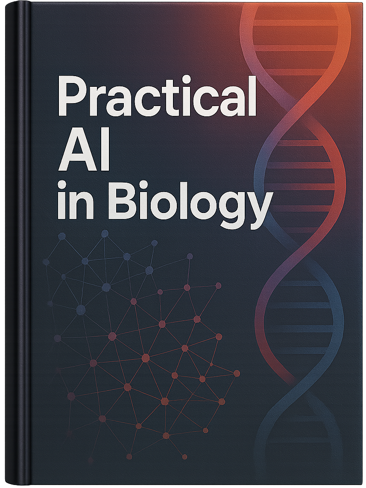

  
   
  <h1>هوش مصنوعی کاربردی در زیست‌شناسی</h1>
   
  
<strong>نسخه ۱.۰</strong>

  
تابستان ۱۴۰۴

 

**رضا شاه‌نظر نژاد خالصی**

- مدال طلای کشوری المپیاد زیست‌شناسی سال ۱۳۸۷
- پزشک، متخصص قلب و عروق - دانشگاه علوم پزشکی تهران
- مدیر فنی و مهندس محصولات هوش مصنوعی

---

## پیشگفتار

### چرا هوش مصنوعی؟

دوستان دانش‌پژوه عزیز،

به دوره تابستان المپیاد زیست‌شناسی خوش آمدید. شما در مسیری قدم گذاشته‌اید که نیازمند ذهنی کنجکاو، نگاهی دقیق و روحیه‌ای خستگی‌ناپذیر است. شما از بهترین‌های کشور در درک عمیق و کاربردی مفاهیم حیات هستید. فرصت همراهی با شما، که پس از سال‌ها دوری از فضای شیرین المپیاد زیست‌شناسی برای من فراهم شده، بسیار جذاب، ارزشمند و اثربخش است. در این همراهی، قرار است با تحولی نوظهور و بزرگ آشنا شویم که احتمالاً تعاریف و ابعاد پژوهشی و کاربردی علوم زیستی را برای همیشه تغییر خواهد داد: **تحول دنیای زیست‌شناسی با هوش مصنوعی**.

شاید بپرسید ارتباط یک زیست‌شناس با دنیای الگوریتم‌ها و کامپیوترها چیست؟ پاسخ ساده است: زیست‌شناسی دیگر تنها یک علم آزمایشگاهی نیست. ما در عصری زندگی می‌کنیم که حجم داده‌های تولید شده در یک روز، از کل داده‌های تولید شده در قرن بیستم بیشتر است. از توالی کامل ژنوم یک فرد که در چند ساعت و با هزینه‌ای اندک به دست می‌آید، تا تصاویر میکروسکوپی با وضوح باورنکردنی و داده‌های حاصل از میلیاردها حسگر پوشیدنی؛ ما در اقیانوسی از داده‌های زیستی غرق شده‌ایم.

مغز انسان، با تمام شگفتی‌هایش، برای تحلیل این حجم از اطلاعات طراحی نشده است. ما نمی‌توانیم الگوهای پنهان در میان میلیون‌ها جهش ژنتیکی بیماران سرطانی را با چشم غیرمسلح پیدا کنیم. نمی‌توانیم از میان میلیاردها ترکیب شیمیایی، آن یک ترکیبی را که می‌تواند داروی یک بیماری صعب‌العلاج باشد، به سادگی حدس بزنیم. اینجاست که **هوش مصنوعی (AI)** به عنوان یک ابزار قدرتمند جدید وارد میدان می‌شود.

هوش مصنوعی برای یک زیست‌شناس، مانند یک میکروسکوپ در قرن هفدهم است. همان‌طور که میکروسکوپ به ما اجازه داد دنیای میکروارگانیسم‌ها را برای اولین بار ببینیم، هوش مصنوعی نیز به ما اجازه می‌دهد الگوهایی را ببینیم که پیش از این از چشم ما پنهان بودند. این یک **"میکروسکوپ محاسباتی"** است که به ما قدرت تحلیل، پیش‌بینی و حتی طراحی در مقیاسی را می‌دهد که پیش از این در قلمرو داستان‌های علمی-تخیلی بود.

---

اگرچه هوش مصنوعی شاید در اصل پدیده‌ای کاملاً نوظهور نباشد، اما پیشرفت چشمگیر آن در سال‌های اخیر، که موجب تأثیرگذاری عمیق بر سایر علوم از جمله زیست‌شناسی شده، به راستی پدیده‌ای تازه است. همین امر باعث شده دسترسی به منابع و کتاب‌های میان‌رشته‌ای با رویکردی کاربردی در علوم زیستی و سلامت، که منطبق با دانش و مهارت‌های مورد نیاز ما باشد، بسیار محدود و چالش‌برانگیز باشد. از همین رو، به نظرم رسید که با تکیه بر تجربیاتی که در هر دو حوزه علوم زیستی و علوم کامپیوتر و هوش مصنوعی کسب کرده‌ام، شاید بتوانم با نوشتن این کتاب گامی بردارم. هدف این بود که هم زیربنای محتوای مورد بحث ما در طول کلاس‌های دوره تابستان باشد و هم منبعی قابل استفاده برای سایر علاقه‌مندان و دانشجویان علوم زیستی و سلامت جهت یادگیری کاربردی‌تر هوش مصنوعی فراهم شود.

این دوره (و کتاب) برای آن نیست که شما را به یک برنامه‌نویس حرفه‌ای تبدیل کنیم. هدف، بسیار فراتر از آن است! هدف این است که هر کدام از ما به سمت تبدیل شدن به یک **متفکر محاسباتی** حرکت کنیم. تمرکز بیشتر این دوره، تلاشی عمیق‌تر از گذشته برای یادگرفتن این است که چگونه:
* یک مسئله پیچیده زیستی را به اجزای قابل تحلیل تقسیم کنیم.
* با نگرشی نقادانه به داده‌ها نگاه کنیم و الگوهای اولیه را کشف کنیم.
* منطق پشت الگوریتم‌های یادگیری ماشین را درک کنیم.
* و از همه مهم‌تر، **سوال درست و به شیوه درست بپرسیم تا هوش مصنوعی پاسخ بهتر و مفیدتری به ما بدهد.**

این دوره به دو بخش اصلی تقسیم شده است. در نیمه اول (فصل‌های ۱ تا ۳)، بدون نیاز به نوشتن حتی یک خط کد، با مفاهیم بنیادین، کاربردهای شگفت‌انگیز و منطق پشت هوش مصنوعی در زیست‌شناسی آشنا می‌شوید. در سه فصل دوم، آستین‌ها را بالا می‌زنیم و با زبان برنامه‌نویسی پایتون، ابزارهای ساده‌ای می‌سازیم تا قدرت این علم را با دستان خودتان لمس کنید.

دوستان خوبم، تصور می‌کنم که آینده نه چندان دور زیست‌شناسی در پیوند عمیق آن با علوم کامپیوتر رقم خواهد خورد. پزشکی شخصی‌سازی شده، کشف داروهای جدید، مبارزه با پاندمی‌ها و حتی درک عمیق‌تر تکامل، همگی به توانایی ما در استفاده هوشمندانه از داده‌ها بستگی دارد. شما به عنوان نسل آینده دانشمندان علوم زیستی، نه تنها باید زیست‌شناسی را عمیقاً بشناسید، بلکه لازم است بر زبان صحبت با داده‌های زیستی مسلط باشید.

این کتاب، دعوت‌نامه‌ای است برای ورود به این دنیای جدید و هیجان‌انگیز. سفری که در آن، شما نه تنها مصرف‌کننده دانش، که خالق راه‌حل‌های نوآورانه برای بزرگترین چالش‌های سلامت انسان و حیات تمامی موجودات زنده، دست کم در سیاره زمین (!) خواهید بود.

با آرزوی موفقیت برای تک‌تک شما در این مسیر پرماجرا،

رضا شاه‌نظر
تابستان ۱۴۰۴

---

## ساختار کتاب: راهنمای سفر شما

این کتاب به گونه‌ای طراحی شده که شما را قدم به قدم از مفاهیم اولیه تا اجرای پروژه‌های زیست‌شناسی واقعی مبتنی بر هوش مصنوعی راهنمایی کند.

- **بخش اول (فصل‌های ۱ تا ۳):** در این بخش، بر درک شهودی و مفهومی تمرکز داریم. شما با داستان‌های واقعی از کاربرد AI در پزشکی و زیست‌شناسی آشنا می‌شوید، منطق انواع روش‌های یادگیری ماشین را درک می‌کنید و یاد می‌گیرید که مانند یک کارآگاه، الگوها را در داده‌ها پیدا کنید. در این بخش هیچ نیازی به کامپیوتر یا کدنویسی ندارید.

- **بخش دوم (فصل‌های ۴ تا ۶):** در این بخش، وارد دنیای عملی می‌شویم. با ابزار اصلی خود یعنی زبان برنامه‌نویسی **پایتون** در محیط **Google Colab** (که رایگان و در دسترس همگان است) آشنا می‌شوید. یاد می‌گیرید که چگونه داده‌های زیستی را تحلیل کنید، مدل‌های پیش‌بینی‌کننده بسازید و در نهایت، یک پروژه تحقیقاتی کوچک را از صفر تا صد انجام دهید.

- **آزمون‌های فصلی:** در پایان هر فصل، یک آزمون تحلیلی مبتنی بر سناریوهای واقعی قرار داده شده است. این آزمون‌ها شامل چندین سناریوی مستقل هستند که هر یک، جنبه‌ای چالش‌برانگیز از کاربرد هوش مصنوعی در زیست‌شناسی را پوشش می‌دهند. سوالات صرفاً در راستای ارزیابی دانش شما نیستند، بلکه توانایی شما در استدلال، تحلیل داده و حل مسئله را به چالش می‌کشند. پاسخ‌های تشریحی کامل نیز به شما کمک می‌کنند تا مسیر فکری صحیح برای رسیدن به جواب را بهتر بیاموزید.

- **آزمون نهایی، واژه‌نامه و منابع:** در انتهای کتاب، یک آزمون جامع از تمامی مباحث مطرح شده در کتاب، یک واژه‌نامه برای مرور اصطلاحات کلیدی و لیستی از منابع برای مطالعه بیشتر قرار داده شده است.

این سفر را با ذهنی باز و کنجکاو آغاز کنید. بیایید با هم ببینیم که چگونه می‌توان با ترکیب هوش انسانی و هوش مصنوعی، آینده بهتری برای جهان (نه فقط سیاره زمین!) بسازیم.

---

# فهرست مطالب

- [فصل ۱: انقلاب جدید در زیست‌شناسی: هوش مصنوعی](./01-ai-revolution-in-biology/00-introduction.md)
  - [بخش ۱-۱: داستان یک کشف: از ژنوم انسان تا پزشکی شخصی](./01-ai-revolution-in-biology/01-discovery-story-genome-to-personalized-medicine.md)
  - [بخش ۱-۲: هوش مصنوعی چیست؟ یک شهود برای زیست‌شناسان](./01-ai-revolution-in-biology/02-what-is-ai-for-biologists.md)
  - [بخش ۱-۳: سونامی داده: چرا زیست‌شناسی به هوش مصنوعی نیاز دارد؟](./01-ai-revolution-in-biology/03-data-tsunami.md)
  - [بخش ۱-۴: مطالعه موردی: تشخیص سرطان با چشم‌های مصنوعی](./01-ai-revolution-in-biology/04-case-study-cancer-detection.md)
  - [بخش ۱-۵: تمرین تحلیلی: شما کارآگاه داده هستید](./01-ai-revolution-in-biology/05-exercise-data-detective.md)
  - [آزمون فصل اول](./01-ai-revolution-in-biology/exam/index.md)
    - [سناریو ۱: سوالات](./01-ai-revolution-in-biology/exam/scenario-01-questions.md) | [پاسخنامه سناریو ۱](./01-ai-revolution-in-biology/exam/scenario-01-answers.md)
    - [سناریو ۲: سوالات](./01-ai-revolution-in-biology/exam/scenario-02-questions.md) | [پاسخنامه سناریو ۲](./01-ai-revolution-in-biology/exam/scenario-02-answers.md)
    - [سناریو ۳: سوالات](./01-ai-revolution-in-biology/exam/scenario-03-questions.md) | [پاسخنامه سناریو ۳](./01-ai-revolution-in-biology/exam/scenario-03-answers.md)
    - [سناریو ۴: سوالات](./01-ai-revolution-in-biology/exam/scenario-04-questions.md) | [پاسخنامه سناریو ۴](./01-ai-revolution-in-biology/exam/scenario-04-answers.md)
- [فصل ۲: ماشین چگونه یاد می‌گیرد؟](./02-how-machines-learn/00-introduction.md)
  - [بخش ۲-۱: از مغز انسان تا مغز مصنوعی: داستان شبکه‌های عصبی](./02-how-machines-learn/01-from-brain-to-ann.md)
  - [بخش ۲-۲: یادگیری با معلم: یادگیری تحت نظارت (Supervised Learning)](./02-how-machines-learn/02-supervised-learning.md)
  - [بخش ۲-۳: کشف الگوهای پنهان: یادگیری بدون نظارت (Unsupervised Learning)](./02-how-machines-learn/03-unsupervised-learning.md)
  - [بخش ۲-۴: مطالعه موردی: آلفافولد و معمای تاشدگی پروتئین](./02-how-machines-learn/04-case-study-alphafold.md)
  - [بخش ۲-۵: بازی عملی: یک نورون را خودتان آموزش دهید!](./02-how-machines-learn/05-exercise-train-a-neuron.md)
  - [آزمون فصل دوم](./02-how-machines-learn/exam/index.md)
    - [سناریو ۱: سوالات](./02-how-machines-learn/exam/scenario-01-questions.md) | [پاسخنامه سناریو ۱](./02-how-machines-learn/exam/scenario-01-answers.md)
    - [سناریو ۲: سوالات](./02-how-machines-learn/exam/scenario-02-questions.md) | [پاسخنامه سناریو ۲](./02-how-machines-learn/exam/scenario-02-answers.md)
    - [سناریو ۳: سوالات](./02-how-machines-learn/exam/scenario-03-questions.md) | [پاسخنامه سناریو ۳](./02-how-machines-learn/exam/scenario-03-answers.md)
    - [سناریو ۴: سوالات](./02-how-machines-learn/exam/scenario-04-questions.md) | [پاسخنامه سناریو ۴](./02-how-machines-learn/exam/scenario-04-answers.md)
- [فصل ۳: هنر شناخت الگو](./03-art-of-pattern-recognition/00-introduction.md)
  - [بخش ۳-۱: الگوها در دنیای زنده: از اکوسیستم تا ژنوم](./03-art-of-pattern-recognition/01-patterns-in-living-world.md)
  - [بخش ۳-۲: جستجوی هوشمند در توالی‌ها: داستان BLAST](./03-art-of-pattern-recognition/02-intelligent-sequence-search-blast.md)
  - [بخش ۳-۳: ساختن درخت زندگی: فیلوژنتیک مولکولی](./03-art-of-pattern-recognition/03-building-tree-of-life-phylogenetics.md)
  - [بخش ۳-۴: مطالعه موردی: ردیابی ویروس‌ها در زمان واقعی](./03-art-of-pattern-recognition/04-case-study-real-time-virus-tracking.md)
  - [بخش ۳-۵: شبیه‌سازی: یک جستجوی BLAST روی کاغذ](./03-art-of-pattern-recognition/05-simulation-blast-on-paper.md)
  - [آزمون فصل سوم](./03-art-of-pattern-recognition/exam/index.md)
    - [سناریو ۱: سوالات](./03-art-of-pattern-recognition/exam/scenario-01-questions.md) | [پاسخنامه سناریو ۱](./03-art-of-pattern-recognition/exam/scenario-01-answers.md)
    - [سناریو ۲: سوالات](./03-art-of-pattern-recognition/exam/scenario-02-questions.md) | [پاسخنامه سناریو ۲](./03-art-of-pattern-recognition/exam/scenario-02-answers.md)
    - [سناریو ۳: سوالات](./03-art-of-pattern-recognition/exam/scenario-03-questions.md) | [پاسخنامه سناریو ۳](./03-art-of-pattern-recognition/exam/scenario-03-answers.md)
    - [سناریو ۴: سوالات](./03-art-of-pattern-recognition/exam/scenario-04-questions.md) | [پاسخنامه سناریو ۴](./03-art-of-pattern-recognition/exam/scenario-04-answers.md)
- [فصل ۴: اولین جعبه ابزار شما: پایتون](./04-your-first-toolbox-python/00-introduction.md)
  - [بخش ۴-۱: سلام، دنیای پایتون! آشنایی با محیط برنامه‌نویسی](./04-your-first-toolbox-python/01-hello-python-world.md)
  - [بخش ۴-۲: متغیرها: قفسه‌هایی برای داده‌های زیستی](./04-your-first-toolbox-python/02-variables-for-bio-data.md)
  - [بخش ۴-۳: کار با رشته‌ها: توالی DNA به عنوان متن](./04-your-first-toolbox-python/03-working-with-strings-dna-sequences.md)
  - [بخش ۴-۴: منطق ماشین: حلقه‌ها و شرط‌ها](./04-your-first-toolbox-python/04-machine-logic-loops-and-conditions.md)
  - [بخش ۴-۵: پروژه: محاسبه محتوای GC](./04-your-first-toolbox-python/05-project-gc-content-calculation.md)
  - [آزمون فصل چهارم](./04-your-first-toolbox-python/exam/index.md)
    - [سناریو ۱: سوالات](./04-your-first-toolbox-python/exam/scenario-01-questions.md) | [پاسخنامه سناریو ۱](./04-your-first-toolbox-python/exam/scenario-01-answers.md)
    - [سناریو ۲: سوالات](./04-your-first-toolbox-python/exam/scenario-02-questions.md) | [پاسخنامه سناریو ۲](./04-your-first-toolbox-python/exam/scenario-02-answers.md)
    - [سناریو ۳: سوالات](./04-your-first-toolbox-python/exam/scenario-03-questions.md) | [پاسخنامه سناریو ۳](./04-your-first-toolbox-python/exam/scenario-03-answers.md)
    - [سناریو ۴: سوالات](./04-your-first-toolbox-python/exam/scenario-04-questions.md) | [پاسخنامه سناریو ۴](./04-your-first-toolbox-python/exam/scenario-04-answers.md)
- [فصل ۵: ساخت اولین مدل‌های پیش‌بینی](./05-building-first-prediction-models/00-introduction.md)
  - [بخش ۵-۱: کتابخانه‌های قدرتمند: NumPy، Pandas و Scikit-learn](./05-building-first-prediction-models/01-powerful-libraries-numpy-pandas-sklearn.md)
  - [بخش ۵-۲: هنر رام کردن داده‌ها: پاک‌سازی و آماده‌سازی](./05-building-first-prediction-models/02-art-of-data-wrangling.md)
  - [بخش ۵-۳: اولین مدل طبقه‌بندی شما: الگوریتم K-نزدیک‌ترین همسایه (KNN)](./05-building-first-prediction-models/03-first-classification-model-knn.md)
  - [بخش ۵-۴: مدل ما چقدر خوب کار می‌کند؟ معیارهای ارزیابی](./05-building-first-prediction-models/04-model-evaluation-metrics.md)
  - [بخش ۵-۵: پروژه: ساخت مدل تشخیص سرطان](./05-building-first-prediction-models/05-project-cancer-detection-model.md)
  - [آزمون فصل پنجم](./05-building-first-prediction-models/exam/index.md)
    - [سناریو ۱: سوالات](./05-building-first-prediction-models/exam/scenario-01-questions.md) | [پاسخنامه سناریو ۱](./05-building-first-prediction-models/exam/scenario-01-answers.md)
    - [سناریو ۲: سوالات](./05-building-first-prediction-models/exam/scenario-02-questions.md) | [پاسخنامه سناریو ۲](./05-building-first-prediction-models/exam/scenario-02-answers.md)
    - [سناریو ۳: سوالات](./05-building-first-prediction-models/exam/scenario-03-questions.md) | [پاسخنامه سناریو ۳](./05-building-first-prediction-models/exam/scenario-03-answers.md)
    - [سناریو ۴: سوالات](./05-building-first-prediction-models/exam/scenario-04-questions.md) | [پاسخنامه سناریو ۴](./05-building-first-prediction-models/exam/scenario-04-answers.md)
- [فصل ۶: مباحث پیشرفته و کاربردهای دنیای واقعی](./06-advanced-topics-and-real-world-applications/00-introduction.md)
  - [بخش ۶-۱: پیش‌بینی مقادیر پیوسته: مدل‌های رگرسیون](./06-advanced-topics-and-real-world-applications/01-predicting-continuous-values-regression.md)
  - [بخش ۶-۲: شیرجه به عمق: مقدمه‌ای بر یادگیری عمیق (Deep Learning)](./06-advanced-topics-and-real-world-applications/02-deep-dive-into-deep-learning.md)
  - [بخش ۶-۳: مطالعه موردی: طراحی مولکول‌های دارو با هوش مصنوعی](./06-advanced-topics-and-real-world-applications/03-case-study-drug-molecule-design.md)
  - [بخش ۶-۴: اخلاق در هوش مصنوعی زیستی: فراتر از کد](./06-advanced-topics-and-real-world-applications/04-ethics-in-bio-ai.md)
  - [بخش ۶-۵: پروژه: پیش‌بینی پایداری پروتئین](./06-advanced-topics-and-real-world-applications/05-project-protein-stability-prediction.md)
  - [آزمون فصل ششم](./06-advanced-topics-and-real-world-applications/exam/index.md)
    - [سناریو ۱: سوالات](./06-advanced-topics-and-real-world-applications/exam/scenario-01-questions.md) | [پاسخنامه سناریو ۱](./06-advanced-topics-and-real-world-applications/exam/scenario-01-answers.md)
    - [سناریو ۲: سوالات](./06-advanced-topics-and-real-world-applications/exam/scenario-02-questions.md) | [پاسخنامه سناریو ۲](./06-advanced-topics-and-real-world-applications/exam/scenario-02-answers.md)
    - [سناریو ۳: سوالات](./06-advanced-topics-and-real-world-applications/exam/scenario-03-questions.md) | [پاسخنامه سناریو ۳](./06-advanced-topics-and-real-world-applications/exam/scenario-03-answers.md)
    - [سناریو ۴: سوالات](./06-advanced-topics-and-real-world-applications/exam/scenario-04-questions.md) | [پاسخنامه سناریو ۴](./06-advanced-topics-and-real-world-applications/exam/scenario-04-answers.md)
- [فصل ۷: آزمون جامع نهایی](./07-final-exam/index.md)
  - [سناریو ۱: فارماکوژنومیکس و پیش‌بینی پاسخ به دارو](./07-final-exam/scenario-01-questions.md)
    - [پاسخنامه سناریو ۱](./07-final-exam/scenario-01-answers.md)
  - [سناریو ۲: همه‌گیرشناسی ویروسی و تحلیل فیلوژنتیک](./07-final-exam/scenario-02-questions.md)
    - [پاسخنامه سناریو ۲](./07-final-exam/scenario-02-answers.md)
  - [سناریو ۳: مهندسی پروتئین با هوش مصنوعی مولد](./07-final-exam/scenario-03-questions.md)
    - [پاسخنامه سناریو ۳](./07-final-exam/scenario-03-answers.md)
  - [سناریو ۴: ارزیابی مدل تشخیص پزشکی از روی تصاویر](./07-final-exam/scenario-04-questions.md)
    - [پاسخنامه سناریو ۴](./07-final-exam/scenario-04-answers.md)
- [نتیجه‌گیری (Conclusion)](./08-conclusion.md)
- [واژه‌نامه (Glossary)](./09-glossary.md)
- [پیوست (Appendix)](./10-appendix.md)
