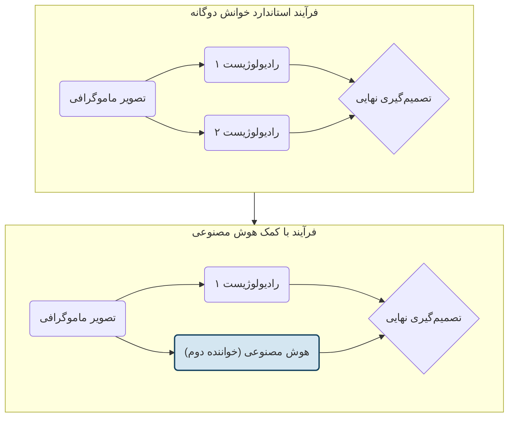

# فصل ۱: انقلاب جدید در زیست‌شناسی

## بخش ۱-۴: مطالعه موردی: تشخیص سرطان با تصاویر پزشکی

در بخش قبل، با ابعاد ترسناک "سونامی داده" آشنا شدیم. اما گاهی، چالش در حجم داده نیست، بلکه در پیچیدگی و ظرافت اطلاعات نهفته در آن است. یک تصویر پزشکی، تنها چند مگابایت حجم دارد، اما اطلاعات درون آن می‌تواند مرگ و زندگی را رقم بزند. در این مطالعه موردی، می‌خواهیم ببینیم هوش مصنوعی چگونه به کمک یکی از حساس‌ترین و پراسترس‌ترین تخصص‌های پزشکی، یعنی رادیولوژی، می‌آید.

تصور کنید یک رادیولوژیست هستید. هر روز، صدها تصویر ماموگرافی از مقابل چشمان شما عبور می‌کند. هر تصویر، یک داستان بالقوه از زندگی یک انسان است. وظیفه شما این است که در میان انبوهی از بافت‌های سالم، کوچکترین نشانه‌های یک تومور بدخیم را پیدا کنید. این یک مسئولیت بسیار سنگین است. یک اشتباه کوچک می‌تواند به قیمت جان یک بیمار تمام شود.

چالش بزرگ در این کار، تنها پیدا کردن سرطان نیست، بلکه نادیده گرفتن موارد غیرسرطانی است. دو نوع خطا در اینجا بسیار پرهزینه است:

1.  **مثبت کاذب (False Positive):** زمانی که یک توده خوش‌خیم یا یک سایه بی‌خطر، به اشتباه به عنوان سرطان تشخیص داده می‌شود. این خطا منجر به اضطراب شدید بیمار و انجام نمونه‌برداری‌های دردناک و غیرضروری می‌شود.
2.  **منفی کاذب (False Negative):** زمانی که یک تومور واقعی، از چشم رادیولوژیست پنهان می‌ماند و به بیمار گفته می‌شود که همه چیز طبیعی است. این خطرناک‌ترین نوع خطاست، زیرا به سرطان فرصت رشد و پیشرفت می‌دهد.

به دلیل همین فشار و پیچیدگی، در بسیاری از کشورهای پیشرفته، هر تصویر ماموگرافی توسط **دو رادیولوژیست** به صورت مستقل بررسی می‌شود. این کار دقت را بالا می‌برد، اما حجم کار را نیز دو برابر می‌کند و با توجه به کمبود جهانی رادیولوژیست‌های متخصص، یک چالش بزرگ است.

### **ورود یک همکار خستگی‌ناپذیر: هوش مصنوعی**

اینجا جایی است که هوش مصنوعی وارد میدان می‌شود. در یک مطالعه پیشگامانه که در سال ۲۰۲۰ در مجله معتبر **Nature** منتشر شد، یک تیم تحقیقاتی از گوگل یک سیستم هوش مصنوعی را توسعه داد که می‌توانست تصاویر ماموگرافی را با دقتی فراتر از متخصصان انسانی تحلیل کند.

> **منبع:** McKinney, S.M., Sieniek, M., Godbole, V. et al. International evaluation of an AI system for breast cancer screening. _Nature_ **577**, 89–94 (2020). [https://doi.org/10.1038/s41586-019-1799-6](https://doi.org/10.1038/s41586-019-1799-6)

این سیستم هوش مصنوعی بر روی مجموعه داده عظیمی شامل صدها هزار تصویر ماموگرافی از بیماران در بریتانیا و ایالات متحده آموزش دیده بود. درست مانند یک رادیولوژیست کارآموز که با دیدن هزاران مثال یاد می‌گیرد، این هوش مصنوعی نیز الگوهای ظریف و پیچیده‌ای را که نشان‌دهنده سرطان هستند، از دل داده‌ها استخراج کرد.

### **نتایج شگفت‌انگیز: دقت بالاتر، خطای کمتر**

نتایج این تحقیق، جامعه پزشکی را شگفت‌زده کرد:

- **کاهش خطاهای تشخیصی:** این سیستم توانست موارد **مثبت کاذب** را تا **۵.۷٪** در مجموعه داده آمریکایی و **۱.۲٪** در مجموعه داده بریتانیایی کاهش دهد. همزمان، موارد **منفی کاذب** (یعنی سرطان‌های دیده‌نشده) را تا **۹.۴٪** در آمریکا و **۲.۷٪** در بریتانیا کم کرد.
- **عملکرد بهتر از متخصصان:** در یک مقایسه مستقیم با شش رادیولوژیست خبره، سیستم هوش مصنوعی عملکردی **بهتر از همه آن‌ها** داشت.
- **کاهش حجم کار:** شبیه‌سازی‌ها نشان داد که اگر از این هوش مصنوعی به عنوان "خواننده دوم" در کنار یک رادیولوژیست انسانی استفاده شود، می‌توان حجم کاری که نیاز به بررسی توسط رادیولوژیست دوم دارد را تا **۸۸٪** کاهش داد! این یعنی آزاد شدن وقت متخصصان برای تمرکز بر روی موارد پیچیده‌تر.

این مطالعه نشان داد که هوش مصنوعی نه تنها می‌تواند یک ابزار کمکی باشد، بلکه پتانسیل آن را دارد که به عنوان یک همکار قابل اعتماد، دقت و کارایی فرآیندهای تشخیصی را به شکل چشمگیری بهبود بخشد.

### **نمودار: هوش مصنوعی به عنوان خواننده دوم**

بیایید فرآیند خوانش دوگانه را با و بدون هوش مصنوعی مقایسه کنیم:

در مدل جدید، هوش مصنوعی می‌تواند نقش رادیولوژیست دوم را با سرعت و دقت بالا ایفا کند و تنها در موارد مشکوک یا پیچیده، نظر یک رادیولوژیست انسانی دیگر خواسته شود.

---

### 🔬 تمرین تحلیلی: شما یک رادیولوژیست هستید!

تصور کنید سه تصویر ماموگرافی به شما داده شده است. سیستم هوش مصنوعی برای هر کدام یک "امتیاز ریسک" از ۰ تا ۱۰۰ محاسبه کرده است. رادیولوژیست همکار شما نیز نظر خود را اعلام کرده است. با توجه به اطلاعات زیر، برای هر بیمار چه تصمیمی می‌گیرید؟ (نمونه‌برداری، بررسی بیشتر، یا اعلام نتیجه سالم)

| بیمار       | امتیاز ریسک هوش مصنوعی | نظر رادیولوژیست همکار | اطلاعات تکمیلی                                  | تصمیم شما؟ |
| :---------- | :--------------------- | :-------------------- | :---------------------------------------------- | :--------- |
| **بیمار A** | ۹۵                     | بسیار مشکوک           | بیمار سابقه خانوادگی سرطان دارد.                |            |
| **بیمار B** | ۴۰                     | احتمالاً خوش‌خیم      | توده شکلی منظم و حاشیه صاف دارد.                |            |
| **بیمار C** | ۸                      | بدون مورد مشکوک       | بیمار هیچ علامتی ندارد و این یک چکاپ روتین است. |            |

**فکر کنید:**

- در کدام مورد، نظر هوش مصنوعی و انسان همسو است و تصمیم‌گیری آسان‌تر است؟
- در کدام مورد، اختلاف نظر وجود دارد؟ در این شرایط، چه عاملی می‌تواند به تصمیم‌گیری نهایی کمک کند؟ (به ستون اطلاعات تکمیلی دقت کنید)
- اگر شما مسئول طراحی یک سیستم همکاری بین انسان و هوش مصنوعی بودید، چگونه قوانینی برای حل اختلاف نظرها وضع می‌کردید؟

---

### 💡 نکات کلیدی این بخش

- **دقت فراتر از انسان:** هوش مصنوعی می‌تواند تصاویر پزشکی را با دقتی معادل یا حتی فراتر از متخصصان انسانی تحلیل کند.
- **ابزار کمکی قدرتمند:** AI به عنوان یک "خواننده دوم" عمل می‌کند که با کاهش خطاهای تشخیصی (مثبت و منفی کاذب) و کاهش حجم کاری رادیولوژیست‌ها، به بهبود فرآیند تشخیص کمک می‌کند.
- **همکاری انسان و ماشین:** آینده پزشکی پیشرفته در همکاری هوشمندانه پزشکان و سیستم‌های هوش مصنوعی نهفته است، نه در جایگزینی انسان توسط ماشین.

این مطالعه موردی نشان می‌دهد که آینده پزشکی، نه در رقابت بین انسان و ماشین، بلکه در **همکاری هوشمندانه** این دو نهفته است. هوش مصنوعی می‌تواند با تحلیل حجم عظیمی از داده‌ها، الگوهایی را کشف کند که از چشم انسان پنهان می‌مانند و به پزشکان کمک کند تا تصمیمات بهتر و دقیق‌تری برای بیماران خود بگیرند.
